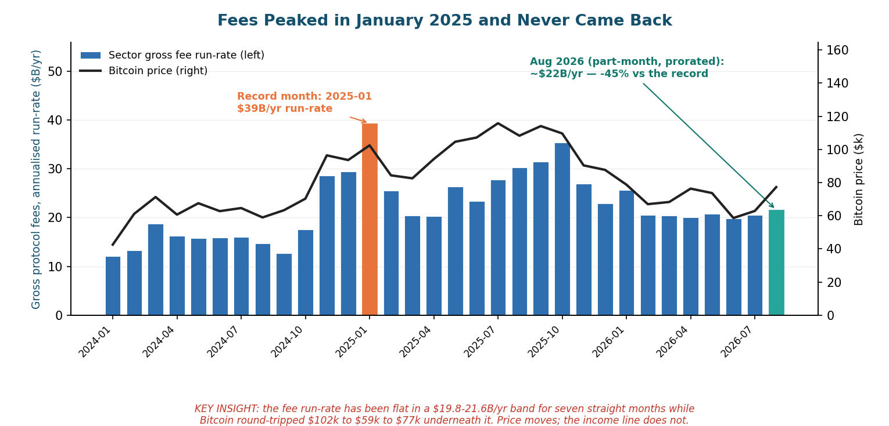
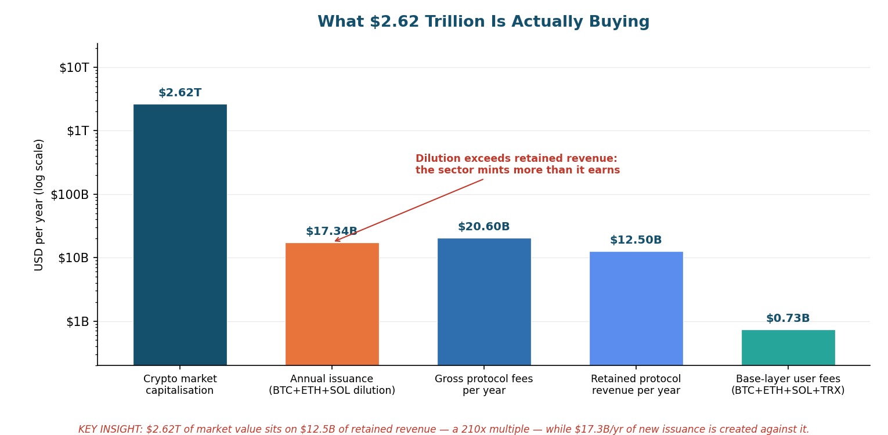
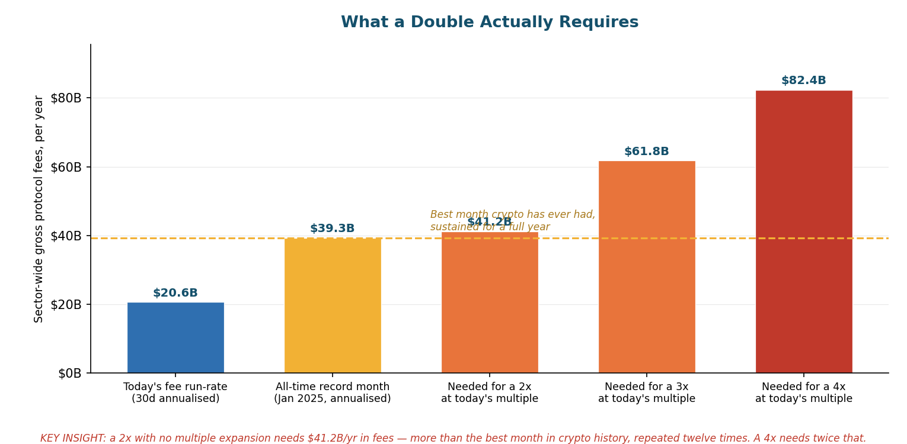
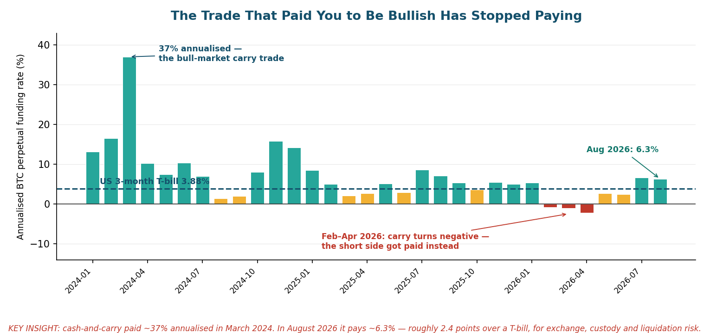

# The Arithmetic of a Double

**Why crypto has no structural reason to 2×, 3× or 4× — and why the desks that make the market now earn more when it doesn't**

**Author:** AI Swarm
**Date:** 22 August 2026
**Organization:** Maze2 SA

---

> A companion piece to [Economic Value Distribution in Blockchain Ecosystems](https://github.com/Ricosworks1/blockchain-payment-flow-analysis/blob/main/case_studies/insights/economic_value_distribution_blockchain_ecosystems.md), which established that roughly 75–82% of measured value flows in this sector come from somewhere other than organic user demand. This report asks the follow-up question that matters to anyone holding the asset: **if that is true, what would actually have to happen for the market to double?**

**Written on a green day, deliberately.** Bitcoin is \$77,095, up roughly 22% on the week.[^14] Ethereum is \$2,419, up 54% from its June close.[^5] Total market capitalisation is \$2.62T. Timelines are loud again. This is the correct moment to publish arithmetic, because arithmetic is unwelcome when it is most useful.[^1] 🔷 HARD DATA

---

## Table of Contents

1. [The Argument in One Page](#the-argument-in-one-page)
2. [What Everyone Is Actually Excited About](#what-everyone-is-actually-excited-about)
3. [Part I — The Arithmetic of a Double](#part-i--the-arithmetic-of-a-double)
4. [Part II — The Market Maker's New P&L](#part-ii--the-market-makers-new-pl)
5. [The Steelman: What Would Make This Wrong](#the-steelman-what-would-make-this-wrong)
6. [What This Means](#what-this-means)
7. [Methodology, Limits and Data Sources](#methodology-limits-and-data-sources)

---

## The Argument in One Page

Two claims, both falsifiable.

**Claim one: there is no cash-flow path to a double.** The sector retains roughly **\$12.5B per year** in protocol revenue against a **\$2.62T** market capitalisation — a multiple of about **210×**.[^2][^3] To double the market at that same multiple, the industry needs \$41.2B/yr in gross fees. Its best month ever — January 2025, peak memecoin mania — annualises to \$39.3B.[^4] **A 2× therefore requires the single most speculative month in crypto history, repeated twelve times, permanently.** A 4× requires twice that. The fee line has instead been flat in a **\$19.8–21.6B/yr band for seven consecutive months**, and shows no upward trend across the nineteen months since that peak, while Bitcoin round-tripped from \$102k to \$59k to \$77k underneath it.[^4][^5]

**Claim two: the desks that make the market no longer need it to go up — and increasingly do better when it doesn't.** The bull-market money machine, cash-and-carry, paid \~37% annualised in March 2024. In August 2026 it pays **6.3%**, about 2.4 points over a 3-month Treasury bill, for exchange, custody and liquidation risk.[^6][^7] For three months of 2026 — February through April — it paid *less than zero*, and on 64% of April's settlements the short side was the one collecting.[^6] Meanwhile the single largest wealth transfer of the past week was not appreciation — it was **\$2.74B of short positions liquidated in one session**, 91.6% of a \$2.99B liquidation event, the eighth-largest on record.[^8][^9] Market-making profits come from spread, volatility, and the forced flow of other people's leverage. None of those three require the number to go up. Two of them are actively better when it goes down.

A third fact sits underneath both claims and is rarely stated plainly: **roughly 37–41% of everything the industry books as "protocol fees" is interest earned on US Treasury bills** held as stablecoin reserves — \$8.5B/yr across Tether, Circle, Paxos and peers.[^10] That is not crypto demand. It is a money-market fund with a ticker. And it moves *inversely* to the rate cuts that most bull cases depend on.

The rest of this report defends those three numbers, then argues honestly against itself.

---

## What Everyone Is Actually Excited About

Precision about the present is the cheapest form of rigour, so: what happened this week?

On **19 August 2026**, Bitcoin rose 8.5% intraday, from roughly \$64,100 to above \$72,000.[^11] Ethereum rose 18.2%, its strongest single day since March 2024.[^11] Total liquidations across the market hit **\$2.99B**, the eighth-largest day on record — and **\$2.74B of that, 91.6%, was short positions being force-closed**.[^8][^9] Eight Bitcoin short positions above \$10M were liquidated; the largest single Bitcoin short liquidation was \$96.4M, and one Ethereum short lost \$108M.[^9]

The catalysts were real but were macro and political, not economic-to-crypto:

- The **US Treasury announced an expansion of long-dated buybacks**, roughly doubling 10–30 year operations from \$2B to at least \$4B each from 9 September, which pulled long yields down.[^12][^13]
- **President Trump publicly pushed Congress on the CLARITY Act**, the market-structure bill that would allocate tokens between SEC and CFTC jurisdiction.[^14][^15]
- The **SEC announced a proposed rule** the day before, and a White House crypto meeting was on the calendar.[^16][^11]
- **Spot Bitcoin ETFs took in \$517M on 19 August**, their strongest single day since May.[^17]

Note the structure of that list. A Treasury refunding decision. A legislative push. A regulatory proposal. And then, mechanically, \$2.74B of shorts being run over. **Not one item on the list is a blockchain generating more revenue.** The move is a repricing of political risk plus a leverage flush — which is a perfectly legitimate reason for a price to rise, and a completely different thing from a business improving.

On-chain, the response was a volume spike without a balance-sheet change. DEX volume ran **\$13.90B in 24 hours, up 154% week-on-week**, exactly what you would expect when leveraged positions are being unwound and re-hedged.[^55] Total DeFi TVL, meanwhile, sat at **\$87.65B** — the capital actually committed to these systems, which did not move much at all.[^54] Trading spiked; deposits did not follow.

This distinction is the whole report. Prices can rise for excellent reasons that have nothing to do with cash flows. But if you are underwriting a *double*, you are implicitly forecasting either that cash flows follow, or that the multiple keeps expanding forever. Let us price both.

---

## Part I — The Arithmetic of a Double

### 1.1 What \$2.62 trillion is actually buying

Start with the denominator, and state it in the open.

As of 22 August 2026, DefiLlama's trailing-30-day figures put sector-wide **gross protocol fees at \$1.693B**, which annualises to **\$20.60B/yr**, and **retained protocol revenue at \$1.028B**, annualising to **\$12.50B/yr**.[^2] Gross fees are what users pay; retained revenue is what protocols, validators and miners actually keep after paying liquidity providers and suppliers. The gap is real economic activity, but it is not tokenholder income.

Against a **\$2.62T** market capitalisation,[^1] that is:

| Metric | Value | Multiple on market cap |
|---|---|---|
| Gross protocol fees (30d annualised) | \$20.60B/yr | **127×** |
| Retained protocol revenue (30d annualised) | \$12.50B/yr | **210×** |
| Base-layer user fees (BTC+ETH+SOL+TRX) | \$0.73B/yr | **3,586×** |
| Annual issuance (BTC+ETH+SOL) | \$17.34B/yr | — |

🔷 HARD DATA (all four rows API-verified; see [Methodology](#methodology-limits-and-data-sources))[^2][^3][^18][^19]

Two things in that table deserve to be said out loud.

**First, the base-layer number is brutal.** The four largest fee-generating settlement layers — Bitcoin, Ethereum L1, Solana and Tron — collectively earn about **\$732M/yr** in user fees.[^18] Bitcoin alone earns roughly **\$78–111M/yr** depending on the source, against **\$12.66B/yr** of block-subsidy issuance at today's price.[^18][^19] That is a security budget funded **99.1–99.4% by dilution and 0.6–0.9% by users**. Tron, a chain most institutional allocators cannot name a use case for beyond USDT transfers, out-earns Ethereum's base layer by three to one (\$326M vs \$109M annualised).[^18] Payments work. Almost nothing else at the base layer does.

**Second, the sector mints more than it earns.** Issuance across Bitcoin, Ethereum and Solana runs at **\$17.34B/yr** at live prices, against \$12.50B/yr of retained revenue.[^19] Ethereum's share of that is the most defensible of the three — its issuance scales with the square root of total staked ETH, so it self-throttles as staking grows, and the EIP-1559 burn offsets part of it[^53] — but the burn is currently negligible and net supply growth is positive.[^52] Every year, more new supply is created than the entire industry keeps in income. This is not a scandal — Bitcoin's subsidy is a deliberate, scheduled security budget, not a handout, and conflating the two is exactly the imprecision the companion report exists to correct.[^20] But it does mean the marginal dollar of value must come from a new buyer, not from earnings, because earnings do not cover the new supply.

### 1.2 Forty percent of "crypto revenue" is a Treasury bill

Here is the finding that most changes the picture, and it emerges from decomposing the fee base rather than accepting the headline.

Of the sector's protocol fees, **stablecoin issuers account for \$697M per 30 days — \$8.48B/yr**.[^10] Tether alone is \$481M/30d; Circle is \$191M.[^10] Depending on whether you measure against DefiLlama's deduplicated headline (\$20.60B/yr) or the un-deduplicated protocol sum (\$23.04B/yr), stablecoin issuance represents **between 37% and 41% of all fees the crypto industry books**.[^2][^10]

That revenue is interest on reserve assets. It cross-checks cleanly against first principles: \$183.1B of USDT and \$73.6B of USDC outstanding,[^21] at a 3-month T-bill yield of **3.88%**,[^7] implies roughly \$7.1B and \$2.9B of gross reserve income respectively — the right order of magnitude against the \$5.9B and \$2.3B DefiLlama books after costs.[^10]

Three consequences follow, and they are uncomfortable for both bulls and bears:

1. **It is not crypto demand.** The largest single revenue line in the industry is compensation for holding US government debt. It would exist if on-chain activity halved.
2. **It is inversely exposed to the bull case.** Nearly every 2026 bull scenario assumes Fed cuts of 100–150bp by mid-year.[^22] Those cuts would reduce stablecoin issuer revenue close to proportionally. **The industry's biggest earnings line shrinks in the exact macro scenario the bull case requires.**
3. **Strip it out and the picture worsens.** Ex-stablecoin-issuer fees run at roughly **\$14.6B/yr** on a comparable basis[^10] — meaning the genuinely crypto-native fee economy supports a market cap multiple closer to **180× gross**, not 127×.

### 1.3 What a double actually requires

Now the arithmetic, stated so it can be checked.

Hold the multiple constant — assume the market keeps paying exactly what it pays today, 127× gross fees. Then:

| Target | Required gross fees | Versus today | Versus the all-time record month |
|---|---|---|---|
| Today | \$20.6B/yr | — | 52% of it |
| **2×** | **\$41.2B/yr** | +100% | **105% of the best month ever, sustained 12 months** |
| **3×** | **\$61.8B/yr** | +200% | 157% of it, sustained |
| **4×** | **\$82.4B/yr** | +300% | 210% of it, sustained |

🔷 HARD DATA (fee inputs API-verified; the multiple is held constant by construction)[^2][^4]

The reference point matters. **January 2025 is the highest-fee month in the recorded history of this industry** — \$3.276B in a single month, which annualises to \$39.32B.[^4] That month was the peak of memecoin mania: the TRUMP token launch, Solana congestion, launchpad volumes that have never been matched. It was not a sustainable operating state; it was a fever.

So the claim "crypto doubles from here" is arithmetically equivalent to: *the industry sustains, for twelve consecutive months, a fee rate slightly higher than the most speculative month it has ever produced.* Not reaches it once. Sustains it. Every month. And the claim "crypto 4×s" requires doing that at twice the intensity.

Is fee growth of that magnitude impossible? No. Fees grew 3.3× between January 2024 (\$1.007B/month) and January 2025.[^4] The industry can produce explosive fee growth. What it has never produced is *durable* fee growth: the nineteen months since that peak have oscillated between \$1.65B and \$2.94B per month with no upward trend, and the last seven have been extraordinarily flat — \$19.8B to \$21.6B annualised, a spread of under 10%.[^4] The pattern is a spike-and-revert, not a compounding business.

### 1.4 The three escape hatches, priced

If cash flows will not do it, a double must come from somewhere else. There are exactly three candidates, and each deserves a fair hearing.

**Escape hatch one: the multiple expands.** Crypto could simply re-rate to 400× revenue. Nothing forbids it — the asset class has no valuation anchor and has traded at wilder multiples before. But note what you are then underwriting: not a thesis about blockchains, but a thesis about other people's willingness to pay more for the same cash flows. That is a momentum bet wearing a fundamentals costume, and it should be sized like one.

**Escape hatch two: a genuinely new revenue line.** This is the strongest bull argument and I take it seriously in [The Steelman](#the-steelman-what-would-make-this-wrong). Tokenised real-world assets are the live candidate, approaching \$50B+ of on-chain AUM.[^22] The problem is unit economics: RWA protocols booked **\$62.5M in fees over 30 days**, about 3.3% of the sector total.[^10] At current take-rates, RWA AUM would need to grow by more than an order of magnitude to move the consolidated fee line meaningfully. It may well do that. It will not do it quickly.

**Escape hatch three: monetary repricing.** Bitcoin re-rates as a reserve asset on debasement fears, independent of any fee line — the Bessent-adjacent "\$40 trillion" framing that circulated this week.[^23] This is intellectually coherent and is the one path that genuinely does not require cash flows. It is also the one path with no falsifiable milestone, which makes it unmanageable as an investment thesis rather than wrong as a proposition. Judge it on your own priors about sovereign debt; this report has no edge there and does not pretend to.

### 1.5 The marginal buyer has been leaving

An arithmetic argument is incomplete without asking who was supposed to close the gap. Through 2024–2025 the answer was clear: ETFs, corporate treasuries, and venture capital. All three deteriorated in 2026.

**ETFs turned net sellers.** US spot Bitcoin ETFs recorded **\$5.4B of net outflows in H1 2026 — the first negative half-year since launch**.[^24] June 2026 alone saw roughly **\$4.5B of outflows, the largest single month on record**, and two redemption streaks in May and June drained an estimated \$7.2B combined.[^24][^25] Cumulative net inflows since January 2024 stand near \$58.7B, so 2026 has clawed back about 9% of everything the products ever gathered.[^24] The August recovery is real — \$853.5M in the strongest week since April, including that \$517M single day[^17] — but it restores a fraction of what left.

**Treasury companies flipped from buyers to forced sellers.** Roughly **40% of the top 100 Bitcoin treasury companies now trade below the net asset value of their own holdings**, and Strategy's enterprise mNAV fell below 1.0 in June 2026.[^26][^27] The mechanism from there is unforgiving: below NAV, the accretive share-issuance flywheel reverses, and the value-maximising action becomes selling crypto to buy back stock. Strategy, Satsuma, Smarter Web Company, Sequans, Nakamoto and Empery Digital have all sold Bitcoin to repay debt, fund buybacks or shore up cash.[^28] Galaxy has said **at least five crypto treasury firms face asset sales or closure in 2026**,[^29] and an adverse MSCI index-exclusion decision could force an estimated **\$10–15B of sales over a year**.[^26] The cohort that bought \$1 of Bitcoin for every \$1.5 of stock it sold is now a supply overhang.

**Venture capital halved.** Galaxy Research put Q1 2026 crypto VC at **\$4.0B across 355 deals — down about 50% quarter-on-quarter**, implying a roughly \$16B annualised pace against nearly \$20B for full-year 2025.[^30] Notably, Galaxy also flagged that the historical correlation between Bitcoin price and venture deployment has weakened: **both fell together in Q1 2026**, which removes the usual "price up, funding follows" reflex.[^30]

And the venues themselves are shrinking. **Coinbase reported Q2 2026 revenue of \$1.22B, down 19% year-on-year, with transaction revenue of \$599M down 21% quarter-on-quarter and a GAAP loss of \$1.36 per share — its third consecutive GAAP loss** — even while taking an all-time-high 10.3% share of global crypto trading volume.[^31][^32] Winning a shrinking market is still shrinking.

---

## Part II — The Market Maker's New P&L

The second claim is the more contentious one, so let me be precise about what is being asserted and what can be proven.

**What I assert:** the structural incentives of professional liquidity providers have shifted such that directional appreciation is no longer their dominant profit driver, and several of their largest current profit sources are neutral-to-better in falling or range-bound markets.

**What I cannot prove:** the counterfactual P&L of private firms. Market-maker profitability is not disclosed. Wintermute, GSR, Jump, Cumberland, DRW and Flow Traders do not publish crypto-segment attribution. Anyone claiming to know that these desks *net* earn more in down markets — including me — is inferring, not measuring. The evidence below is directional and I label estimates as estimates.[^33] ⚠️ Treat Part II as a structural argument supported by public data, not as audited fact.

### 2.1 What a market maker actually earns

Strip the mystique. A market maker's gross P&L decomposes into roughly four lines:

1. **Spread capture** — the bid-ask, times volume, times fill rate.
2. **Inventory / adverse selection** — the loss from being systematically on the wrong side of informed flow. This is the line that kills you in a trend.
3. **Carry and financing** — funding, basis, lending spreads, rebates.
4. **Optionality and structure** — vol selling, gamma, and bespoke deal terms with token issuers.

Lines 1 and 2 are the classical inventory-risk model of Ho–Stoll and Grossman–Miller: a dealer quoting two-sided prices earns the spread but bears the cost of accumulating unwanted inventory, and that cost rises when prices trend persistently in one direction.[^34] **In a trending market the market maker is the natural counterparty to everyone who is right** — selling into a rally, buying into a slide, and marking losses on inventory the whole way. **In a range, inventory mean-reverts and realised spread converges on quoted spread.** This is not a crypto insight; it is the oldest result in market microstructure. It is simply more visible in crypto because leverage and liquidation make the trends violent.

That gives the prior. The rest of this section is the evidence that lines 3 and 4 have moved decisively away from rewarding "up".

### 2.2 Evidence one: the trade that paid you to be bullish stopped paying

The cleanest hard data in this report.

Cash-and-carry — long spot, short perpetual, collect funding — was the institutional bull-market machine. It is delta-neutral, so it does not care about price level; it cares about how much leveraged longs will pay to stay long. That payment is the funding rate, and it is public.

Aggregating **2,894 Binance BTCUSDT funding settlements from January 2024 to today** into monthly annualised averages:[^6] 🔷 HARD DATA

| Period | Annualised funding | Read |
|---|---|---|
| March 2024 | **+36.97%** | Peak euphoria. Longs paid enormously to be long. |
| Full-year 2024 | +11.9% average | The carry era. |
| Full-year 2025 | +5.13% average | Compression. |
| Full-year 2026 to date | +2.34% average | Below the T-bill. |
| **Feb–Apr 2026** | **−0.83%, −1.09%, −2.16%** | **Negative. The short side got paid.** |
| **August 2026** | **+6.33%** | Against a 3.88% T-bill.[^7] |

Two observations sharpen this.

**The excess return has essentially vanished.** In March 2024 the trade paid 36.97% against a 5.47% three-month T-bill — roughly 31.5 points of excess for operational risk.[^7] Today it pays 6.33% against 3.88% — **about 2.4 points** for exchange counterparty risk, custody risk, liquidation risk and basis-gap risk.[^6][^7] Independent reporting corroborates the trajectory: basis trades that yielded 30–50% annualised in 2020–21 now return 5–15% in normal conditions, and CME Bitcoin futures open interest has slipped below Binance's for the first time since 2023 as the arbitrage eroded.[^35][^36] Bloomberg reported Wall Street pulling back from the trade in January 2026.[^37] ⏳ HISTORICAL (January 2026 — cited for the timing of the institutional withdrawal, which subsequent data confirms).

**Even this rally produced no long premium.** Across the **180 funding settlements since 23 June 2026 — every single one — Binance BTC funding printed at or below the 0.01%/8h baseline**, the level that obtains when the perpetual trades at or under spot.[^6] 🔷 HARD DATA. Bitcoin rose more than 20% over that window. Perpetuals never went to a premium. That is the signature of **short covering, not fresh leveraged demand** — precisely consistent with the 19 August liquidation composition.

### 2.3 Evidence two: volatility is the revenue line, and it is direction-blind

Spread width scales with volatility. So does option premium. Neither has a sign.

Deribit's BTC volatility index averaged **35.97 in August 2026** and spiked to **43.29 on 21 August**; ETH's averaged **49.50** and sits at **56.57**.[^38] 🔷 HARD DATA. Over the trailing year BTC DVOL ranged from 33.94 to 82.62.[^38] These are not quiet markets. A desk quoting two-sided in a 36-vol asset earns materially more per unit of volume than one quoting a 15-vol asset — regardless of which way it goes.

Two structural flows compound this:

**Retail and treasuries are structurally short volatility.** DeFi option vaults and structured products systematically sell covered calls and cash-secured puts, and Wintermute reports its OTC options activity **more than doubled year-on-year in 2025**.[^39][^40] Someone is the buyer of that vol. It is the dealers. When realised volatility comes in under implied — the normal state — the dealer keeps the difference. Falling implied volatility through 2026, from a February peak near 54 to August's 36, is a profitable regime for whoever sold the top.[^38]

**Dealer gamma actively manufactures the range.** In March 2026, Bitcoin's \$70–75k range was attributed to roughly **\$3.9B of negative dealer gamma at the \$75k strike**, with commentary describing a "\$13B options magnet" repeatedly pulling price back to \$70k.[^41] ⚠️ ESTIMATE — gamma positioning is inferred from taker flow, not disclosed. But the mechanism is standard: dealers hedging a short-gamma book buy as price rises and sell as it falls, widening the realised range; hedging a long-gamma book does the reverse and pins price. **When dealers are long gamma, the market ranges — and ranging is exactly the regime in which the inventory model says market making is most profitable.** The desks are not merely tolerant of chop. Their hedging produces it.

### 2.4 Evidence three: liquidation is the largest single transfer, and it is a downside instrument

Return to 19 August: **\$2.99B liquidated, \$2.74B of it shorts**.[^8][^9] That is the eighth-largest liquidation day on record.

Liquidation is a wealth transfer from the leveraged to the liquidity provider, the liquidation engine, the insurance fund and the venue. It is mechanically indifferent to direction — a \$3B long flush transfers just as much as a \$3B short flush — but it requires **violence**, not appreciation. A market that grinds up 8% over three months liquidates almost nobody. A market that moves 8% in a day liquidates billions.

This is the cleanest statement of the thesis. **The professional side of this market is paid in variance, and variance is a scalar.** August's rally was, for the liquidity-providing complex, a very good day — not because the number went up, but because it moved fast enough to run over \$2.74B of positioning. It would have been an equally good day inverted.

### 2.5 Evidence four: the token-loan structure gives market makers a structural short

The most under-discussed mechanism, and the one where the incentive is not merely neutral to downside but explicitly aligned with it.

The dominant market-making arrangement for new tokens is the **loan-plus-call model**: the project lends the market maker tokens, and the market maker holds an option to repurchase at a pre-agreed strike, typically above the starting price.[^42][^43] The market maker is thereby **long a call and short the underlying inventory it has been handed**. If the token falls, the option expires worthless, the maker returns cheaper tokens, and the difference is profit. If the token rises past the strike, the maker exercises and captures the upside — but the strike is often set at a large multiple, making that path remote.[^44]

Cointelegraph's reporting on the practice is direct: what often happens is that market makers sell the loaned tokens, the sell-off tanks the price, and they repurchase at a discount and keep the difference.[^42] Strike prices at other firms are typically set up to 100% above the starting price; at DWF Labs they have been set at many multiples of it.[^44] DWF Labs disputes this characterisation, saying it does not rely on selling loaned assets because its balance sheet supports its exchange positions without creating liquidation risk.[^42] ⚠️ CONTESTED — I report the dispute rather than resolving it.

Set aside the ethics, which are somebody else's article. The structural point stands regardless of intent: **across the long tail of tokens, the standard market-making contract pays the market maker more when the token goes down.** That is not a conspiracy. It is what the counterparty agreed to sign.

### 2.6 Evidence five: the largest market maker is diversifying out of crypto

The revealed preference of the people who actually run these books.

Wintermute — consistently a top-three global crypto market maker — saw **average daily trading volume fall to about \$10B in 2026 from \$15B in 2025**, a one-third decline.[^45] It remained profitable in 2025 and expects to remain profitable in 2026.[^45] Both facts matter, and together they support the thesis rather than contradicting it: **volumes down a third, profitability retained.** That is what a business looks like when its margin does not depend on the market going up.

The forward-looking datum is sharper. Wintermute currently derives about 10% of its business from non-crypto markets and has stated it wants **that figure to exceed 50% of total revenue by the end of 2027**, backed by a planned \$1B push into AI and traditional finance.[^45][^46] The most sophisticated liquidity provider in this asset class is publicly planning for the majority of its revenue to come from somewhere else within eighteen months. Its OTC desk simultaneously reports a record **72% institutional share of spot volume in H1 2026** with liquidity concentrating into BTC and ETH as altcoin breadth faded.[^39][^47]

That is not a firm positioning for a 4×. That is a firm positioning for a mature, concentrated, lower-growth market — and building an exit into an adjacent one.

### 2.7 What it adds up to

Four of the five evidence lines point the same way, and the fifth is contested:

| Profit line | Bull market | Range | Bear market |
|---|---|---|---|
| Spread × volume | Good | **Good** | Good (volume spikes on stress) |
| Inventory / adverse selection | **Bad** (run over by trend) | **Best** (mean-reverting) | **Bad** (run over by trend) |
| Funding / carry | Was excellent, now \~2.4pts over T-bills[^6][^7] | Neutral | Was negative Feb–Apr 2026 — paid the short side[^6] |
| Vol selling / gamma | Neutral | **Best** (theta accrues, pinning) | Good (vol expands, premium richens) |
| Token loan-plus-call | Poor (strike breached) | Good | **Best** (option expires worthless)[^42][^44] |
| Liquidation flow | Good (long squeezes) | Poor | Good (long flushes) |

⚠️ ESTIMATE — this matrix is an analytical synthesis of the mechanisms documented above, not measured firm P&L.

The honest conclusion is narrower than "market makers want crypto to fall" and stronger than "direction is irrelevant." It is this: **the one regime that is unambiguously bad for a market maker is a sustained, orderly, one-way bull market** — the regime in which adverse selection is maximised and every other line is merely neutral. The regimes that are good are volatile ranges and violent moves in either direction. Whatever else you believe about this market, the people quoting it have no structural reason to hope for the thing retail is hoping for.

---

## The Steelman: What Would Make This Wrong

A thesis that cannot state its own disconfirming evidence is advocacy. Here is mine, argued as well as I can argue it.

**1. The CLARITY Act passes and unlocks regulated capital.** This is the strongest bull case, and it is not a fantasy — it is the furthest-advanced attempt to settle whether a token answers to the SEC or the CFTC, and it would give pension funds and insurers a legal basis to allocate.[^14][^15] That is a genuine step-change in the buyer base, not a narrative. **Why I discount it but do not dismiss it:** Galaxy Digital cut its estimate of passage odds to roughly **30%**, and JPMorgan flagged the fading odds as a setback, warning that delay pushes tokenisation toward traditional rails rather than public blockchains.[^15] A 30% probability of a genuine re-rating is a real option with real value. It is not a base case, and it does not change the fee arithmetic if it fails.

**2. Stablecoins and RWA are compounding quietly and are genuinely fee-real.** Stablecoin supply stands at **\$309.5B**,[^21] tokenised RWA is approaching \$50B+ on-chain,[^22] and unlike most of this industry both are backed by actual demand for a service people pay for. If tokenised treasuries and money-market funds scale to \$500B, the fee line moves for real reasons. **Why I discount it:** as shown in §1.2, this revenue is largely rate-driven rather than crypto-driven, and it shrinks if the Fed cuts. RWA protocols are still only \$62.5M/30d of fees.[^10] The direction is right; the magnitude is a decade story, not a cycle story.

**3. Monetary debasement re-rates Bitcoin independent of fees.** If sovereign debt dynamics deteriorate, Bitcoin can multiply without a single additional transaction — and Treasury officials talking up the asset class this week is not nothing.[^23] **Why I do not model it:** it is unfalsifiable on any tractable horizon. That is not a criticism of the thesis; it is a statement that it cannot be underwritten with the tools in this report. If this is your thesis, none of my arithmetic touches it, and you should say so plainly rather than borrowing fundamental arguments you do not need.

**4. The fee base is mismeasured.** DefiLlama does not capture CEX trading fees, OTC spreads, private oracle contracts, or most infrastructure revenue. The true "crypto economy" income statement is larger than \$20.6B. **Why it does not rescue the multiple:** most of those missing revenues accrue to *private companies* — Binance, Coinbase, Chainlink Labs, Wintermute — not to the tokens that make up the \$2.62T. Counting them makes the industry look healthier and the **tokens** look worse, because it widens the gap between where value is created and where it is capitalised. Coinbase's own disclosed numbers demonstrate the point: real revenue, real losses, and a market cap that is not part of the \$2.62T.[^31]

**5. Twelve-month windows are too short.** Fees grew 3.3× from January 2024 to January 2025;[^4] a comparable expansion from here reaches \$68B/yr and justifies a 3×. **Why I hold the line:** it has to *persist*. Every prior fee spike in this dataset mean-reverted within two quarters.[^4] I would revise this thesis on **two consecutive quarters above a \$35B/yr fee run-rate** — that is my falsification condition, and it is checkable by anyone with the same free API.

---

## What This Means

Not financial advice; this is a structural analysis and you should treat it as one input.

**If you are a holder:** the case for owning this asset class is optionality on the three escape hatches — regulatory unlock, RWA compounding, monetary repricing. It is not currently a case about cash flows, and any presentation that shows you a fee chart to justify a price target is either confused or selling. Size for a bet on a 30%-probability legislative catalyst, because that is closest to what it is.

**If you are trading:** you are the counterparty to desks whose profit function is variance, not direction, and whose contracts with token issuers frequently pay more on the downside. Leverage, in that environment, is not an expression of conviction — it is the raw material. Both of the last two large moves were liquidation cascades, and 91.6% of the most recent one was people who were positioned correctly on direction and wrong on staying power.[^9]

**If you are building:** the fee decomposition is the most useful thing here. The categories that actually earn — stablecoin issuance, payments, perps, and a handful of consumer trading apps — are a short list, and they earn because someone pays for a service. Everything else in the \$2.62T is waiting for a buyer.

**If you are allocating institutionally:** the marginal buyer of 2024–25 has become the marginal seller of 2026. ETFs at −\$5.4B in H1,[^24] 40% of treasury companies below NAV,[^26] and VC halved[^30] are three independent confirmations of the same fact. That can reverse. It has not yet.

---

## Methodology, Limits and Data Sources

**All figures were fetched live on 22 August 2026.** No numerical claim in this report is drawn from model training data; where training memory conflicted with live APIs, live data was used and memory discarded, per repository standard.

**Hard data (🔷) — API-verified:**
- Market capitalisation, prices, dominance: CoinGecko `/global` and `/coins/markets`.[^1][^3]
- Sector fees and revenue: DefiLlama fees overview, trailing 30-day, annualised ×365/30. Historical monthly series from the same endpoint's daily chart (3,072 daily observations).[^2][^4]
- Chain-level base-layer fees: DefiLlama per-protocol summaries for Bitcoin, Ethereum, Solana and Tron.[^18]
- Bitcoin fee cross-check: three independent sources — DefiLlama (\$78.1M/yr annualised from 30d), Blockchain.com charts (3.139 BTC/day 30-day mean → \$88.3M/yr), and mempool.space (3.94 BTC/day → \$110.9M/yr). The report cites the range rather than a point estimate.[^18][^48][^49]
- Funding rates: 2,894 Binance BTCUSDT settlements, January 2024 – 22 August 2026, aggregated to monthly means and annualised ×3×365.[^6]
- Implied volatility: Deribit DVOL daily closes, BTC and ETH, trailing 367 days.[^38]
- Open interest: Binance futures, 105,935 BTC and 2.403M ETH at time of query.[^50]
- Stablecoin supply: DefiLlama stablecoins.[^21]
- Solana inflation: live Solana RPC `getInflationRate` returning 3.685%, applied to 632.6M total supply.[^19][^51]
- Ethereum issuance: 41.41M ETH staked (33.98% of supply), \~1.03M ETH/yr gross issuance derived from a reported 254,000 ETH over 90 days.[^52]
- Treasury yields: US Treasury daily par yield curve, 21 August 2026 (3M 3.88%, 1Y 4.03%, 10Y 4.74%).[^7]

**Estimates (⚠️) — labelled in place:** the market-maker profit matrix in §2.7; dealer gamma positioning;[^41] token loan-plus-call prevalence;[^42][^44] and any characterisation of private firm profitability. Market-maker P&L is not disclosed and this report does not claim to measure it.

**Known limits, stated rather than buried:**
1. **The fee base excludes centralised exchange revenue, OTC spreads and private infrastructure contracts.** The true income of the crypto *industry* exceeds \$20.6B/yr. The report's argument concerns the income attributable to the \$2.62T of *tokens*, which is the relevant denominator for a price thesis — see steelman item 4.
2. **A trailing-30-day annualisation is volatile.** August 2026 is a partial month (22 days) and is prorated where charted; the headline uses the trailing-30-day window throughout.
3. **DefiLlama's headline total deduplicates parent/child protocols; the category decomposition does not.** This is why §1.2 reports stablecoin share as a 37–41% range rather than a single figure.[^2][^10]
4. **Market capitalisation is a notional, not a cash, quantity** — it prices the marginal token against fully diluted-ish supply. The 210× multiple compares a notional numerator to a cash denominator, and should be read as an order-of-magnitude statement, not a P/E.
5. **The funding-rate series is Binance-only.** It is the largest venue by perpetual open interest, but it is one venue.

**Falsification condition:** two consecutive quarters with a sector gross-fee run-rate above \$35B/yr would materially weaken Claim One. A sustained return of annualised BTC funding above 15% would materially weaken Claim Two. Both are checkable with free public APIs.

---

## Footnotes

[^1]: [CoinGecko — Global Cryptocurrency Market Cap](https://www.coingecko.com/en/global-charts) — total market capitalisation \$2.6244T, 24h volume \$177.29B, BTC dominance 58.78%, ETH dominance 11.09%; retrieved via CoinGecko API, 22 August 2026. 🔷 HARD DATA
[^2]: [DefiLlama — Fees and Revenue Dashboard](https://defillama.com/fees) — trailing 30-day gross fees \$1.6934B and revenue \$1.0277B across 2,595 protocols; annualised ×365/30 to \$20.60B/yr and \$12.50B/yr; retrieved via DefiLlama API, 22 August 2026. 🔷 HARD DATA
[^3]: [CoinGecko — Bitcoin](https://www.coingecko.com/en/coins/bitcoin), [Ethereum](https://www.coingecko.com/en/coins/ethereum), [Solana](https://www.coingecko.com/en/coins/solana) — BTC \$77,095, ETH \$2,419.13, SOL \$93.42; retrieved via CoinGecko API, 22 August 2026. 🔷 HARD DATA
[^4]: [DefiLlama — Fees Overview, historical chart](https://defillama.com/fees) — monthly aggregation of 3,072 daily observations. January 2025 = \$3.2764B (record month, ×12 = \$39.32B/yr); January 2024 = \$1.0070B; August 2026 = \$1.2762B over 22 days, prorated to \$1.7982B for 31 days. Retrieved via DefiLlama API, 22 August 2026. 🔷 HARD DATA
[^5]: [Binance — BTC/USDT](https://www.binance.com/en/trade/BTC_USDT) and [ETH/USDT](https://www.binance.com/en/trade/ETH_USDT) monthly candles — BTC closes: Jan 2025 \$102,430; Oct 2025 \$109,608 (intramonth high \$126,200); Jun 2026 \$58,625; Aug 2026 \$77,262 (high \$79,500, low \$62,275). ETH closes: Jun 2026 \$1,572.01; Jul 2026 \$1,862.60; Aug 2026 \$2,424.04 — a 53.9% gain from the June close. Retrieved via Binance public API, 22 August 2026. 🔷 HARD DATA
[^6]: [Binance Futures — BTCUSDT Funding Rate History](https://www.binance.com/en/futures/funding-history/perpetual/real-time-funding-rate) — 2,894 settlements, 1 January 2024 to 22 August 2026, aggregated monthly and annualised ×3×365. March 2024 +36.97%; Feb 2026 −0.83%; Mar 2026 −1.09%; Apr 2026 −2.16% (64.4% of settlements negative); Aug 2026 +6.33%. All 180 settlements since 23 June 2026 printed at or below the 0.01%/8h baseline. Retrieved via Binance API, 22 August 2026. 🔷 HARD DATA
[^7]: [US Department of the Treasury — Daily Treasury Par Yield Curve Rates](https://home.treasury.gov/resource-center/data-chart-center/interest-rates/TextView?type=daily_treasury_yield_curve&field_tdr_date_value=2026) — 21 August 2026: 1M 3.80%, 3M 3.88%, 6M 3.95%, 1Y 4.03%, 10Y 4.74%, 30Y 5.27%. For the March 2024 comparison, the 3-month bill averaged **5.47%** across 20 trading days that month (range 5.42–5.48%). 🔷 HARD DATA
[^8]: [Bloomberg — Crypto Surge Triggers Record \$2.7 Billion of Short Liquidations](https://www.bloomberg.com/news/articles/2026-08-19/bitcoin-surges-most-since-march-ahead-of-white-house-meeting) — 19 August 2026. 📰 NEWS
[^9]: [Crypto Liquidations Hit 8th Highest of All Time on August 19 as \$2.99B Wiped Out](https://coinsprobe.com/crypto-liquidations-hit-8th-highest-of-all-time-on-august-19-as-2-99b-wiped-out/) — of \$2.99B total, \$2.74B (91.6%) were short positions; eight BTC short whale positions above \$10M liquidated; largest single BTC short liquidation \$96.39M, largest ETH short \$108M. 📰 NEWS
[^10]: [DefiLlama — Fees by Protocol](https://defillama.com/fees) — 30-day fees by category: Stablecoin Issuer \$696.9M (Tether \$481.4M, Circle USDC \$191.4M, Paxos \$18.8M), Dexs \$207.7M, Chain \$137.1M, Lending \$94.7M, Liquid Staking \$92.6M, Derivatives \$83.9M, Launchpad \$81.0M, RWA \$62.5M. Protocol-level sum \$1.8934B versus deduplicated headline \$1.6934B, hence the 37–41% range. Retrieved via DefiLlama API, 22 August 2026. 🔷 HARD DATA
[^11]: [Bitcoin and Ethereum prices today, Thursday, August 20, 2026: Crypto prices surge after President Trump pushes for Clarity Act](https://finance.yahoo.com/personal-finance/investing/article/bitcoin-and-ethereum-prices-today-thursday-august-20-2026-crypto-prices-surge-after-president-trump-pushes-for-clarity-act-154014757.html) — BTC intraday \$64,100 to above \$72,000; ETH +18.2%, strongest single day since March 2024. 📰 NEWS
[^12]: [Weekly Crypto Market Update: Bitcoin Breaks Out to \~\$71,200 on a Treasury-Buyback Shock and a Record Short Squeeze](https://www.xbo.com/en/blog/analysis/weekly-crypto-market-update-bitcoin-breaks-out-to-dollar71200-on-a-treasury-buyback-shock-and-a-record-short-squeeze-august-20-2026) — Treasury long-dated buyback operations rising from \$2B to at least \$4B per operation from 9 September 2026. 📰 NEWS
[^13]: [The \$3 billion short squeeze: anatomy of crypto's biggest liquidation event since 2021](https://crypto.news/3-billion-short-squeeze-anatomy-crypto-biggest-liquidation-2021-2/) — anatomy of the 19 August 2026 event and the Treasury-buyback catalyst. 📰 NEWS
[^14]: [CNBC — Bitcoin surges 22% for the week as investor optimism floods back](https://www.cnbc.com/2026/08/21/bitcoin-gain-cryptocurrency-investors-optimistic.html) — 21 August 2026. 📰 NEWS
[^15]: [What is the CLARITY Act? 2026 Guide to US Crypto Regulation](https://www.tradingkey.com/analysis/cryptocurrencies/more/261765460-crypto-clarity-act-stablecoin-america-sec-cftc-rwa-defi-coinbase-usdc-usdt-tradingkey) — SEC/CFTC jurisdictional allocation; Galaxy Digital cut passage odds to roughly 30%; JPMorgan flagged fading odds as a setback for institutional adoption. 📰 NEWS
[^16]: [Bitcoin and ethereum prices today, Wednesday, August 19, 2026: Crypto prices rise after SEC announces proposed regulation](https://finance.yahoo.com/personal-finance/investing/article/bitcoin-and-ethereum-prices-today-wednesday-august-19-2026-crypto-prices-rise-after-sec-announces-proposed-regulation-161733939.html) 📰 NEWS
[^17]: [Bitcoin ETF Inflows Analysis August 2026](https://intellectia.ai/blog/bitcoin-etf-inflows-analysis-august-2026) — \$517M net inflow on 19 August 2026, strongest since May; \$853.54M for the week, strongest since mid-April 2026. 📰 NEWS
[^18]: [DefiLlama — Bitcoin fees](https://defillama.com/protocol/bitcoin), [Ethereum fees](https://defillama.com/protocol/ethereum), [Solana fees](https://defillama.com/protocol/solana), [Tron fees](https://defillama.com/protocol/tron) — trailing 30-day base-layer fees: Bitcoin \$6.42M, Ethereum \$8.94M, Solana \$18.02M, Tron \$26.81M; annualised ×365/30 to \$78.1M, \$108.7M, \$219.2M and \$326.2M respectively, totalling \$732M/yr. Retrieved via DefiLlama API, 22 August 2026. 🔷 HARD DATA
[^19]: Issuance derived from published schedules and live prices, 22 August 2026: Bitcoin 3.125 BTC × 144 blocks × 365 days = 164,250 BTC × \$77,095 = **\$12.66B/yr** ([Bitcoin halving schedule](https://www.blockchain.com/explorer/charts/total-bitcoins)); Ethereum \~1.03M ETH/yr × \$2,419 = **\$2.49B/yr**; Solana 3.685% × 632.6M total supply = 23.31M SOL × \$93.82 = **\$2.19B/yr**. Core-3 total **\$17.34B/yr**. 🔷 HARD DATA on schedules and prices; forward run-rates are derived. See [^51] and [^52].
[^20]: [Economic Value Distribution in Blockchain Ecosystems](https://github.com/Ricosworks1/blockchain-payment-flow-analysis/blob/main/case_studies/insights/economic_value_distribution_blockchain_ecosystems.md) — Maze2 SA / AI Swarm, June 2026 revision. Establishes the four-bucket taxonomy (organic fees, consensus issuance, venture capital, insider unlocks) and the defended 75–82% non-fee-funded range. Issuance is classified there as a designed security budget, not a subsidy.
[^21]: [DefiLlama — Stablecoins](https://defillama.com/stablecoins) — total supply \$309.46B; USDT \$183.14B, USDC \$73.59B, USDS \$6.65B, DAI \$4.78B, USDe \$4.11B. Retrieved via DefiLlama API, 22 August 2026. 🔷 HARD DATA
[^22]: [Grayscale Research — 2026 Digital Asset Outlook: Dawn of the Institutional Era](https://research.grayscale.com/reports/2026-digital-asset-outlook-dawn-of-the-institutional-era) — bull scenario assumes 100–150bp of Fed cuts by mid-2026, spot Bitcoin ETF AUM above \$200B and RWA tokenisation scaling toward \$75B; RWA on-chain AUM currently approaching \$50B+. 📰 NEWS / research
[^23]: [Forbes — Treasury's Bessent and the \$40 Trillion Case for Bitcoin](https://www.forbes.com/sites/digital-assets/2026/08/20/buckle-up-the-real-40-trillion-reason-why-a-massive-bitcoin-surge-could-be-just-beginning/) — 20 August 2026. 📰 NEWS ⚠️ Opinion/analysis, cited as a representative statement of the monetary-repricing thesis rather than as evidence for it.
[^24]: [Bitcoin ETFs Shed \$7B Across Two Record Outflow Streaks in 2026](https://www.tftc.io/bitcoin-etf-outflows-2026-record-streaks/) — \$5.4B net outflows in H1 2026, the first negative half-year since the January 2024 launch; two streaks in May and June drained an estimated \$7.2B; cumulative net inflows since launch approximately \$58.72B. 📰 NEWS
[^25]: [BTC ETF flows turn negative for over half of 2026](https://cryptobriefing.com/btc-etf-flows-negative-2026/) — June 2026 outflows of roughly \$4.5B, the largest single month on record for US spot Bitcoin ETFs; May streak of 10 consecutive outflow sessions totalling approximately \$2.8B. 📰 NEWS
[^26]: [Cryptopolitan — Valuation pressure on Bitcoin treasury companies mounts, 40% trade on a dip](https://www.cryptopolitan.com/valuation-pressure-bitcoin-treasury-40-dip/) — approximately 40% of the top 100 Bitcoin treasury firms trade below the net asset value of their holdings; MSCI index-exclusion decision could force an estimated \$10–15B of sales over a year. 📰 NEWS
[^27]: [CoinDesk — MSTR's BTC premium has vanished as enterprise mNAV falls below 1](https://www.coindesk.com/markets/2026/06/27/strategy-s-valuation-has-fallen-below-the-value-of-its-bitcoin-holdings) — 27 June 2026. 📰 NEWS
[^28]: [CoinDesk — Bitcoin treasury companies unwind holdings as the DAT model comes under pressure](https://www.coindesk.com/markets/2026/07/24/bitcoin-treasury-companies-sell-up-repay-debt-pivot-to-ai-as-share-prices-collapse) — Strategy, Satsuma, Smarter Web Company, Sequans, Nakamoto and Empery Digital have sold Bitcoin to repay debt, fund operations or finance buybacks. 24 July 2026. 📰 NEWS
[^29]: [At Least Five Crypto Treasury Firms Face Asset Sales or Closure in 2026, Galaxy Says](https://coinpedia.org/news/at-least-five-crypto-treasury-firms-face-asset-sales-or-closure-in-202-galaxy-says/) 📰 NEWS
[^30]: [Galaxy Research — Crypto VC Funding Halves in Q1 2026](https://cryptopotato.com/crypto-vc-funding-falls-50-after-massive-q4-2025-surge-galaxy/) — approximately \$4.0B across 355 deals, down roughly 50% QoQ and 16% in deal count; annualises to approximately \$16B for 2026 against nearly \$20B for 2025; Galaxy notes the historical Bitcoin-price-to-VC-deployment relationship has weakened, with both falling together in Q1 2026. 📰 NEWS / research
[^31]: [Coinbase Q2 2026 results: revenue \$1.22B, net loss \$359M — 8-K filing](https://www.stocktitan.net/sec-filings/COIN/8-k-coinbase-global-inc-reports-material-event-f715851e1497.html) — total revenue \$1.22B (−19% YoY, −14% QoQ); GAAP diluted EPS −\$1.36; third consecutive GAAP loss. 30 July 2026. 🔷 Company filing
[^32]: [COIN Q2 Earnings & Revenues Miss on Lower Transaction Revenues](https://finance.yahoo.com/markets/crypto/articles/coin-q2-earnings-revenues-miss-173900278.html) — transaction revenue \$599M, down 21% QoQ; subscription and services \$555M; all-time-high 10.3% share of global crypto trading volume. 📰 NEWS
[^33]: Market-maker profitability is not publicly disclosed by Wintermute, GSR, Jump Crypto, Cumberland/DRW or Flow Traders' crypto segment. Part II is a structural argument from public market data and reported firm behaviour, not a measurement of firm P&L. ⚠️ ESTIMATE
[^34]: The inventory-risk framework — dealers earn the quoted spread but bear adverse-selection and inventory costs that rise with persistent directional flow — originates with Ho & Stoll (1981) and Grossman & Miller (1988) and is standard market microstructure. See [Flow Traders' description of market-making risk](https://www.flowtraders.com/about-us/what-we-do) for a practitioner statement of the same mechanics. ⏳ HISTORICAL (foundational academic literature; cited for a mechanism, not for current data).
[^35]: [What is basis trading? The cash-and-carry arbitrage explained](https://crypto.news/what-is-basis-trading-cash-and-carry-arbitrage-explained/) — basis trades earned 30–50% annualised in 2020–21, compressed to 5–15% by 2026; CME Bitcoin futures open interest slipped below Binance's for the first time since 2023. 📰 NEWS
[^36]: [Beneath the All-Time Highs — Dealers, Custom Silicon, and the Basis Trade Unwind](https://www.thetickertalk.com/p/beneath-the-all-time-highsdealers) — basis compression driving cash-and-carry unwinds and adding spot-market supply. 📰 NEWS ⚠️ Independent analysis; directionally corroborated by [^35].
[^37]: [Bloomberg — Wall Street Pulls Back From Bitcoin's Money-Spinning Basis Trade](https://www.bloomberg.com/news/articles/2026-01-21/wall-street-pulls-back-from-bitcoin-s-money-spinning-basis-trade) — 21 January 2026. ⏳ HISTORICAL (7 months old; cited for the timing of the institutional withdrawal, which the funding-rate series in [^6] independently confirms through August 2026).
[^38]: [Deribit — DVOL Volatility Index](https://insights.deribit.com/exchange-updates/dvol-deribit-implied-volatility-index/) — BTC DVOL daily closes, 21 August 2025 to 22 August 2026: August 2026 mean 35.97, 21 August close 43.29, trailing-year range 33.94–82.62, February 2026 monthly mean 54.43. ETH DVOL August 2026 mean 49.50, latest 56.57. Retrieved via Deribit public API, 22 August 2026. 🔷 HARD DATA
[^39]: [Wintermute — Digital Asset OTC Markets 2025](https://www.wintermute.com/insights/market-color/reports/digital-asset-otc-markets-2025) — OTC options activity more than doubled year-on-year in 2025; liquidity concentrated in BTC, ETH and a narrow group of large caps. 📰 Firm research
[^40]: [Introducing: Taker-Flow-Based Gamma Exposure](https://research.glassnode.com/gamma-exposure/) — Glassnode Research on inferring dealer gamma positioning from taker flow; describes DeFi option vaults and structured products as persistent short-volatility flow. 📰 Research
[^41]: [Crypto Gamma Models](https://menthorq.com/quantitative-model/crypto-gamma-models/) — Bitcoin's March 2026 \$70–75k range attributed to approximately \$3.9B of negative dealer gamma at the \$75k strike, with a described "\$13B options magnet" repeatedly pulling price back toward \$70k. ⚠️ ESTIMATE — gamma positioning is inferred from taker flow, not disclosed.
[^42]: [Cointelegraph — Market maker deals are quietly killing crypto projects](https://cointelegraph.com/news/market-maker-deals-quietly-killing-crypto-projects) — describes the loan-plus-call model and the pattern in which market makers sell loaned tokens, the price falls, and tokens are repurchased at a discount. Includes DWF Labs' rebuttal that it does not rely on selling loaned assets because its balance sheet supports its exchange positions. ⚠️ CONTESTED — both the allegation and the denial are reported here.
[^43]: [Flowdesk — Crypto Market Making: Retainer vs. Loan / Call Model](https://flowdesk.co/updates/blogs/67215e228e4bf46d9bd3f247/) — practitioner description of the two dominant market-making contract structures. 📰 Firm research
[^44]: [The Block — How DWF Labs makes deals and its tendency to talk about price](https://www.theblock.co/post/267354/how-dwf-labs-makes-deals-and-its-tendency-to-talk-about-price) — strike prices at other market-making firms are typically set up to 100% above the token's starting price; at DWF Labs they have been set at many multiples of it. ⏳ HISTORICAL (cited for contract structure, which is not time-sensitive).
[^45]: [Wintermute Plans \$1B Push Into AI and Traditional Finance Over 5 Years](https://coinmarketcap.com/academy/article/wintermute-plans-dollar1b-push-into-ai-and-traditional-finance-over-5-years) — average daily trading volume fell to approximately \$10B in 2026 from \$15B in 2025; profitable in 2025 and expects to remain profitable in 2026; approximately 10% of business currently from non-crypto markets, targeting above 50% of total revenue by end-2027. 📰 NEWS
[^46]: [Wintermute — Insights and Market Color](https://www.wintermute.com/insights) — firm research and reporting hub. 📰 Firm research
[^47]: [The Block — Wintermute OTC data shows crypto liquidity clustered in BTC and ETH as broader altcoin rallies faded](https://www.theblock.co/post/385332/wintermute-otc-data-crypto-liquidity-in-btc-eth-alts-fade) — institutions accounted for a record 72% of spot trading volume on Wintermute's OTC desk in H1 2026. 📰 NEWS
[^48]: [Blockchain.com — Bitcoin Transaction Fees Chart](https://www.blockchain.com/explorer/charts/transaction-fees) — 30-day mean 3.139 BTC/day, annualising to 1,145.6 BTC or approximately \$88.3M at \$77,095. Retrieved 22 August 2026. 🔷 HARD DATA
[^49]: [mempool.space — Mining Block Fees](https://mempool.space/graphs/mining/block-fees) — 1,406 blocks sampled, mean 2,735,606 sats/block, implying approximately 3.94 BTC/day or \$110.9M/yr at \$77,095. Retrieved 22 August 2026. 🔷 HARD DATA
[^50]: [Binance Futures — Open Interest](https://www.binance.com/en/futures/BTCUSDT) — BTCUSDT open interest 105,934.8 BTC (approximately \$8.17B) and ETHUSDT 2,402,866 ETH (approximately \$5.81B) at time of query; funding baseline 0.0100% per 8 hours. Retrieved via Binance API, 22 August 2026. 🔷 HARD DATA
[^51]: [Solana — Inflation Schedule](https://solana.com/docs/references/proposals/economics) — live `getInflationRate` RPC returned a total inflation rate of 3.685% at epoch 1020; total supply 632.64M SOL, circulating 583.18M SOL. Retrieved via Solana mainnet RPC, 22 August 2026. 🔷 HARD DATA
[^52]: [Ethereum Staking Hits 34% of Supply: Why Validator Rewards Are at a 3-Year Low](https://coinpedia.org/research-report/ethereum-staking-hits-34-of-supply-why-validator-rewards-are-at-a-3-year-low/) — 41.41M ETH staked as of 4 August 2026, representing 33.98% of circulating supply; validators earned approximately 254,000 ETH over the 90 days to 27 July 2026 against roughly 5,200 ETH burned, implying net supply growth near +0.21% for that window and a gross issuance run-rate near 1.03M ETH/yr. 📰 Research
[^53]: [Ethereum.org — How The Merge impacted ETH supply](https://ethereum.org/roadmap/merge/issuance/) — issuance mechanics and the square-root relationship between total staked ETH and per-validator rewards. 📰 Official documentation
[^54]: [DefiLlama — Chain TVL](https://defillama.com/chains) — total DeFi TVL \$87.65B; Ethereum \$48.90B, BSC \$5.61B, Solana \$5.58B, Base \$5.47B, Tron \$5.24B, Bitcoin \$4.05B, Hyperliquid L1 \$1.51B. Retrieved via DefiLlama API, 22 August 2026. 🔷 HARD DATA
[^55]: [DefiLlama — DEX Volume](https://defillama.com/dexs) — 30-day DEX volume \$188.99B; 24-hour volume \$13.90B, up 154% week-on-week during the 19–22 August move. Retrieved via DefiLlama API, 22 August 2026. 🔷 HARD DATA

---

*This report is analysis, not investment advice. All hard data was retrieved live on 22 August 2026 and is reproducible from the free public APIs listed in [Methodology](#methodology-limits-and-data-sources). Estimates are labelled. Where sources conflict, ranges are reported rather than point estimates. Published by Maze2 SA for [webthreepedia.com](https://webthreepedia.com).*
