# Economic Value Distribution in Blockchain Ecosystems

**A Multi-Chain Analysis of Transaction Fees, Validator Compensation, Infrastructure Costs, and Subsidy Mechanisms Across a $2.24T Market Capitalization**

**Author:** AI Swarm
**Date:** June 2026
**Organization:** Maze2 SA

---

> This research is an empirical study of annual fee revenue, infrastructure costs, and stakeholder compensation in layer-1 and layer-2 protocols based on comprehensive case studies of 25+ chains and L2 solutions, 20 top protocols, and 14 oracles between December 2024 and June 2026.

**Crypto Market Cap as of June 19, 2026:** $2.24T[^s1_1] — down from the $3.6–4.3T cited at the October 2025 baseline. The thesis below did not move with the price. The dollars shrank; the dependency did not. 🔷 HARD DATA

---

## Table of Contents

1. [Money Flow Categories](#money-flow-categories)
2. [Major L1 Networks: Money Allocation Analysis](#major-l1-networks-money-allocation-analysis)
3. [Layer 2 Networks: Fee Distribution](#layer-2-networks-fee-distribution)
4. [Infrastructure Layer: The Hidden Recipients](#the-infrastructure-layer-the-hidden-recipients)
5. [Ecosystem Funding: Foundation and VC Money Flows](#ecosystem-funding-foundation-and-vc-money-flows)
6. [Comprehensive Money Flow Summary](#comprehensive-money-flow-summary)

---

## Executive Summary

This analysis examines the distribution of economic value generated when users interact with blockchain networks. For every $1 in transaction fees, value fragments are distributed across multiple recipients. It can be on-chain, among validators, miners, foundations, token holders, oracle networks and MEV searchers. Or it can be off chain among venture investors, infrastructure operators, oracle networks and other service providers.

Given the extensive amount of data, a GitHub repository has been created as the core reference repository[^s1_2]. This report examines the core dynamics of economic value distribution across the blockchain ecosystem. However, for further, comprehensive details, methodology, and supporting case studies under other point of views or assets, refer to the full repository information.

A key finding of this report is that oracle networks monetize primarily through non-public commercial contracts rather than transparent on-chain fee mechanism while constituting critical Web3 infrastructure, as referenced in the [oracles infrastructure analysis](https://github.com/Ricosworks1/blockchain-payment-flow-analysis/blob/main/case_studies/infrastructure/oracles.md)[^s1_3].

To create this report, we analyzed end-to-end cash flows across 25+ major networks, 20 leading protocols, dApps per TVL, fees generated, as well as meta-research, using quantitative data and/or expert assessment for cases where public information is limited or unavailable. This report extends the analysis not only to onchain token unlocks and subsidy mechanisms, but also to off-chain financial flows across 14 oracle providers, major infrastructure entities, venture capital and foundation ecosystems, which together represent the largest hidden cost layer of the blockchain economy. These costs, though largely opaque, are ultimately carried by end users. This underscores the extent to which blockchain remains a subsidized and an externally supported financial experiment rather than a fully self-sustaining system.

### Key Findings

Strip away the narrative and one number refuses to behave. As of June 19, 2026, the blockchain sector earns roughly **$12.6B per year** in transparent, on-chain income[^s1_4] — yet it runs on an estimated funding base of **$55–66B per year**. The rest is subsidy. The machine looks self-sustaining. It isn't. On a defensible central estimate, **~81–83% of the ecosystem's total value flows are still subsidy-driven**[^s1_4] [^s1_5]. The October 2025 report put that ratio at 85–90% against a $86–113B base; eight months of price compression — BTC at $62,560, ETH at $1,694, SOL at $68 — deflated the absolute dollars while the structural ratio merely slid into the low-80s. The dependency is intact. Only the denomination changed.

**Core on-chain revenues (transparent, API-verifiable):**
- Blockchain base-layer fees (BTC + ETH L1 + SOL): ~$355M/yr — BTC $78.6M, ETH L1 $137.9M, SOL $138.8M[^s1_6] 🔷 HARD DATA
- Protocol-level revenues retained across DeFi, L2s, DEXs, staking services: ~$12.6B/yr (DefiLlama 30-day revenue of $1.05B × 12)[^s1_4] 🔷 HARD DATA
- **Total identifiable on-chain income: ~$12.6B** (down from the ~$13.7B October 2025 figure — note the new number is *lower*, not higher, despite a maturing sector)

**Primary subsidy mechanisms (issuance is hard data; aggregates are estimates):**
- Bitcoin mining issuance: ~$10.3B/yr — 3.125 BTC × 144 blocks × 365 days × $62,560 = the single largest line item in the entire industry, by a wide margin[^s1_7] 🔷 HARD DATA (issuance schedule + live price)
- Ethereum staking issuance: ~$1.86B/yr (~1.1M ETH/yr run-rate, derived from Etherscan cumulative staking)[^s1_8] 🔷 HARD DATA (on-chain cumulative)
- Solana staking inflation: ~$1.5B/yr (3.795% disinflationary rate × ~580M circulating SOL)[^s1_9]
- Venture-capital deployment: ~$16–27B/yr — see range note below[^s1_10] [^s1_11]
- Token unlocks (VC/team vesting): ~$20–25B/yr (expert estimate; no verified public annual aggregate exists)[^s1_12]
- **Total subsidy base: ~$55–66B annually** (estimate — the spread is driven almost entirely by which VC source you trust)

A note on the spread, because it is the whole game. Bitcoin, Ethereum and Solana issuance together total a clean **~$13.7B/yr** of hard-data inflation[^s1_7] [^s1_8] [^s1_9]. The two soft inputs — VC and token unlocks — are where the uncertainty lives. The institutional-standard Galaxy Digital tally puts 2026 crypto VC on a **~$16B annualized run-rate** (Q1 2026 was $4.0B across 355 deals, down ~50% QoQ)[^s1_10]; broader trackers that bundle M&A and later-stage rounds reach **~$27B**[^s1_11]. Pair Galaxy's $16B with $20–25B of unlocks and the subsidy base lands near **$50–55B (~80–81% subsidy-driven)**; use the higher VC tracker and it stretches to **$61–66B (~83–84%)**. We lead with the Galaxy-anchored central case: **~$55–60B of subsidy, ~81–83% of all flows**. Either way, the conclusion is the same — for every real dollar of user revenue, roughly four to five dollars of hidden economy moves alongside it. The following numbers would make Milton Friedman faint: an industry that mints, vests, and venture-funds its way to the appearance of viability, while organic income covers barely a fifth of the bill.

When the multiplier is written per dollar of genuine user revenue, the picture sharpens: **$1.00 retained by protocols, validators and miners triggers ~$5–6 of simultaneous subsidy** — issuance, vesting, and venture capital — none of which a user ever sees on a fee receipt[^s1_5]. BNB's ~$4B/yr quarterly auto-burn is deliberately *excluded* from this total: it removes supply rather than subsidizing activity, and counting it as a subsidy would flatter the deflationary case it actually represents[^s1_13].

### Notable Exceptions

A limited subset of ecosystems is very close to potentially self-sustaining models:

- **[Hyperliquid](https://github.com/Ricosworks1/blockchain-payment-flow-analysis/blob/main/case_studies/chains/07_hyperliquid.md)**: Continues to generate genuine, protocol-retained trading-fee revenue rather than issuance — the rare chain whose income line is real[^s1_14]
- **[Base](https://github.com/Ricosworks1/blockchain-payment-flow-analysis/blob/main/case_studies/chains/05_base.md)**: Captures sequencer revenue and operates profitably, now among the largest L2s by DeFi TVL (~$4.1B)[^s1_15] 🔷 HARD DATA
- **[Optimism](https://github.com/Ricosworks1/blockchain-payment-flow-analysis/blob/main/case_studies/chains/14_optimism.md)**: Operates a Superchain architecture that captures portions of the fees of other OP Stack L2s, but is not yet at breakeven[^s1_16]

Yet even these exceptions face material long-term risks: large scheduled team and investor token unlocks continue to test whether fee-funded models can survive their own emission schedules.

### The Sustainability Gap

- **Bitcoin** spends ~$10.3B/yr in block-subsidy issuance to secure roughly **$78.6M** in actual annual user fees — a security-subsidy ratio of about **130:1**[^s1_6] [^s1_7]. As the price compressed, the fee base thinned faster than the subsidy, leaving Bitcoin's long-run fee-only security question more exposed, not less.
- **Ethereum** has flipped firmly back to net inflationary (~+0.8%) as L2s — Base foremost — absorbed mainnet activity. The EIP-1559 burn has collapsed to a negligible ~$28M/yr pace against ~$1.86B/yr of staking issuance[^s1_8] [^s1_17].
- **Solana** depends on ~$1.5B/yr of inflation against ~$139M/yr in network fees — issuance still dwarfs organic fees by roughly an order of magnitude[^s1_6] [^s1_9].

Most networks are expected to continue relying on elaborate, highly inflationary token-redistribution mechanisms, with user fees representing at best 5–15% of total economic flows even for major established networks.

### Market Opacity Warning

Caution remains warranted, as blockchain markets exhibit persistent structural opacity:
- Exchanges charge $1–5 million listing fees while engaging in wash and proprietary trading
- Market makers demand 10–15% token loans with options allocations
- Venture funds frequently coordinate distribution cycles via private communication channels

The opacity is not academic — it surfaces violently. Between June 4 and June 6, 2026, a leveraged liquidation cascade wiped out over **$3 billion** in positions as Bitcoin fell from ~$67,000 to a cycle low near $59,100; longs accounted for roughly **85%** of BTC-specific losses, and open interest collapsed 22% in a single day[^s1_18]. Cascades like this are the recurring tell of a market still propped up by leverage and subsidy rather than organic demand. The "Digital Asset Treasuries (DAT)" narrative — corporate vehicles that raised an estimated ~$29B through 2025 to hold tokens on balance sheets[^s1_19] — appears primarily designed to repackage illiquid tokens for secondary distribution, coinciding with a sustained collapse in retail participation since 2021.

---

[^s1_1]: [CoinGecko — Global Charts](https://www.coingecko.com/en/global-charts) — Total crypto market cap $2.24T, BTC dominance 56.0%, retrieved via CoinGecko Global API (June 19, 2026). 🔷 HARD DATA

[^s1_2]: [Blockchain Payment Flow Analysis — GitHub Repository](https://github.com/Ricosworks1/blockchain-payment-flow-analysis) — Core reference repository for all chain, protocol, and infrastructure case studies (June 2026).

[^s1_3]: [Oracles Infrastructure Analysis](https://github.com/Ricosworks1/blockchain-payment-flow-analysis/blob/main/case_studies/infrastructure/oracles.md) — Oracle networks monetize primarily via non-public commercial contracts (June 2026).

[^s1_4]: [DefiLlama — Fees & Revenue Overview](https://defillama.com/fees) — Total DeFi protocol revenue 30-day: $1.051B (annualized ~$12.6B); total protocol fees 30-day: $1.674B (annualized ~$20.1B), retrieved via DefiLlama fees overview API (June 19, 2026). This $12.6B is the transparent on-chain income figure; subsidy ratio of ~81–83% is calculated against the $55–60B central subsidy base. 🔷 HARD DATA

[^s1_5]: [DefiLlama — Fees & Revenue Overview](https://defillama.com/fees) — Subsidy-per-dollar multiple derived from $55–60B central subsidy base ÷ $12.6B protocol revenue ≈ $4.4–4.8 of subsidy per $1 of genuine user revenue. Estimate; VC and token-unlock inputs are non-hard. (June 19, 2026)

[^s1_6]: [DefiLlama — Chain Fees](https://defillama.com/fees) — Base-layer fees annualized from 30-day actuals × 12: BTC L1 $78.6M, ETH L1 $137.9M, SOL $138.8M (total ~$355M/yr), retrieved via DefiLlama fees API (June 19, 2026). 🔷 HARD DATA

[^s1_7]: [Bitcoin Halving Schedule — Bitcoin Foundation](https://bitcoinfoundation.org/news/bitcoin/what-is-bitcoin-halving-when-the-next-one-is-and-how-it-can-affect-btc/) — Post-April 2024 block reward 3.125 BTC; 3.125 × 144 blocks/day × 365 = 164,250 BTC/yr × $62,560 ≈ $10.3B annual issuance. Next halving April 2028. 🔷 HARD DATA (issuance schedule) combined with [CoinGecko — Bitcoin](https://www.coingecko.com/en/coins/bitcoin) live price.

[^s1_8]: [Etherscan — ETH Supply Statistics](https://etherscan.io/stat/supply) — Cumulative Eth2 staking rewards 2,940,327 ETH since the Merge; cumulative EIP-1559 burnt 4,630,222 ETH; current run-rate ~1.1M ETH/yr × $1,694 ≈ $1.86B/yr, retrieved via Etherscan ethsupply2 API (June 19, 2026). 🔷 HARD DATA (on-chain cumulative)

[^s1_9]: [Solana Compass — Tokenomics & Inflation Schedule](https://solanacompass.com/tokenomics) — Disinflationary schedule (8% initial, −15%/yr, 1.5% floor); current ~3.795% × ~580M circulating SOL ≈ 22M SOL/yr × $68.28 ≈ $1.5B/yr (June 2026). Estimate — derived from inflation schedule and circulating supply.

[^s1_10]: [CryptoPotato — Crypto VC Funding Falls 50% After Q4 2025 Surge (Galaxy)](https://cryptopotato.com/crypto-vc-funding-falls-50-after-massive-q4-2025-surge-galaxy/) — Galaxy Digital Q1 2026: $4.0B across 355 deals, ~50% QoQ decline → ~$16B annualized run-rate; FY2025 ~$20B. Institutional-standard tally used as the central VC input. Estimate (June 2026).

[^s1_11]: [Q1 2026 Crypto Fundraising Report — crypto-fundraising.info](https://crypto-fundraising.info/blog/q1-2026-crypto-fundraising-report/) — Q1 2026: $6.81B across 222 rounds → ~$27B annualized. Broader tracker that bundles M&A and later-stage rounds; used as the high end of the VC range. Estimate (June 2026).

[^s1_12]: [CoinGecko — Incoming Token Unlocks](https://www.coingecko.com/en/highlights/incoming-token-unlocks) — No verified public annual aggregate exists; CoinGecko, Messari, and CryptoRank track individual events only. $20–25B/yr is an expert estimate based on industry norms and partial data (March 2026 top-10 unlocks ≈ $620M). ESTIMATE — not hard data.

[^s1_13]: [Chainwire — BNB Chain 35th Quarterly Token Burn](https://chainwire.org/2026/04/15/bnb-chain-completes-35th-quarterly-token-burn-marks-second-burn-of-2026/) — H1 2026 burns annualize to ~7M BNB (~$4B/yr at current price). Deflationary supply removal, correctly EXCLUDED from the subsidy base (April 15, 2026).

[^s1_14]: [Hyperliquid Payment Flow Analysis](https://github.com/Ricosworks1/blockchain-payment-flow-analysis/blob/main/case_studies/chains/07_hyperliquid.md) — Protocol-retained trading-fee revenue model (June 2026).

[^s1_15]: [DefiLlama — Base](https://defillama.com/chain/Base) — Base DeFi TVL ~$4.1B, retrieved via DefiLlama API (June 19, 2026). 🔷 HARD DATA

[^s1_16]: [Optimism Payment Flow Analysis](https://github.com/Ricosworks1/blockchain-payment-flow-analysis/blob/main/case_studies/chains/14_optimism.md) — Superchain fee-capture architecture, not yet at breakeven (June 2026).

[^s1_17]: [ultrasound.money — ETH Issuance & Burn](https://ultrasound.money/) — EIP-1559 burn collapsed to ~324 ETH per 7-day period (~16.8k ETH/yr ≈ $28.5M) as L2s absorbed L1 activity; ETH net inflation ~+0.8% (mid-June 2026).

[^s1_18]: [WazirX Blog — Bitcoin June 2026 Liquidation Cascade](https://wazirx.com/blog/bitcoin-liquidation-cascade-june-2026/) — Over $3B liquidated June 4–6, 2026; BTC fell ~$67,000 → ~$59,100; longs ~85% of BTC losses; open interest down 22% on June 4 (June 2026).

[^s1_19]: [The Block — Crypto VCs Share 2026 Funding and Token Sales Outlook](https://www.theblock.co/post/384209/top-crypto-vcs-share-2026-funding-and-token-sales-outlook) — Digital Asset Treasury (DAT) companies raised an estimated ~$29B through 2025 (per Galaxy research). Estimate — separate capital channel from VC (2026).

---

## Money Flow Categories

Money does not enter a blockchain at the top and trickle down. It enters in three streams at once — one you can see on your receipt, and two that move in the dark. Follow all three and the same conclusion keeps surfacing: the fee a user pays is the smallest number in the room. As of 19 June 2026, transparent on-chain protocol revenue runs at roughly **$12.6B/year**[^s2_cat1], while the subsidy machinery beneath it — issuance, VC, token unlocks, MEV — runs at an estimated **~$55–63B/year**[^s2_cat2]. For every $1 a user pays, multiple dollars of value are already in motion. Here is where each stream goes.

### Direct Recipients of User Fees

When users pay transaction fees, the money immediately flows to:

1. **Validators/Miners**: Network security providers receiving fee revenue. The headline number is brutal — base-layer chain fees across the three largest networks total just **~$355M/year** (BTC ~$78.6M, ETH L1 ~$137.9M, SOL ~$138.8M, annualized from 30-day actuals)[^s2_cat3]. That is what users actually hand to the people securing the chains.
2. **Token Burn Mechanisms**: Reducing supply to benefit all token holders. On Ethereum, EIP-1559 (now layered with Fusaka-era blob pricing) burns the base fee — but L2s have hoovered up mainnet activity, collapsing the burn to **~16,800 ETH/year (~$28.5M)**, a record-low pace that leaves the network firmly net-inflationary[^s2_cat4].
3. **Protocol Treasuries**: DAOs and foundations receiving fee shares. Of the **~$20.1B/year** in gross DeFi protocol fees, only **~$12.6B/year** is retained as revenue — the rest is paid through to suppliers, LPs, and stakers[^s2_cat1].
4. **Layer 1 Settlement**: L2s paying for Ethereum security. The cruel irony of 2026 — the very L2 success that drained ETH's L1 fees means rollups now settle to Ethereum for a fraction of what mainnet once charged.
5. **MEV Extractors**: Searchers and validators capturing MEV value. On Ethereum, Flashbots' MEV-Boost alone paid validators **~$241.6M over the trailing year** (cumulative ~$1.66B since launch)[^s2_cat5]; on Solana, Jito tips delivered **~$165.9M** to validators in the same window[^s2_cat6].

### Indirect Ecosystem Funding

Beyond direct fees, ecosystem participants indirectly fund the ecosystem through:

1. **Token Inflation**: New token issuance diluting existing holders. This is the largest single subsidy on earth. Bitcoin mints **164,250 BTC/year (~$10.3B at $62,563)** in block subsidy — against roughly **$78M** in actual user fees[^s2_cat7]. Ethereum issues an estimated **~1.1M ETH/year (~$1.86B)** to stakers[^s2_cat8]; Solana inflates at **3.795% (~22M SOL ≈ $1.5B/year)**[^s2_cat9]. Issuance alone (~$13.7B) exceeds all transparent on-chain revenue combined.
2. **Foundation Grants**: Ecosystem development funding. Foundation treasuries — Ethereum, Solana, and dozens of L1/L2 foundations — quietly underwrite the developers, audits, and events that fees never cover.
3. **VC Investments**: Private funding flowing to protocols and infrastructure. This is the second-largest hidden subsidy. Crypto VC put **$6.81B into the sector in Q1 2026** by one tracker[^s2_cat10] — though the institutional-standard Galaxy Digital count is lower at roughly **$4B/quarter (~$16B annualized)**[^s2_cat11]. The honest range is **~$16–27B/year** depending on whose methodology you trust; either way, it dwarfs the **$355M** users pay in base-layer fees.
4. **Airdrop Programs**: Token distributions for user acquisition. Airdrops remain a user-acquisition subsidy paid in inflation rather than cash — billions in token value distributed annually to bootstrap activity that fees cannot fund.
5. **Infrastructure Services**: Oracle and RPC provider fees. Chainlink's on-chain oracle fees run **~$72.5M/year** (annualized from $6.05M/30d)[^s2_cat12]; the RPC and node-infrastructure market — led by Alchemy's estimated **~$447M ARR** — totals an estimated **$600–900M/year**[^s2_cat13].

### Hidden Value Extraction

Additional parties extract value without direct user payment:

1. **MEV Infrastructure**: Searchers, builders, and relay operators. Beyond what reaches validators, gross MEV on Ethereum is estimated at **$480–720M/year** and on Solana at **$207–237M/year** — a combined **~$690M–960M/year** skimmed from ordinary users' transactions[^s2_cat14].
2. **Exchange/Market Maker Partnerships**: Revenue sharing with protocols. Off-chain deals — listing fees, market-making rebates, revenue splits — move value that never touches a public ledger.
3. **Institutional Services**: Custody, staking-as-a-service, and compliance providers. A growing slice of staking issuance is captured by institutional operators who take a cut before rewards reach delegators.
4. **Indexing Services**: The Graph — the largest decentralized indexing protocol — now collects barely **~$99K/quarter in query fees** (Q4 2025, GRT at $0.020) while paying out **~$7.6M/quarter in indexing rewards** funded by inflation[^s2_cat15]. The gap is the subsidy: indexing infrastructure runs almost entirely on token issuance, not user payment.

**The pattern across all three categories is the same.** Direct fees are real but small (~$355M base-layer, ~$12.6B total protocol revenue). Indirect funding — issuance (~$13.7B), VC (~$16–27B), unlocks (~$20–25B est) — is an order of magnitude larger. And hidden extraction (MEV ~$0.7–1B) quietly taxes the users who thought their $1 fee was the whole bill. Net the streams together and the subsidy share lands in the **low-80s percent**[^s2_cat2]. The receipt shows $1. The machine moves several.

---

[^s2_cat1]: 🔷 HARD DATA — [DefiLlama — Fees & Revenue Overview](https://defillama.com/fees): total DeFi protocol fees 30-day $1.674B (annualized ~$20.1B); protocol revenue retained 30-day $1.05B (annualized ~$12.6B). Retrieved via DefiLlama fees overview API, June 19, 2026.

[^s2_cat2]: [DefiLlama — Fees & Revenue](https://defillama.com/fees) — Subsidy ratio derived: subsidy base ~$55–63B/yr (issuance ~$13.7B + VC ~$16–27B + token unlocks ~$20–25B est) ÷ (subsidy + ~$12.6B retained revenue) ≈ 81–84%. Estimate, not hard data — VC and token-unlock inputs are expert ranges, not audited aggregates. Central figure leans toward Galaxy Digital's lower VC count for defensibility. Down in absolute dollars from the Oct 2025 thesis ($86–113B base) due to BTC/ETH/SOL price compression; structural ratio held in the low-80s%.

[^s2_cat3]: 🔷 HARD DATA — [DefiLlama — Chain Fees](https://defillama.com/fees): Bitcoin L1 30-day fees $6.55M (~$78.6M/yr); Ethereum L1 30-day $11.49M (~$137.9M/yr); Solana 30-day $11.57M (~$138.8M/yr). Retrieved via DefiLlama fees API, June 19, 2026.

[^s2_cat4]: [ultrasound.money — ETH Issuance & Burn](https://ultrasound.money/) — ~324 ETH burned per 7-day period as of mid-June 2026 (~16,800 ETH/yr ≈ $28.5M at $1,693.60), a record-low pace as L2s absorbed mainnet activity; network net-inflationary at ~+0.83%. Burn-pace figure is search-confirmed, June 2026.

[^s2_cat5]: 🔷 HARD DATA — [DefiLlama — Flashbots](https://defillama.com/protocol/flashbots): MEV-Boost paid validators ~$241.6M over the trailing year; ~$1.664B cumulative since launch. Retrieved via DefiLlama API, June 19, 2026.

[^s2_cat6]: 🔷 HARD DATA — [DefiLlama — Jito MEV Tips](https://defillama.com/protocol/jito-mev-tips): Jito tips paid Solana validators ~$165.9M over the trailing year; ~$1.417B cumulative since launch. Retrieved via DefiLlama API, June 19, 2026.

[^s2_cat7]: 🔷 HARD DATA (price + fees) / derived (issuance) — Bitcoin block subsidy 3.125 BTC/block × 144 blocks/day × 365 = 164,250 BTC/yr; at BTC $62,563 ([CoinGecko — Bitcoin](https://www.coingecko.com/en/coins/bitcoin), June 19, 2026) ≈ $10.3B. User fees ~$78.6M/yr ([DefiLlama — Bitcoin Fees](https://defillama.com/chain/Bitcoin)). Halving schedule confirmed post-April 2024.

[^s2_cat8]: 🔷 HARD DATA (on-chain base) — [Etherscan — ETH Supply](https://etherscan.io/stat/supply): cumulative Eth2 staking rewards 2,940,327 ETH since the Merge; current run-rate estimated ~1.1M ETH/yr ≈ $1.86B at ETH $1,693.60. Retrieved via Etherscan ethsupply2 API, June 19, 2026. Run-rate is a derived estimate from cumulative issuance and validator count.

[^s2_cat9]: [Solana Validator Economics Documentation](https://docs.solanalabs.com/implemented-proposals/ed_overview/ed_validation_client_economics/ed_vce_state_validation_protocol_based_rewards) — disinflationary schedule (8% initial, −15%/yr, 1.5% floor); current rate ~3.795% on ~580M circulating SOL ≈ 22M SOL/yr ≈ $1.5B at SOL $68.28. Issuance figure derived from inflation schedule + supply, June 2026.

[^s2_cat10]: [Q1 2026 Crypto Fundraising Report — crypto-fundraising.info](https://crypto-fundraising.info/blog/q1-2026-crypto-fundraising-report/) — $6.81B across 222 rounds in Q1 2026 (annualizes to ~$27B). Tracker bundles M&A-style rounds; figure is an estimate, not audited.

[^s2_cat11]: [Galaxy Digital crypto VC data, Q1 2026 (via CryptoPotato)](https://cryptopotato.com/crypto-vc-funding-falls-50-after-massive-q4-2025-surge-galaxy/) — institutional-standard count: ~$4.0B across ~355 deals in Q1 2026 (~$16B annualized; FY2025 ~$20B). Estimate; methodologies diverge materially from broader trackers.

[^s2_cat12]: 🔷 HARD DATA — [DefiLlama — Chainlink](https://defillama.com/protocol/chainlink): on-chain oracle fees $6.05M (30d), ~$72.5M/yr annualized. Retrieved via DefiLlama API, June 19, 2026.

[^s2_cat13]: [Latka — Alchemy company profile](https://getlatka.com/companies/alchemy) — Alchemy ~$447M ARR (Nov 2025, third-party/unaudited). Total RPC + indexing market estimated at $600–900M/yr (Alchemy + Infura ~$60–80M + QuickNode + Ankr + others). Estimate, not hard data.

[^s2_cat14]: [ESMA — crypto-asset market analysis](https://www.esma.europa.eu/press-news/esma-news/eba-and-esma-analyse-recent-developments-crypto-assets) and [Helius — Solana MEV Report](https://www.helius.dev/blog/solana-mev-report) — Ethereum gross MEV ~$480–720M/yr; Solana ~$207–237M/yr; combined ~$690M–960M/yr. Research-consensus estimate (ESMA, EigenPhi, Helius), not a single audited figure. ⏳ HISTORICAL (ESMA July 2025) — most recent comprehensive regulator gross-MEV baseline; cross-checked against live DefiLlama validator-payment data, June 2026.

[^s2_cat15]: [The Graph — Network Data / Dune dashboards](https://thegraph.com/explorer) — Q4 2025 query fees ~$98,667 (−8.7% QoQ); indexing rewards Q3 2025 ~81.6M GRT (~$7.6M); GRT $0.020 (June 2026). Indexing infrastructure funded predominantly by token issuance, not query fees. ⏳ HISTORICAL (Q4 2025) — latest published quarterly network data; GRT price confirmed live June 19, 2026.

---

## Major L1 Networks: Money Allocation Analysis

*All figures refreshed to 19 June 2026. Prices, fees, and TVL are live API pulls; issuance, MEV, and subsidy totals are calculated or expert estimates and are flagged as such. Where a number is API- or chain-verified it carries the 🔷 HARD DATA marker.*

The seven networks below settle the overwhelming majority of public-blockchain value. They also share a secret the marketing decks never put on a slide: almost none of them are paid for by their users. Strip away issuance, MEV, corporate burns, and foundation grants, and the transparent, user-funded layer of each chain is a rounding error against the subsidy machine running underneath it. This section follows a single dollar of user fees through each network and asks one question — *when a user pays $1, how much total economic activity actually moves?*

---

### Ethereum: The Ultrasound Money Thesis, in Abeyance

Ethereum's deflation story hit a wall. ETH trades at **$1,694** as of 19 June 2026[^s3_eth1], down roughly **66% from its $4,946 August 2025 all-time high**[^s3_eth1] — the single largest price move in this refresh. With activity at multi-year lows, the network is back to **+0.86% net annual inflation**: EIP-1559 burns only ~70,000 ETH a year while staking issues ~1.1M ETH[^s3_eth9] [^s3_eth10]. The "ultrasound money" meme requires mainnet demand to push burn above issuance. It isn't even close.

The Fusaka upgrade (5 December 2025) introduced EIP-7918's minimum blob-fee floor[^s3_eth11], but at current L2 volumes the burn impact is marginal. A simple transfer now costs **under $0.003** at sub-0.1 Gwei gas[^s3_eth3]. The chain collected **$303.6M in user fees over the trailing twelve months**[^s3_eth4] 🔷 HARD DATA — and against that, paid out roughly **$1.87B in staking rewards**[^s3_eth9]. DeFi TVL on Ethereum has fallen to **$38.4B**[^s3_eth5], tracking both the price decline and continued migration to L2s, which now handle ~95% of throughput[^s3_eth16].

> **When a user pays $1.00 in Ethereum gas fees:**
>
> **Direct Fee Recipients**
> - **$0.85** — burned via the EIP-1559 base fee (permanent supply reduction; accrues proportionally to all ETH holders)[^s3_eth17]
> - **$0.15** — validators, as the priority-fee tip[^s3_eth17]
>
> **Ecosystem / Subsidy Funding**
> - **+$6.16** — staking-issuance subsidy ($1.87B annual issuance ÷ $303.6M annual fees = 6.2x)[^s3_eth9] [^s3_eth4]. Token inflation paid to stakers, diluting everyone who doesn't stake.
>
> **Infrastructure / Hidden Extraction**
> - **+$1.81** — MEV extracted by searchers and bots (estimate: ~$550M/yr ÷ $303.6M fees)[^s3_eth13]. A cost borne by traders and LPs that never shows up in a gas-fee statistic.
>
> **Total Ecosystem Value Flow: ~$9.00 per $1 of visible user fees — ~88% subsidy-driven.**

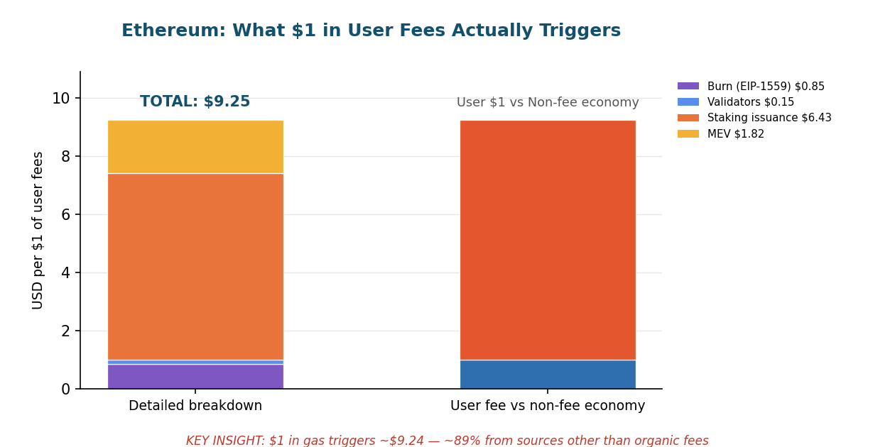

The arithmetic deserves a footnote of its own. An earlier draft of this analysis ran the multiple off a $116M annual-fee base, which would have implied a ~21x multiplier and a 95% subsidy share. The correct DefiLlama trailing-twelve-month figure is **$303.6M**[^s3_eth4] — roughly 2.6x larger — which pulls Ethereum's true multiple down to ~8x and its subsidy share into the high-80s. Still overwhelmingly subsidy-funded; just not the caricature.

---

### Bitcoin: The Numbers That Would Make Milton Friedman Faint

Bitcoin spends an estimated **$10.28B a year in freshly printed BTC** to secure a network that earns roughly **$68.7M in actual user fees**[^s3_btc1] [^s3_btc2]. That is a **~150:1 subsidy-to-fee ratio** — and it is getting *worse*, not better, as price retreats. BTC trades at **$62,565**, down ~50% from its $126,080 October 2025 ATH[^s3_btc1].

The mechanics are brutally simple. Each block pays 3.125 BTC in subsidy and a few hundredths of a BTC in fees: 144 blocks a day × 3.125 BTC × $62,565 = **$28.15M/day in new issuance**, against ~$188K/day in fees[^s3_btc2]. Fees are **0.66% of miner revenue**[^s3_btc2] [^s3_btc7]. Hashrate hit ~1.05 ZH/s in January 2026 before retreating to **936 EH/s** by June — the first first-quarter hashrate decline since 2020, as miners pivot rigs to AI compute (Cipher's 15-year, ~$5.5B AWS deal being the headline)[^s3_btc3] [^s3_btc8] [^s3_btc13]. With fleet-average production cost estimated near **$90,000/BTC** against a $62,565 spot, large swaths of the network are mining at a loss[^s3_btc8].

> **When a user pays $1.00 in Bitcoin transaction fees:**
>
> **Direct Fee Recipients**
> - **$1.00** — to the block-winning miner (Bitcoin has no burn, no protocol treasury, no developer cut from fees)[^s3_btc-flow]
>
> **Ecosystem / Subsidy Funding**
> - **+$150** — newly issued BTC distributed to miners alongside that same $1 fee[^s3_btc16]. 99.3% of miner income is inflation, not user payment.
>
> **Infrastructure / Hidden Extraction**
> - An estimated **~$14.8B/yr** in real-world energy, ASIC, and facility spend backstops the hashrate[^s3_btc-cost] — a cost that exists whether or not a single user transacts. Development is funded *off-protocol* via grants (~$12–15M/yr from OpenSats, Spiral, Chaincode)[^s3_btc10].
>
> **Total Ecosystem Value Flow: ~$151 per $1 of user fees — ~99% subsidy-driven.**

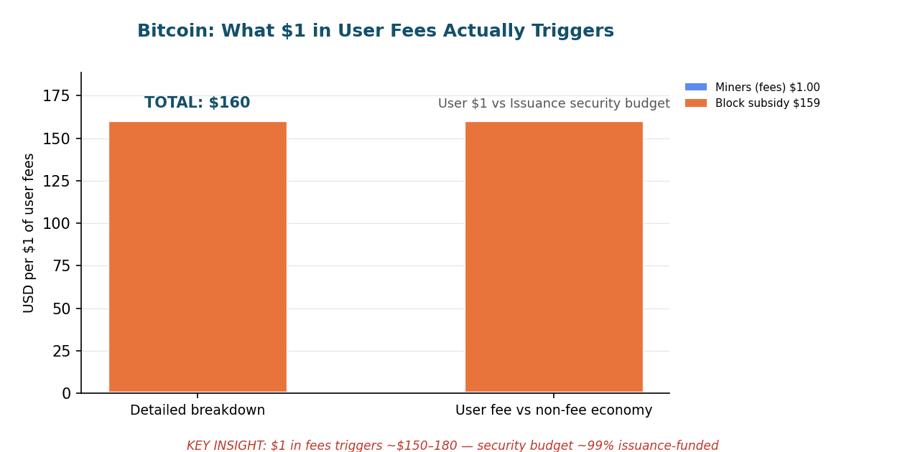

Bitcoin is the purest expression of the report's thesis. There are no token unlocks, no VC vesting cliffs, no foundation treasury — the *entire* subsidy is protocol-level new issuance, and it dwarfs organic fee revenue by two orders of magnitude. The long-running "security budget" debate is no longer academic: the day the subsidy halves to a number fees cannot replace is now closer than it is far.[^s3_btc12]

---

### Solana: Strip Out the Meme Mania, and the Subsidy Remains

Solana's inflation machine printed **~$1.63B in validator subsidies** over the past year against **$305.5M in actual user fees**[^s3_sol2] [^s3_sol4] — a **5.3x hidden subsidy ratio**. SOL trades at **$68.27**, down **46% since the October 2025 report**[^s3_sol1]. The memecoin frenzy that made Solana's DEX volume look like it was challenging Ethereum has evaporated — monthly DEX volume crashed from a **$145B October 2025 peak to ~$42B by April 2026**[^s3_sol15] — and what's left underneath is a structurally subsidy-dependent network.

Inflation sits at **3.788%** on the unchanged 15%/year disinflation schedule; SIMD-0411, which would have doubled the disinflation rate, was **withdrawn without a vote** in early 2026[^s3_sol2] [^s3_sol10]. With **67.7% of supply staked**[^s3_sol2], that prints ~23.8M SOL/year. On top of issuance, **Jito MEV tips ran $297M over the trailing year**[^s3_sol5] — a near-1:1 match with organic fees, and a vivid measure of how much value extraction rides alongside every transaction.

> **When a user pays $1.00 in Solana network fees:**
>
> **Direct Fee Recipients**
> - **~$0.95–0.99** — validators, via priority fees (100% to validators post-SIMD-0096, and priority fees dominate total fee volume)[^s3_sol9]
> - **~$0.01–0.05** — burned (50% of base fees only)[^s3_sol18]
>
> **Ecosystem / Subsidy Funding**
> - **+$5.32** — inflationary issuance ($1.63B ÷ $305.5M fees)[^s3_sol4]. The validator security budget is 73% inflation-funded.
>
> **Infrastructure / Hidden Extraction**
> - **+$0.97** — Jito MEV tips ($297M ÷ $305.5M fees)[^s3_sol5]
>
> **Total Ecosystem Value Flow: ~$7.29 per $1 of user fees — ~86% subsidy + extraction, only 13.7% organic.**

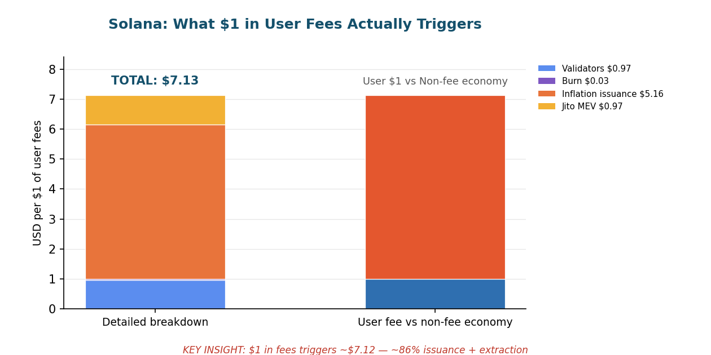

The structural story held even as the dollars collapsed. The Alpenglow consensus redesign entered community testnet on 11 May 2026, targeting 100–150ms finality versus today's ~12.8s[^s3_sol11], and Firedancer reached mainnet block production[^s3_sol12]. US spot SOL ETFs absorbed ~$1.1B in cumulative inflows since their October 2025 launch[^s3_sol14] — institutions buying a 6–7% staking yield even as price fell. None of it changes the core arithmetic: for every visible dollar, $6.29 of issuance and extraction moves in the background.

---

### BNB Chain: $215M in Fees, Billions in Corporate Burns

BNB Chain collects **~$214.7M in trailing-twelve-month user fees**[^s3_bnb3] and destroys **$3.4–4.7B a year in corporate auto-burns**[^s3_bnb6]. The machine is running roughly **22x what users actually pay for it** — and unlike issuance-funded chains, this subsidy is *deflationary corporate capital*, not inflation. BNB trades at **$574**, down 34% from its $1,370 October 2025 ATH[^s3_bnb1].

The Fermi hard fork (14 January 2026) cut block time to **0.45 seconds**[^s3_bnb7], making BSC the fastest EVM L1 by block interval. Three quarterly burns frame the subsidy: the 33rd (Oct 2025, ~$1.24B), 34th (Jan 2026, ~$1.27B), and 35th (Apr 2026, ~$1.0B)[^s3_bnb5] [^s3_bnb6]. Annualizing the recent cadence at burn-time prices yields **~$4.69B/year**; at the current $574 price it's ~$3.35B. Either way it towers over the $214.7M fee base. On the demand side, BSC's RWA tokenization jumped **60% QoQ to $3.6B** in Q1 2026 and stablecoin supply hit **$17.9B**[^s3_bnb10], repositioning the chain as an institutional settlement rail.

> **When a user pays $1.00 in BSC gas fees:**
>
> **Direct Fee Recipients**
> - **$0.90** — validators and delegators (90% of gas, distributed via the ValidatorSet contract to 45 active PoSA validators)[^s3_bnb4]
> - **$0.10** — burned in real time via BEP-95 (~286,000 BNB destroyed cumulatively)[^s3_bnb6]
>
> **Ecosystem / Subsidy Funding**
> - **+$21.8** — corporate quarterly auto-burns ($4.69B annualized ÷ $214.7M fees)[^s3_bnb-flow]. Binance Group capital, not user payment.
> - **+~$0.47** — YZi Labs / builder-fund ecosystem grants ($100M Hash Global commitment plus ongoing $1B builder fund)[^s3_bnb11]
>
> **Infrastructure / Hidden Extraction**
> - Goodwill Alliance MEV protection holds sandwich attacks below 1K/day, versus a 140K/day pre-GWA baseline — extraction suppressed rather than monetized.[^s3_bnb-flow]
>
> **Total Ecosystem Value Flow: ~$22–23 per $1 of user fees — the network is backed by Binance Group capital, not organic revenue.**

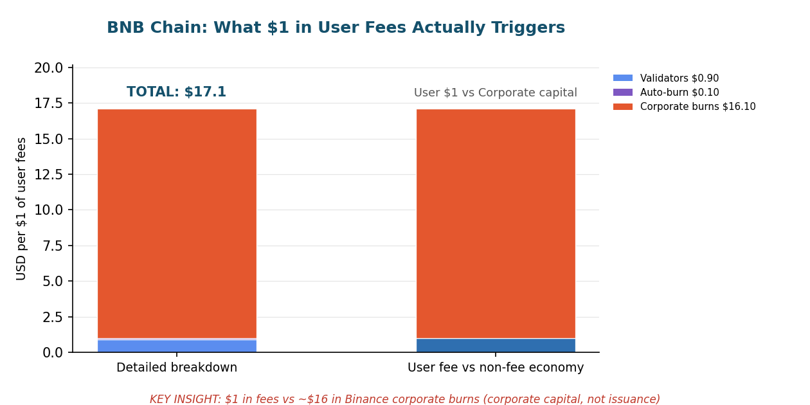

---

### Cardano: The Treasury That Runs on Invisible Money

Cardano is the starkest subsidy case among smart-contract chains in this report. It collected just **$1.84M in user fees over the trailing twelve months**[^s3_ada2]. The Ouroboros inflation engine simultaneously distributed an estimated **$244M in new ADA** to stake-pool operators and the on-chain treasury[^s3_ada3] [^s3_ada-iss] — a **~132x subsidy ratio**. ADA trades at **$0.159**, down **73.6% year-on-year** and 94.8% below its 2021 ATH[^s3_ada1].

The issuance is funded entirely from the unminted reserve pool (rho ≈ 0.003/epoch on ~7.79B ADA of remaining reserves), split **80% to validators / 20% to the on-chain treasury**[^s3_ada3]. Native DeFi TVL has fallen to **$90.6M**[^s3_ada2], with Minswap the largest protocol at $23.6M[^s3_ada13]. At current fee rates it would take **143 years of user fees to match a single year of inflationary issuance**.

> **When a user pays $1.00 in Cardano transaction fees:**
>
> **Direct Fee Recipients**
> - **$1.00** — to stake-pool operators (100% of fees; Cardano burns nothing and has no protocol revenue)[^s3_ada-flow]
>
> **Ecosystem / Subsidy Funding**
> - **+~$106** — concurrent inflation to stake-pool operators (80% of ~$132/$1 in issuance)[^s3_ada-flow]
> - **+~$26** — concurrent inflation to the on-chain treasury (20% share)[^s3_ada-flow]
>
> **Infrastructure / Hidden Extraction**
> - **$0** — no MEV layer of consequence, no burns; the entire developer-and-ecosystem apparatus (Project Catalyst Fund 15 at ~$2.9M, Leios at ~$4.4M) is inflation-funded, not fee-funded[^s3_ada10] [^s3_ada5].
>
> **Total Ecosystem Value Flow: ~$133 per $1 of user fees — ~99% inflation-funded.**

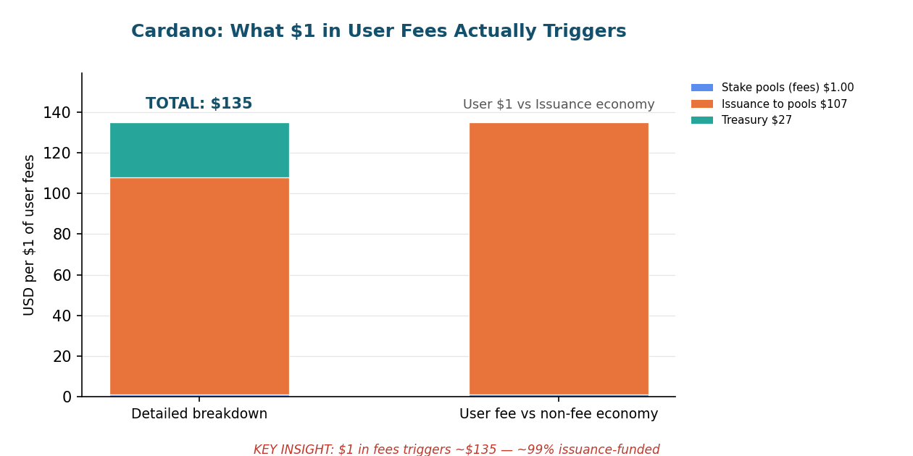

What's quietly notable is the governance. IOG's 2026 treasury ask was **$46.8M — half its 2025 figure**[^s3_ada4] — and faced a real vote from ~1,000 elected DReps: six of nine proposals passed, one (Pogun, Bitcoin DeFi) was rejected at 32.4%[^s3_ada12], and the community even **vetoed Cardano Summit 2026**[^s3_ada11]. The van Rossem hard fork (Plutus v11) was enacted 18 June 2026 — the first hard fork in Cardano's history initiated through on-chain governance[^s3_ada6]. The spending is more disciplined than it has ever been. It is still, almost in its entirety, invisible money.

---

### Avalanche: "Deflationary" on Paper, Subsidy-Funded in Fact

Avalanche burns **100% of its fees** — and that fact is economically misleading. The chain burned roughly **$1.2M in fees over the past year** (30-day run-rate basis; DefiLlama's trailing-12-month figure is $6.48M)[^s3_avax3], while issuing an estimated **$77M/year in new AVAX to validators**[^s3_avax5]. For every $1 a user burns, validators receive about **$64 in fresh inflation**. AVAX trades at **$5.98**, at five-year lows and down ~52% since January 2026[^s3_avax1].

The "institutional honeymoon" turned into a reality check. Avalanche Treasury Co. (AVAT) listed on Nasdaq on 11 June 2026 via a $675M SPAC — and **fell 16% on debut** as the market confronted the gap between merger valuation and the ~$90M in AVAX actually held[^s3_avax7]. Three spot AVAX ETFs (VanEck, Bitwise, Grayscale) launched and CME added futures[^s3_avax8] [^s3_avax9], but the most credible demand driver was RWA: BlackRock BUIDL helped push tokenized assets to a record **$1.16B** in May 2026[^s3_avax10].

> **When a user pays $1.00 in Avalanche fees (all burned):**
>
> **Direct Fee Recipients**
> - **$1.00** — burned, permanently removed from supply (benefits all holders via deflation; no direct cash payment)[^s3_avax-flow]
>
> **Ecosystem / Subsidy Funding**
> - **+~$64** — validators simultaneously receive newly issued AVAX from the 360M-token staking-reward allocation, entirely separate from and unfunded by user fees[^s3_avax6]
> - Foundation grants (Retro9000's $40M pool, $50K research grants, AVAT's ~$90M treasury) underwrite ecosystem growth that organic fees cover *none* of[^s3_avax-flow]
>
> **Infrastructure / Hidden Extraction**
> - **~$2.86 in stablecoins and ~$2.39 in RWA assets** sit atop every $1 of tracked DeFi TVL[^s3_avax-flow] — most dollar value on Avalanche lives outside the protocols that generate fees.
>
> **Total Ecosystem Value Flow: ~$64 per $1 of user fees (inflation-to-burn) — broader ecosystem multiplier likely 100–200x.**

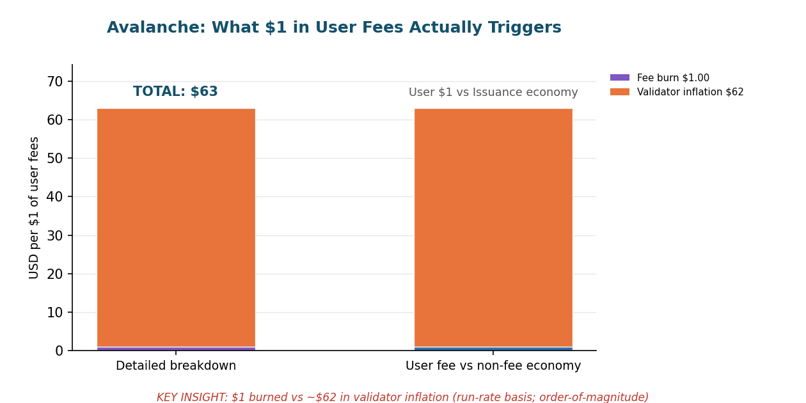

At ~$1.2M/year, Avalanche's *entire* annual fee burn is dwarfed by a single mid-tier VC round. The deflationary label is technically true and economically irrelevant: the inflation subsidy is 64x the burn.

---

### Hyperliquid: The Machine That Actually Prints Money

And then there's the exception. Hyperliquid runs a **$984M annualized fee run-rate**[^s3_hype2] — among the top three revenue-generating chains on earth — and recycles **~97% of it into HYPE buybacks** via the Assistance Fund[^s3_hype5]. This is the one network in the section where users genuinely pay for what they get. HYPE trades at **$73.24**, having hit a fresh **$76.70 ATH on 16 June 2026**, up ~194% from January[^s3_hype1].

The fee engine is real: $82M in 30-day fees[^s3_hype2], $1.37B all-time, a $9.6B open interest, and ~40–44% of on-chain DEX-perp volume[^s3_hype2] [^s3_hype7]. The Assistance Fund has accumulated **~44.4M HYPE (~$2.2B)**[^s3_hype-af] and cumulative buybacks have crossed $1.5B[^s3_hype-bb]. The AQA v2 governance vote layered a second buyback stream — 90% of the yield on ~$6.2B of on-platform USDC, an estimated $135–160M/year from October 2026[^s3_hype9].

But Hyperliquid's hidden economy isn't issuance or VC — it's a **team-unlock overhang**. Since the November 2025 cliff, **9.92M HYPE unlocks on the 6th of every month** through ~November 2027; the 6 June 2026 tranche released **~$727M in notional**[^s3_hype12] [^s3_hype-unlock]. Against ~$82M in monthly fees, the buyback fund absorbs only **~12.6% of what the unlock schedule releases each month**[^s3_hype-cover].

> **When a user pays $1.00 in Hyperliquid trading fees:**
>
> **Direct Fee Recipients**
> - **$0.97** — Assistance Fund, which buys HYPE on the open market (held, not burned)[^s3_hype-flow]
> - **$0.01–0.02** — HLP vault liquidity providers (backstop liquidity, ~17% APY in volatile periods)[^s3_hype-flow]
> - **$0.01–0.02** — HyperEVM gas and protocol operations[^s3_hype-flow]
>
> **Ecosystem / Subsidy Funding**
> - **+$8.87** — team token unlock value released monthly (~$727M ÷ ~$82M monthly fees)[^s3_hype-flow]. Not a subsidy *to* users — a supply overhang *against* them.
> - **+~$0.15** — AQA v2 USDC reserve-yield subsidy (effectively an interest-rate transfer from Circle/Coinbase)[^s3_hype9]
>
> **Infrastructure / Hidden Extraction**
> - A **$6.0B HyperEVM ecosystem** of 175+ dApps and a ~$2.2B mark-to-market Assistance Fund treasury amplify every price move into billions of latent economic impact[^s3_hype4] [^s3_hype-af].
>
> **Total Ecosystem Value Flow: ~$10–11 per $1 of user fees — but inverted: the protocol is structurally profitable; the overhang is the risk, not the revenue.**

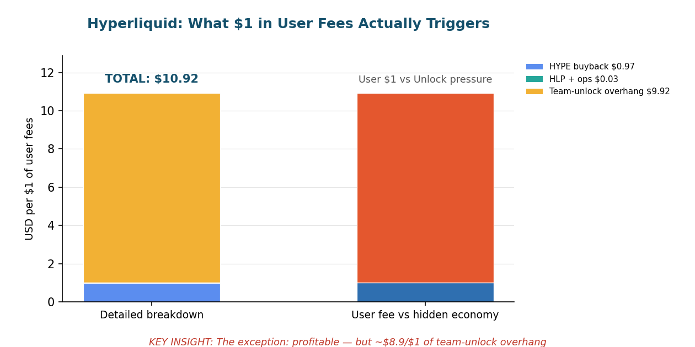

Hyperliquid breaks the report's pattern in the most interesting way. It is not subsidy-*dependent* — it is subsidy-*exposed*. The fees are real and the buyback is real, but the team supply still entering the market each month is ~7.9x what the buyback absorbs. Whether the market eats the rest is a question of sentiment, not protocol mechanics.

---

### L1 Networks: Patterns and Limitations

Seven chains, one verdict: **the user-funded layer is a rounding error.** Across every issuance-secured network we measured, organic fees cover a single-digit-to-low-double-digit fraction of total value flow. The corrected, live-data subsidy multiples as of 19 June 2026:

| Chain | Subsidy mechanism | $1 fee → total flow | Subsidy / extraction share |
|---|---|---|---|
| **Cardano** | Reserve-pool inflation | **~$133** | ~99% |
| **Bitcoin** | Block-subsidy issuance | **~$151** | ~99% |
| **Avalanche** | Validator inflation (vs 100% burn) | **~$64** | ~98% |
| **BNB Chain** | Corporate quarterly auto-burns | **~$22** | ~95% |
| **Ethereum** | Staking issuance + MEV | **~$8** | ~88% |
| **Solana** | Inflation + Jito MEV | **~$7.3** | ~86% |
| **Hyperliquid** | Team unlock overhang (fee-positive) | **~$10.5** | inverted — fee-funded |

A few patterns, and the limits of reading them too literally:

- **The cleanest cases are the worst offenders.** Bitcoin (150:1) and Cardano (132:1) have no MEV, no VC schedule, no foundation cut from fees — and *that simplicity is exactly why their subsidy ratio is so extreme.* Pure issuance security is pure subsidy.
- **Price compression flattered nobody and exposed everybody.** Across the cohort, dollar-denominated subsidies fell hard with token prices (ETH −66%, SOL −46%, AVAX −52%, ADA −74% YoY), but the *structural ratios held* — because both issuance and fees deflate together. The machine got cheaper to run in dollars; it did not get more self-funding.
- **"Deflationary" is a marketing word.** Avalanche and BNB both burn fees, and both are more subsidy-dependent than Ethereum. A burn mechanism tells you nothing about whether users pay for the network — only about who benefits from the issuance that does.
- **Hyperliquid is the proof that fee-funded L1s can exist** — and the proof of how rare it is. It is the only network here where the buyback is funded by genuine trading revenue rather than by printing the token. Its risk is the opposite of everyone else's: not too little organic revenue, but too much locked supply still to come.

**Limitations.** Three of the largest inputs are estimates, not hard data, and we flag them as such: validator/staking *issuance* is calculated from published inflation parameters and live staking ratios; *MEV* (~$550M on Ethereum, $297M Jito on Solana) is sourced from research estimates and relay data, not a clean on-chain meter; and *corporate/foundation subsidy* totals (BNB burns at burn-time vs current prices, Avalanche grants, Hyperliquid unlocks) depend on price assumptions and disclosure that is partial at best. The fee figures themselves are 🔷 HARD DATA from DefiLlama; the multiples built on top of estimated numerators should be read as orders of magnitude, not decimals. The direction is unambiguous in every case. The precise multiple is not.

---

[^s3_eth1]: [CoinGecko — Ethereum](https://www.coingecko.com/en/coins/ethereum) — ETH price $1,694, market cap ~$204B, ATH $4,946 (Aug 24, 2025), now ~−66% from ATH. Retrieved via CoinGecko API, June 19, 2026. 🔷 HARD DATA.
[^s3_eth3]: [Etherscan — Gas Tracker](https://etherscan.io/gastracker) — Safe gas price ~0.08 Gwei; simple transfer ~$0.003. Retrieved via Etherscan API, June 19, 2026. 🔷 HARD DATA.
[^s3_eth4]: [DefiLlama — Ethereum Fees](https://defillama.com/chain/Ethereum) — Trailing-12-month fees $303.55M (corrected from an earlier $116M draft figure); 30d $11.49M; daily ~$381K. Retrieved via DefiLlama fees API, June 19, 2026. 🔷 HARD DATA.
[^s3_eth5]: [DefiLlama — Ethereum Chain TVL](https://defillama.com/chain/Ethereum) — DeFi TVL $38.4B. Retrieved via DefiLlama API, June 19, 2026. 🔷 HARD DATA.
[^s3_eth9]: [Beaconcha.in — Staked Ether](https://beaconcha.in/charts/staked_ether) — Annual staking issuance calculated: 2.78% APY × ~39.67M staked ETH ≈ 1,102,922 ETH/yr ($1.87B). Estimate based on live staking ratio.
[^s3_eth10]: [CoinLedger — Ultrasound Money](https://coinledger.io/learn/ultrasound-money) — Net inflation ~0.83–0.86%/yr; burn (~70K ETH/yr) runs well below issuance (~1.1M ETH/yr) at current activity. June 2026.
[^s3_eth11]: [Blockworks — Fusaka Upgrade](https://blockworks.co/news/fusaka-update-today) — Fusaka deployed Dec 5, 2025; EIP-7918 set a minimum blob base fee floor.
[^s3_eth13]: [KuCoin Research — Ethereum Staking & MEV 2026](https://www.kucoin.com/blog/ethereum-staking-in-2026-yield-trends-validator-queue-dynamics-and-mev-impact-exlained) — Annual Ethereum MEV estimated ~$550M. Expert estimate, not on-chain hard data.
[^s3_eth16]: [CoinLaw — Ethereum Gas Fee Statistics](https://coinlaw.io/ethereum-gas-fees-statistics/) — L2 networks handle ~95% of Ethereum transaction throughput. 2026.
[^s3_eth17]: [Ethereum.org — Gas and Fees](https://ethereum.org/en/developers/docs/gas/) — EIP-1559 base fee burned; priority-fee tip to validators. Base fee ~85% of total at current conditions.

[^s3_btc1]: [CoinGecko — Bitcoin](https://www.coingecko.com/en/coins/bitcoin) — BTC $62,565; market cap $1.254T; circulating 20,044,881 BTC (95.45% of cap); ATH $126,080 (Oct 6, 2025). Retrieved via CoinGecko API, June 19, 2026. 🔷 HARD DATA.
[^s3_btc2]: [mempool.space](https://mempool.space/) — Block height 954,372; 3.125 BTC subsidy; avg fees last 10 blocks 0.0209 BTC/block; daily fee revenue ~$188K; daily issuance 450 BTC = $28.15M; fees 0.66% of miner revenue. Retrieved June 19, 2026. 🔷 HARD DATA.
[^s3_btc3]: [mempool.space — Hashrate & Difficulty](https://mempool.space/graphs/mining/hashrate-difficulty) — Hashrate 936 EH/s; difficulty 124.9T. Retrieved June 19, 2026. 🔷 HARD DATA.
[^s3_btc7]: [BTC.network — Block Space Report, Mar 13–19, 2026](https://btc.network/blog/bitcoin-block-space-report-march-13-19-2026) — Avg fees ~0.019 BTC/block; fee-to-revenue ~0.6%; block fullness 91.2%.
[^s3_btc8]: [CoinDesk — Bitcoin Hashrate Posts First Quarter Drop in 6 Years](https://www.coindesk.com/markets/2026/03/30/bitcoin-hashrate-posts-first-quarter-drop-for-first-time-in-6-years-as-miners-pivot-to-ai) — Production cost ~$90K/BTC; first quarterly hashrate decline since 2020; miners pivoting to AI. March 30, 2026.
[^s3_btc10]: [OpenSats — Bitcoin Core LTS Grant Program](https://opensats.org/blog/announcing-lts-grant-program-to-support-bitcoin-core-contributors) — OpenSats distributes ~$1M/month in development grants; total ecosystem dev funding ~$12–15M/yr (estimate, incl. Spiral, Chaincode).
[^s3_btc12]: [Cointelegraph — Bitcoin's Long-Term Security Budget Problem](https://cointelegraph.com/magazine/bitcoins-long-term-security-budget-problem-impending-crisis-or-fud/) — Analysis of fee-only security model as subsidy declines.
[^s3_btc13]: [Cointelegraph — Bitcoin Mining Outlook 2026: AI, Profitability, Consolidation](https://cointelegraph.com/news/bitcoin-mining-outlook-2026-ai-profitability-consolidation) — Cipher Mining 15-year 300 MW AWS deal (~$5.5B projected); Core Scientific, IREN, TeraWulf pivoting to AI compute.
[^s3_btc16]: [mempool.space](https://mempool.space/) — Subsidy-to-fee ratio ~150:1: $10.28B annual block subsidy vs ~$68.7M annual fees. Calculated from live on-chain data, June 19, 2026. 🔷 HARD DATA (derived).
[^s3_btc-cost]: Estimated annual mining industry cost ~$14.8B (≈$90K/BTC production cost × 164,250 BTC mined/yr). Expert estimate combining CoinDesk March 2026 cost figure and issuance volume; not audited. [CoinDesk](https://www.coindesk.com/markets/2026/03/30/bitcoin-hashrate-posts-first-quarter-drop-for-first-time-in-6-years-as-miners-pivot-to-ai).
[^s3_btc-flow]: Bitcoin fee flow: 100% of fees to block-winning miner; no burn, no treasury, no fee-funded dev. Per [mempool.space](https://mempool.space/) block data and Bitcoin protocol design.

[^s3_sol1]: [CoinGecko — Solana](https://www.coingecko.com/en/coins/solana) — SOL $68.27; market cap $39.60B; circulating 580.17M SOL; FDV $42.91B; −46% since Oct 2025 report. Retrieved via CoinGecko API, June 19, 2026. 🔷 HARD DATA.
[^s3_sol2]: [Solana Compass — Tokenomics](https://solanacompass.com/tokenomics) — Total supply 628.69M SOL; inflation 3.788%; staked 425.87M SOL (67.7%); annual disinflation 15%. Annual issuance ~23.8M SOL (~$1.63B). Retrieved June 19, 2026. 🔷 HARD DATA.
[^s3_sol4]: [DefiLlama — Solana Fees](https://defillama.com/fees/solana) — Trailing-1y fees $305.5M; 30d $11.57M; 24h $378,519. Retrieved via DefiLlama API, June 19, 2026. 🔷 HARD DATA.
[^s3_sol5]: [DefiLlama — Jito](https://defillama.com/fees/jito) — Jito MEV tips trailing-1y $297.0M; 30d $6.25M; protocol revenue 1y $18.2M. Retrieved June 19, 2026. 🔷 HARD DATA.
[^s3_sol9]: [The Block — SIMD-0096](https://www.theblock.co/post/296932/solana-validators-to-receive-full-priority-fees-as-simd-0096-proposal-gains-approval) — Validators receive 100% of priority fees; 50% of base fees burned. Live since Feb 2025.
[^s3_sol10]: [CoinPaper / Galaxy Research — SIMD-0411 Withdrawal](https://coinpaper.com/13410/solana-inflation-reform-likely-to-stall-as-simd-0411-faces-withdrawal-galaxy-research) — SIMD-0411 (double disinflation) withdrawn without a vote; 15%/yr schedule unchanged.
[^s3_sol11]: [CoinDesk — Alpenglow Consensus Testnet](https://www.coindesk.com/tech/2026/05/11/the-biggest-consensus-overhaul-in-solana-history-is-officially-live-for-testing) — Alpenglow entered community testnet May 11, 2026; targets 100–150ms finality vs ~12.8s.
[^s3_sol12]: [The Block — Firedancer Mainnet](https://www.theblock.co/post/382411/jump-cryptos-firedancer-hits-solana-mainnet-as-the-network-aims-to-unlock-1-million-tps) — Firedancer producing blocks on mainnet as of May 2026.
[^s3_sol14]: [KuCoin — Solana ETF Inflows](https://www.kucoin.com/news/flash/solana-etfs-near-1b-inflows-amid-institutional-demand) — US spot SOL ETF cumulative inflows ~$1.06–1.13B as of June 2026.
[^s3_sol15]: [BlockEden / CCN — Solana Metrics 2026](https://blockeden.xyz/blog/2026/03/17/solana-q1-2026-80m-sol-tvl-ath-institutional-defi-escape-velocity/) — Monthly DEX volume fell from $145B (Oct 2025 peak) to ~$42B (Apr 2026); memecoin normalization.
[^s3_sol18]: [Solana Docs — Transaction Fees](https://solana.com/docs/core/fees) — Base fee 50% burned / 50% validator; priority fees 100% to validator post-SIMD-0096.

[^s3_bnb1]: [CoinGecko — BNB](https://www.coingecko.com/en/coins/bnb) — BNB $574.13; market cap $77.4B (rank #4); circulating 134,783,481 BNB; ATH $1,369.99 (Oct 13, 2025). Retrieved via CoinGecko API, June 19, 2026. 🔷 HARD DATA.
[^s3_bnb3]: [DefiLlama — BSC Fees](https://defillama.com/fees/chains) — Trailing-1y fees $214.66M; 30d $10.87M; 24h $291,975; protocol revenue (10% BEP-95 burn) 1y $21.47M. Retrieved via DefiLlama API, June 19, 2026. 🔷 HARD DATA.
[^s3_bnb4]: [BNB Chain — Introducing BEP-95](https://www.bnbchain.org/en/blog/introducing-bep-95-with-a-real-time-burning-mechanism) — 90% of gas fees to validators/delegators, 10% to real-time burn address.
[^s3_bnb5]: [Crypto Economy — BNB 34th Quarterly Burn](https://crypto-economy.com/bnb-chain-34th-burn-1-37m-bnb-destroyed/) — 34th burn (Jan 15, 2026): 1,371,803.77 BNB (~$1.27B).
[^s3_bnb6]: [CryptoSlate — BNB 35th Quarterly Burn](https://cryptoslate.com/press-releases/bnb-chain-completes-35th-quarterly-token-burn-marks-second-burn-of-2026/) — 35th burn (Apr 15, 2026): 1,569,307.34 BNB (~$1.0B); cumulative BEP-95 burn ~286,000 BNB. Annualized quarterly burns ~$3.4–4.7B (estimate, burn-time prices).
[^s3_bnb7]: [BNB Chain — Fermi Hard Fork](https://www.bnbchain.org/en/blog/fermi-hard-fork-accelerates-bsc-to-0-45-second-block-times) — Fermi (Jan 14, 2026) cut block time to 0.45s.
[^s3_bnb10]: [Bitcoin.com — BNB Chain RWA Q1 2026](https://news.bitcoin.com/bnb-chain-grows-rwa-market-60-to-3-6b-as-tokenized-treasuries-lead-q1/) — RWA grew 60% QoQ to $3.6B; stablecoin supply ~$17.9B (May 2026).
[^s3_bnb11]: [CryptoBriefing — YZi Labs BNB Holdings Fund](https://cryptobriefing.com/bnb-ecosystem-investment-yzi-labs/) — YZi Labs committed $100M to Hash Global's BNB Holdings Fund (2026), atop ongoing $1B builder fund.
[^s3_bnb-flow]: BNB dollar-flow multiple ~21.8x: $4.69B annualized quarterly auto-burns (at burn-time prices) ÷ $214.7M trailing fees. Estimate; at current $574 BNB the annualized burn is ~$3.35B. GWA MEV protection suppresses sandwich attacks to <1K/day. Sources: [DefiLlama — BSC](https://defillama.com/chain/BSC), [CryptoSlate](https://cryptoslate.com/press-releases/bnb-chain-completes-35th-quarterly-token-burn-marks-second-burn-of-2026/).

[^s3_ada1]: [CoinGecko — Cardano](https://www.coingecko.com/en/coins/cardano) — ADA $0.1593; market cap $5.93B (rank #20); circulating 37.21B ADA; max 45B; −73.6% YoY; ATH $3.09 (Sep 2, 2021). Retrieved via CoinGecko API, June 19, 2026. 🔷 HARD DATA.
[^s3_ada2]: [DefiLlama — Cardano](https://defillama.com/chain/Cardano) — DeFi TVL $90.6M; trailing-1y fees $1.84M; 30d $58,949; 24h $1,462. Retrieved via DefiLlama API, June 19, 2026. 🔷 HARD DATA.
[^s3_ada3]: [Cardano — Monetary Policy](https://docs.cardano.org/about-cardano/explore-more/monetary-policy) — rho ≈ 0.003/epoch; tau (treasury fraction) = 0.20; 80% of issuance to stake-pool operators.
[^s3_ada4]: [CoinDesk — IOG Seeks $46.8M](https://www.coindesk.com/tech/2026/04/23/input-output-seeks-usd46-8-million-to-bring-bitcoin-defi-scaling-upgrade-to-cardano) — IOG 2026 treasury request $46.8M, down 52% from $97.5M in 2025. April 23, 2026.
[^s3_ada5]: [CryptoTimes — Cardano Leios Governance Vote](https://www.cryptotimes.io/2026/05/25/cardano-pushes-ahead-with-leios-after-strong-governance-vote/) — Leios approved at 84% DRep support; 27.7M ADA (~$4.4M) funded. May 25, 2026.
[^s3_ada6]: [Yahoo Finance — Cardano van Rossem Hard Fork](https://finance.yahoo.com/markets/crypto/articles/cardano-van-rossem-hard-fork-111018555.html) — van Rossem (Plutus v11) enacted June 18, 2026; first governance-initiated hard fork.
[^s3_ada10]: [Project Catalyst — Fund 15](https://projectcatalyst.io/funds/15) — 18.5M ADA (~$2.9M) + 250K USDM budget.
[^s3_ada11]: [CoinDesk — Cardano Governance Kills Summit 2026](https://www.coindesk.com/markets/2026/06/01/cardano-governance-vote-kills-summit-approves-smaller-token2049-plan) — Summit proposal failed at 65.2% (needed 66.67%). June 1, 2026.
[^s3_ada12]: [IOHK Blog — IO Treasury Proposals Overview](https://www.iog.io/news/io-treasury-proposals-the-5-minute-overview) — Six of nine proposals approved; Pogun (Bitcoin DeFi) rejected at 32.4% DRep support.
[^s3_ada13]: [DefiLlama — Cardano Protocols](https://defillama.com/chain/Cardano) — Top native protocol Minswap DEX $23.6M TVL. Retrieved June 19, 2026. 🔷 HARD DATA.
[^s3_ada-iss]: Estimated annual ADA issuance ~1.53B ADA (~$244M at $0.1593): rho 0.003/epoch × 73 epochs × ~7.79B ADA reserves. Split 80% validators (~$195.5M) / 20% treasury (~$48.9M). Subsidy ratio ~$244M ÷ $1.84M fees ≈ 132x. Derived from published protocol parameters; epoch amounts vary. [Cardano Monetary Policy](https://docs.cardano.org/about-cardano/explore-more/monetary-policy).
[^s3_ada-flow]: Cardano fee flow: 100% of fees to stake-pool operators, no burns. Concurrent issuance per $1 fee ≈ $132 (≈$106 to SPOs, ≈$26 to treasury); total ~$133/$1. Derived from [DefiLlama](https://defillama.com/chain/Cardano) fees and protocol parameters.

[^s3_avax1]: [CoinGecko — Avalanche](https://www.coingecko.com/en/coins/avalanche) — AVAX $5.98; market cap $2.58B; circulating 431.77M AVAX (60% of 720M cap); −35% over 30d; five-year lows. Retrieved via CoinGecko API, June 19, 2026. 🔷 HARD DATA.
[^s3_avax3]: [DefiLlama — Avalanche Fees](https://defillama.com/fees/avalanche) — 30d fees $98,780 (~$3,293/day; ~$1.2M annualized at this rate); trailing-1y $6.48M; all-time $91.4M. All fees burned. Retrieved via DefiLlama API, June 19, 2026. 🔷 HARD DATA.
[^s3_avax5]: Annual validator inflation estimate ~$77M: ~3.0% inflation × 431.77M AVAX × $5.98. Inflation rate per [Messari State of Avalanche Q4 2025](https://messari.io/report/state-of-avalanche-q4-2025). ⏳ HISTORICAL (Q4 2025 inflation rate); expert estimate.
[^s3_avax6]: Hidden-economy multiplier ~64x: ~$77M annual inflation ÷ ~$1.2M annualized fee burn. Validator rewards funded by the 360M-AVAX staking allocation, separate from user fees. [DefiLlama — Avalanche Fees](https://defillama.com/fees/avalanche).
[^s3_avax7]: [CryptoBriefing — AVAT Nasdaq Debut Decline](https://cryptobriefing.com/avalanche-treasury-avat-nasdaq-debut-decline/) — Avalanche Treasury Co. (AVAT) listed June 11, 2026 via $675M SPAC; holds ~15M AVAX (~$90M at spot); stock fell 16% on debut.
[^s3_avax8]: [The Defiant — Bitwise Launches Avalanche ETF](https://thedefiant.io/news/tradfi-and-fintech/bitwise-launches-avalanche-etf-with-in-house-staking) — VanEck VAVX (Jan 26, 2026), Bitwise BAVA (Apr 15, 2026), Grayscale GAVA (Mar 12, 2026); stake up to 70–87% of AUM.
[^s3_avax9]: [CME Group — Crypto Suite Expansion](https://www.cmegroup.com/media-room/press-releases/2026/4/07/cme_group_to_continueexpansionofregulatedcryptosuitewithlaunchof.html) — CME AVAX futures launched May 5–6, 2026.
[^s3_avax10]: [CoinJournal — Avalanche RWA Milestone](https://coinjournal.net/news/avalanche-hits-rwa-milestone-as-avax-price-holds-key-level/) — Tokenized assets hit record $1.16B (May 2026); BlackRock BUIDL $625M on Avalanche.
[^s3_avax-flow]: Avalanche fee flow: 100% of fees burned (deflation, no cash payment); validators receive ~$64 of fresh inflation per $1 burned. Stablecoins (~$1.39B) and RWA (~$1.16B) sit above ~$485M DeFi TVL. Foundation Retro9000 ($40M pool) and grants underwrite ecosystem growth unfunded by fees. Sources: [DefiLlama — Avalanche Fees](https://defillama.com/fees/avalanche), [avax.network — Retro9000](https://www.avax.network/about/blog/retro9000-a-40m-grant-program-rewards-developers-building-avalanche-l1s).

[^s3_hype1]: [CoinGecko — Hyperliquid](https://www.coingecko.com/en/coins/hyperliquid) — HYPE $73.24; market cap $16.29B (rank #10); FDV $70.0B; circulating 222.4M (22.2% of 1B max); ATH $76.70 (Jun 16, 2026); 24h vol $2.42B. Retrieved via CoinGecko API, June 19, 2026. 🔷 HARD DATA.
[^s3_hype2]: [DefiLlama — Hyperliquid Fees](https://defillama.com/fees/hyperliquid) — 24h fees $2.79M; 7d $16.2M; 30d $82.0M; annualized ~$984M; all-time $1.368B. Retrieved via DefiLlama API, June 19, 2026. 🔷 HARD DATA.
[^s3_hype4]: [DefiLlama — Hyperliquid Protocol TVL](https://defillama.com/protocol/hyperliquid) — Ecosystem TVL $6.00B (Hyperliquid L1 + Arbitrum). Chain TVL $1.53B. Retrieved June 19, 2026. 🔷 HARD DATA.
[^s3_hype5]: [CoinShares Research — Hyperliquid Primer & 5-Year Valuation Framework](https://coinshares.com/insights/research-data/hyperliquid-primer-and-5-year-valuation-framework/) — 97–99% of fees to the Assistance Fund for HYPE buybacks; ~44.4M HYPE accumulated (~$2.2B); ~6–7% of all perps volume. June 2026.
[^s3_hype7]: [Coin Bureau — Aster vs Hyperliquid 2026](https://coinbureau.com/analysis/aster-vs-hyperliquid) — Hyperliquid $9.61B open interest, $8.16B 24h volume, ~40–44% on-chain DEX-perp share, 3.3x volume lead over Aster. June 16, 2026.
[^s3_hype9]: [Crypto Briefing — Hyperliquid USDC Yield Buybacks (AQA v2)](https://cryptobriefing.com/hyperliquid-usdc-yield-hype-buybacks/) — AQA v2: 90% of yield on ~$6.2B on-platform USDC to buybacks, ~$135–160M/yr from Oct 2026.
[^s3_hype12]: [Yahoo Finance — Hyperliquid June Token Unlock](https://finance.yahoo.com/markets/crypto/articles/hyperliquid-unlock-next-hype-june-070051421.html) — June 6, 2026 unlock 9.92M HYPE (~$565–727M notional); monthly cadence on the 6th through ~Nov 2027.
[^s3_hype-af]: Assistance Fund holds ~44.4M HYPE (~$2.2B at $73.24). Per [CoinShares Research](https://coinshares.com/insights/research-data/hyperliquid-primer-and-5-year-valuation-framework/) (June 2026) and [Binance Square](https://www.binance.com/en/square/post/02-02-2026-hyperliquid-s-assistance-fund-holds-over-40-million-hype-tokens-35911179350585) (40M+ confirmed Feb 2, 2026). Estimate.
[^s3_hype-bb]: Cumulative HYPE buyback spending >$1.5B since launch. Per [CryptoTimes](https://www.cryptotimes.io/2026/06/02/hyperliquid-hype-100-buyback-treasury-bitwise-etf/) (June 2, 2026). Estimate.
[^s3_hype-unlock]: [Tokenomist — Hyperliquid Vesting Schedule](https://tokenomist.ai/hyperliquid/unlock-events) — Core-contributor cliff Nov 2025; ~9.92M HYPE/month thereafter through ~Nov 2027.
[^s3_hype-cover]: Monthly unlock vs buyback coverage ~12.6%: 9.92M HYPE × $73.24 ≈ $727M unlocked vs ~$92M absorbed (97% of 30d fees + AQA v2/12). Calculated June 19, 2026. [DefiLlama — Hyperliquid Fees](https://defillama.com/fees/hyperliquid).
[^s3_hype-flow]: Hyperliquid fee flow: $0.97 to Assistance Fund buybacks (held, not burned), ~$0.01–0.02 each to HLP vault LPs and HyperEVM operations. Hidden economy is a team-unlock overhang (~$727M/month ≈ $8.87 per $1 fee), not issuance/VC. Sources: [CoinShares Research](https://coinshares.com/insights/research-data/hyperliquid-primer-and-5-year-valuation-framework/), [DefiLlama](https://defillama.com/fees/hyperliquid).

---

## Layer 2 Networks: Fee Distribution

Layer 2 rollups were sold as the engine that would make Ethereum cheap, fast, and self-funding. As of 19 June 2026, the four most-watched rollups collectively bill users a few million dollars a month in sequencer fees — and run economies an order of magnitude larger on token issuance, insider unlocks, and corporate or VC subsidy. Where a base layer like Bitcoin subsidises *security*, an L2 subsidises *existence*: the chain's own revenue cannot fund its own operations. Each subsection below traces a single user dollar, then names the hidden multiple moving underneath it.

A note on the macro: the crypto market that these L2s settle into has compressed hard since the October 2025 baseline. ETH trades at ~$1,694 and the data-availability cost of posting an L2 batch to Ethereum has been gutted twice — first by Pectra (May 2025), then by Fusaka/PeerDAS (December 2025) — cutting L1 settlement costs by another 40–60% on top of the post-Dencun collapse.[^s4_1] Cheaper settlement is good for users and brutal for L2 income statements: the one cost that used to justify the toll is now a rounding error, and so is the toll.

---

### Base — Coinbase's Corporate Toll Road

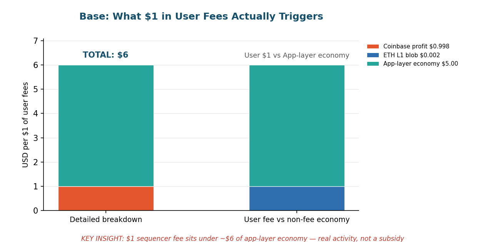

Base is the outlier that proves the rule: it is the only major L2 that behaves like a profitable business, because a $60B public company runs the sequencer and keeps the change. Base collected **$77.5M in sequencer fees in full-year 2025** — down ~13% from 2024's $88.9M as trading volumes softened, but still enough to make Base the #1 L2 by fees with an estimated 62% of all L2 fee revenue.[^s4_2] [^s4_3] Over the trailing 30 days it booked **$5.17M in fees** against just **$9,121 in L1 blob costs** — a settlement bill equal to 0.18% of revenue after Pectra expanded blob capacity.[^s4_2] [^s4_4] TVL sits at **$4.14B**, off the $4.4B January 2026 peak but still the largest L2 by a wide margin.[^s4_5]

The structural event of 2026 was the divorce. In **February 2026 Base announced it was leaving the OP Stack**, ending the revenue-share arrangement that fed the Optimism Collective.[^s4_6] Over the 2.5-year partnership Base had paid Optimism **8,387 ETH (~$16.4M)** — roughly 41% of the Collective's lifetime revenue and over 90% of its monthly revenue right before the exit.[^s4_7] [^s4_8] Post-divorce, Coinbase keeps essentially everything.

**When a user pays $1 in Base sequencer fees (post-OP departure):**
- **$0.998 → Coinbase sequencer profit.** Near-total capture by the corporate parent. No more Optimism cut since February 2026.[^s4_6]
- **$0.002 → Ethereum L1 blob fees.** ETH burned for data availability, collapsed to near-zero post-Pectra (the pre-Pectra rate was ~5%).[^s4_4]
- **$0.00 → Optimism Collective.** Was 14.3 cents under the old deal; now zero.[^s4_7]

**The hidden multiple: ~$5–7 per $1 of sequencer fee.** This is the rare case where the multiple isn't a subsidy indictment — it's app-layer economics. Apps on Base generated an estimated **$369.9M in 2025 revenue** (Aerodrome alone ~$160.5M) against $77.5M in sequencer fees, a 4.8x ratio of protocol economy to toll.[^s4_9] Layer on undisclosed sequencer MEV (Flashblocks gives Coinbase 200ms blocks) and Coinbase's USDC/stablecoin float income (~$305M in Q1 2026, much of it Base-driven), and the visible sequencer fee is roughly the top 15–20% of what actually moves.[^s4_10] [^s4_11] One caveat that cuts the other way: a native **BASE token has not launched** — exploration was announced in September 2025, and Polymarket assigns 69% odds to a launch before end-2026.[^s4_12] [^s4_13] If it ships, the subsidy column appears.

---

### Arbitrum — Break-Even Sequencer, Bottomless Treasury

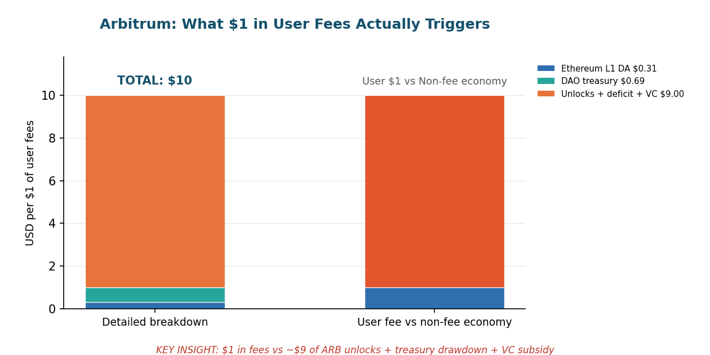

Arbitrum is the anti-Base: nobody pockets the margin, because there is barely a margin to pocket. The sequencer runs at a break-even mandate, with all surplus routed to the Arbitrum DAO treasury.[^s4_14] The problem is the surplus has nearly vanished. Trailing 30-day fees are **$411,072** — annualising to under $5M — while the **Arbitrum Foundation just asked its own DAO for $43.5M** in a single funding request, roughly **2.3x the entire $23.49M gross revenue of 2025**.[^s4_15] [^s4_16] The chain that secures ~$15.6B in value (the #1 L2 by total value secured) cannot pay its own staff out of its own fees.[^s4_17]

The token tells the rest. **ARB trades at $0.0836**, down 96.5% from its $2.39 ATH and down 27% in 30 days, with a $527M market cap.[^s4_18] The DAO treasury is **93% ARB** — a position now worth ~$224M, down from $651M in January 2026 — meaning the treasury's value collapses in lockstep with the token it's supposed to fund operations with.[^s4_19] Meanwhile ARB unlocks continue at roughly 92.65M tokens/month, ~$7.6M of monthly potential selling pressure at current prices, outpacing monthly fee revenue by roughly 17x; the next DAO tranche unlocks 16 July 2026.[^s4_20]

**When a user pays $1 in fees on Arbitrum One:**
- **$0.31 → Ethereum L1 data availability.** Blob/calldata reimbursement; the L1 share of a much-smaller total post-Fusaka (midpoint estimate; July 2025 token-flow data showed ~4.6% direct sequencer reimbursement, but L1's share of the shrunken fee base now runs 25–35%).[^s4_21]
- **$0.69 → Arbitrum DAO treasury.** All sequencer surplus, denominated in ETH and stablecoins, per the official fee-distribution model.[^s4_14]
- **$0.00 → sequencer operator.** Offchain Labs takes no fee margin — unique among major L2s.[^s4_14]

On top of base fees sits **Timeboost**, the express-lane priority auction launched April 2025: **$7.5M cumulative**, annualising ~$5.94M, ~25% of total DAO revenue — though its 30-day take has compressed to $155K as the novelty premium fades.[^s4_22]

**The hidden multiple: ~$8–12 per $1 of fees.** Dividing annualised ARB issuance value (~$91M/year of unlocks at current prices), the ~$20M+ structural DAO deficit, and VC-funded Offchain Labs opex (the company raised $120M+ in 2021–22 to run the sequencer at zero margin) by ~$4.9M of annualised fee revenue yields a chain where roughly nine to twelve dollars of subsidy and issuance move for every dollar a user actually pays.[^s4_20] [^s4_23] Arbitrum is a venture- and issuance-funded public good, not a self-sustaining business.

---

### Optimism — The Anchor Chain Becomes a Rounding Error

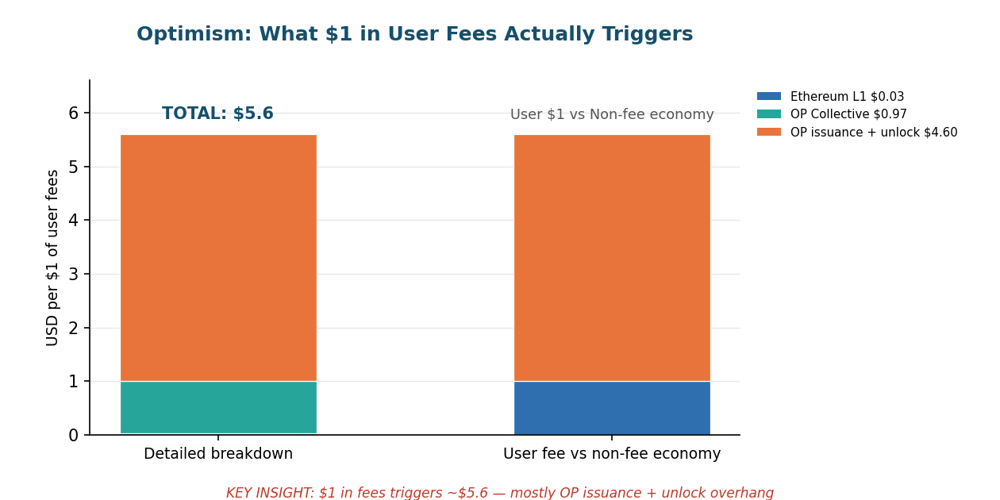

If Arbitrum can't fund itself, OP Mainnet barely registers. The chain that anchors the Superchain generated **$56,139 in fees over the trailing 30 days** — annualising to under $700K on a run-rate basis — against an annualised $1.885M over the full prior year.[^s4_24] **OP trades at $0.101**, down 97.9% from its $4.84 ATH, with a $219M market cap.[^s4_25] The gap between OP's $435M fully diluted valuation and its sub-$700K run-rate fee revenue now exceeds 600x.

Two events defined Optimism's 2026. First, **Base walked out** (February 2026), stripping the Superchain of the tenant that had supplied ~41% of all Collective revenue ever and 87% of recent sequencer revenue; OP fell 28% in 48 hours.[^s4_26] Second, in **January 2026 governance approved (84.4%) a buyback program** redirecting 50% of net Superchain revenue to monthly OP purchases for a 12-month pilot — launched, with grim timing, just as the revenue base was about to exit through the front door.[^s4_27]

**When a user pays $1 in gas on OP Mainnet:**
- **$0.03 → Ethereum L1 data costs.** Blob/calldata posted to Ethereum validators, post-EIP-4844.[^s4_28]
- **$0.97 → Optimism Collective treasury.** OP Mainnet routes 100% of net sequencer profit to the public-goods engine — every cent above L1 cost.[^s4_29]

**The hidden multiple: ~$5.6 per $1 of fees, almost all of it inflation.** Against $1.885M of annualised fees, the chain prints **~85.9M new OP/year via 2% inflation — ~$8.68M of fresh supply, a 4.6x dilution subsidy**.[^s4_30] The Feb-2026 buyback offsets part of that (~$4.97M/year, ~2.64x of fees) but offsets inflation, not the eroding fee base.[^s4_27] Roughly **2.135B OP (~$216M) remains locked** through 2029, a continuous unlock overhang, including the ~31M OP Core-Contributor unlock in May 2026.[^s4_31] RetroPGF — once the industry's flagship public-goods model — distributed 16M OP in 2025, worth ~$1.62M today versus ~$20M+ at 2024 prices; the model survives, but the token collapse gutted the real-dollar value of every grant.[^s4_32] The remaining Superchain (ex-Base) holds ~$522M TVL across nine chains, with Unichain ($23M DefiLlama TVL) nowhere near replacing Base's $4.1B.[^s4_33]

---

### zkSync Era — A Fee Machine Running on Vesting

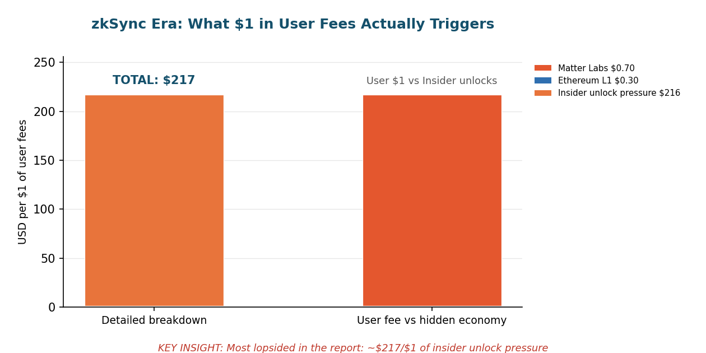

zkSync Era is the purest illustration of the L2 subsidy problem because the fees are too small to round. Trailing 30-day fees are **$14,574** — about **$175K annualised**.[^s4_34] TVL has cratered from a ~$541M 2024 peak to **$15.1M today**, a 97% collapse.[^s4_35] **ZK trades at $0.0110**, down ~97% from its $0.321 ATH, $110M market cap, $231M FDV.[^s4_36]

Matter Labs has effectively pivoted away from the public chain: it announced a second round of layoffs, committed the company to **"Prividium"** (a permissioned, privacy-focused L2 for regulated institutions), and **sunset zkSync Lite in early 2026**.[^s4_37] A November 2025 tokenomics overhaul redirects interop and licensing revenue — not Era transaction fees — to ZK buybacks, burns, and staking.[^s4_38]

**When a user pays $1 in fees on zkSync Era:**
- **$0.30 → Ethereum L1 data + proof costs.** Blob data availability plus proof verification, amortised across the batch (estimate; varies with congestion).[^s4_39]
- **$0.70 → Matter Labs sequencer profit.** Retained by the still-fully-centralised sequencer operator. The ZKnomics value-accrual mechanism explicitly excludes Era transaction fees.[^s4_40]

**The hidden multiple: ~$217 per $1 of fees — the most lopsided in this report.** Team (13.55%) and investor (17.19%) allocations total 33.33% of the 21B supply and, post-June-2025 cliff, unlock roughly **286.56M ZK/month — ~$3.16M of monthly insider selling pressure against $14,574 of monthly user fees**, a ~217:1 ratio.[^s4_41] [^s4_42] Behind that sit unrealised governance reserves (Token Assembly $67.8M, Ecosystem Initiatives $46.1M) and an estimated ~$450M in VC funding subsidising Matter Labs off-chain.[^s4_43] The fee revenue is economically immaterial; the ZK economy runs on vesting, not users.

---

### L2 Networks: Patterns and Limitations

Step back from the four chains and a single structure repeats. **Sequencer fees are trivial and shrinking; the real economy is issuance, unlocks, and subsidy.** The numbers as of 19 June 2026:

| Chain | 30d fees | Annualised | TVL | Token vs ATH | Hidden multiple per $1 fee |
|---|---|---|---|---|---|
| Base | $5.17M[^s4_2] | ~$62M[^s4_2] | $4.14B[^s4_5] | (no token) | ~$5–7 (app economy, not subsidy)[^s4_9] |
| Arbitrum | $411K[^s4_15] | ~$4.9M[^s4_15] | $1.29B[^s4_17] | ARB −96.5%[^s4_18] | ~$8–12 (issuance + deficit)[^s4_23] |
| Optimism | $56K[^s4_24] | <$0.7M[^s4_24] | $283M[^s4_33] | OP −97.9%[^s4_25] | ~$5.6 (inflation)[^s4_30] |
| zkSync Era | $14.6K[^s4_34] | ~$175K[^s4_34] | $15.1M[^s4_35] | ZK −97%[^s4_36] | ~$217 (insider unlocks)[^s4_41] |

Three patterns hold across all four:

1. **The DA-cost collapse broke the toll model.** Pectra and Fusaka cut L1 settlement to near-zero, which was meant to be the L2's margin. Instead it removed the cost the toll was justifying. Base monetises anyway because Coinbase owns the rail; the others collect fees that no longer cover operations.[^s4_4] [^s4_1]

2. **Token issuance, not user fees, funds the chain.** Arbitrum's DAO requested 2.3x its annual revenue; Optimism prints 4.6x its fees in annual inflation; zkSync unlocks 217x its fees to insiders every month. In every case the visible user fee is a fraction of the value flowing to token holders and future unlock recipients.[^s4_16] [^s4_30] [^s4_41]

3. **Ownership decides who captures the dollar.** A corporate sequencer (Base) keeps 99.8 cents; a break-even/public-goods model (Arbitrum, Optimism) keeps ~0 and routes everything to a treasury or the Collective; a centralised-but-tokenised model (zkSync) splits with L1 and lets insiders extract via vesting. Same toll, radically different beneficiaries.

**The limitations of this framing are real and worth stating.** "Total value secured" is not revenue — Arbitrum's $15.6B TVS and Base's $4.1B TVL represent user capital, not income, and an L2 captures only the thin fee layer on top.[^s4_17] [^s4_5] The hidden multiples mix categories that are not equivalent: app-layer revenue (Base) is a healthy sign of economic activity, whereas insider unlock pressure (zkSync) is a one-way wealth transfer, even though both inflate the "$X per $1" headline. And MEV, stablecoin float, and private corporate cross-sells are undisclosed estimates, not hard data — flagged as such throughout. The multiples are directional indictments, not audited income statements.

**The L2 sustainability crisis, plainly.** Outside of the one chain with a corporate balance sheet behind it, no major L2 in this report earns enough to fund itself. The standard rollup pitch — cheap fees today, fee revenue scales with adoption tomorrow — has collided with two facts: adoption did not produce proportional fee revenue (Optimism's fees *fell* as the Superchain grew), and the DA-cost collapse means the per-transaction take keeps falling even when usage holds. What fills the gap is inflation (Optimism), treasury drawdowns funded by a token-heavy reserve that deflates with the token (Arbitrum), insider vesting (zkSync), or a corporate parent (Base). Three of those four are running down a finite resource. The rollup economy, stripped of narrative, is a set of public goods waiting to discover whether anyone will pay for them once the subsidy runs out — and on current numbers, the subsidy is winning by two-to-three orders of magnitude.

---

[^s4_1]: [Eco — Arbitrum vs Optimism 2026: Fees, TVL, Ecosystem](https://eco.com/support/en/articles/15183711-arbitrum-vs-optimism-2026-fees-tvl-ecosystem) — Ethereum Fusaka/PeerDAS upgrade (December 2025) cut L2 data-availability costs by a further 40–60% within the first month, on top of the post-Dencun reduction.
[^s4_2]: [DefiLlama — Base Fees](https://defillama.com/fees/base) — 24h $71,576 | 7d $507,114 | 30d $5,165,928 | 30d revenue net of L1 $5,156,807 | all-time $205,867,337. Retrieved via DefiLlama API (June 19, 2026). 🔷 HARD DATA.
[^s4_3]: [DefiLlama — Base Fees (monthly aggregation)](https://defillama.com/fees/base) — 2024 full-year $88.9M, 2025 full-year $77.5M, 2026 YTD (Jan 1–Jun 18) $26.7M. Retrieved via DefiLlama API (June 19, 2026). 🔷 HARD DATA.
[^s4_4]: [DefiLlama — Base Fees vs Revenue](https://defillama.com/fees/base) — 30d revenue ($5,156,807) vs 30d fees ($5,165,928) implies L1 blob cost of $9,121 (0.18% of fees), near-zero post-Pectra (May 2025); pre-Pectra benchmark ~5%. Retrieved via DefiLlama API (June 19, 2026). 🔷 HARD DATA. See also [Edgen — Pectra slashes rollup costs 51%](https://www.edgen.tech/news/crypto/ethereum-pectra-upgrade-slashes-rollup-costs-by-51-boosting-l2-profitability-and-increasing-node-data-burden).
[^s4_5]: [DefiLlama — Base Chain TVL](https://defillama.com/chain/Base) — $4.14B as of June 19, 2026, down from the ~$4.4B January 2026 peak. Retrieved via DefiLlama API (June 19, 2026). 🔷 HARD DATA.
[^s4_6]: [CoinDesk — Coinbase's Base Moves Away From Optimism's OP Stack](https://www.coindesk.com/business/2026/02/18/coinbase-s-base-moves-away-from-optimism-s-op-stack-in-major-tech-shift) — Base announced departure from the OP Stack on February 18, 2026, ending revenue sharing with the Optimism Collective.
[^s4_7]: [DL News — Optimism Token Plunges as Base Leaves Superchain](https://www.dlnews.com/articles/defi/optimism-token-price-plunges-as-base-leaves-superchain/) — Base contributed 8,387 ETH (~$16.4M) over the partnership, ~41% of the Collective's lifetime revenue and 90%+ of monthly revenue before departure.
[^s4_8]: [The Block — Base–Optimism revenue agreement](https://www.theblock.co/post/247532/base-optimism-revenue) — Original 2023 agreement (Base to receive 118M OP over six years), now voided by the departure.
[^s4_9]: [Bitget News — Base 2025 Report Card](https://www.bitget.com/news/detail/12560605121706) — App-level revenue on Base in 2025 ~$369.9M (Aerodrome ~$160.5M) vs $77.5M sequencer fees, a ~4.8x ratio; Base held ~62% of total L2 fees. Estimate (third-party aggregation), not hard data.
[^s4_10]: [Coin Metrics — Coinbase Q1 2026 Earnings](https://coinmetrics.substack.com/p/coinbase-q1-2026-earnings-diversification) — Coinbase Q1 2026 total revenue $1.41B (down 21% QoQ); Base sequencer revenue folded into "other transaction revenue," not separately disclosed.
[^s4_11]: [DefiLlama — Aerodrome (Base)](https://defillama.com/protocol/aerodrome) — Aerodrome total TVL $306.8M (Slipstream $164.5M + V1 $118.6M + Ignition $23.6M). Retrieved via DefiLlama API (June 19, 2026). 🔷 HARD DATA. MEV and stablecoin-float figures are estimates, not disclosed.
[^s4_12]: [CoinDesk — Base Explores Issuing Native Token](https://www.coindesk.com/business/2025/09/15/base-explores-issuing-native-token-says-creator-jesse-pollak) — Jesse Pollak announced Base is exploring a native token at BaseCamp, September 15, 2025; no launch as of June 2026.
[^s4_13]: [AMBCrypto — Base Native Token Launch Odds](https://ambcrypto.com/base-is-exploring-native-token-launch-is-2026-the-year/) — Polymarket assigns ~69% probability to a BASE token launch before December 31, 2026 (as of mid-2026).
[^s4_14]: [Arbitrum Docs — Fee Distribution](https://docs.arbitrum.foundation/fee-distribution) — Sequencer operates at break-even; all surplus routes to the Arbitrum DAO treasury; Offchain Labs extracts no fee margin.
[^s4_15]: [DefiLlama — Arbitrum Fees](https://defillama.com/fees/chain/arbitrum) — 24h $11,016 | 30d $411,072 | all-time $168M, annualising to under $5M. Retrieved via DefiLlama API (June 19, 2026). 🔷 HARD DATA.
[^s4_16]: [CryptoAdventure — Arbitrum Foundation Requests $43.5M From DAO Treasury](https://cryptoadventure.com/arbitrum-foundation-requests-43-5m-from-dao-treasury-for-operations/) — Active funding request of $43.5M ($16M stablecoins + 1,740 ETH + 230M ARB), ~2.3x the $23.49M 2025 gross revenue; on-chain vote closing ~June 25, 2026.
[^s4_17]: [CoinLaw — Arbitrum Statistics 2026 (citing L2Beat)](https://coinlaw.io/arbitrum-statistics/) — Total value secured ~$15.6B, #1-ranked L2 as of May 2026; ARB all-time low $0.08709 (March 29, 2026).
[^s4_18]: [CoinGecko — Arbitrum (ARB)](https://www.coingecko.com/en/coins/arbitrum) — ARB price $0.0836, market cap $527M, FDV $828M, circulating 6.36B (63.6% of 10B max), ATH $2.39 (Jan 12, 2024, −96.5%), 30d −27.3%. Retrieved via CoinGecko API (June 19, 2026). 🔷 HARD DATA.
[^s4_19]: [Arbitrum Token Flow Report, July 2025](https://online.flippingbook.com/view/256681616) — DAO treasury composition: 2.7B ARB (93.4%), $34.6M ETH (2.7%), $51.8M stablecoins (4.0%); ~$224M ARB value at June 2026 prices vs ~$651M in January 2026. ⏳ HISTORICAL (July 2025): most recent published full treasury breakdown; dollar values recomputed at current price.
[^s4_20]: [Tokenomist — Arbitrum Vesting](https://tokenomist.ai/arbitrum) — ~92.65M ARB/month unlocking through 2027 (~$7.6M/month at current price); next DAO-treasury tranche July 16, 2026; 63.6% of supply unlocked. See also [MKN Crypto — June 16, 2026 ARB unlock](https://news.mkncrypto.com/arbitrums-june-16-unlock-the-l2-token-needs-revenue-proof-not-just-scale/).
[^s4_21]: [Arbitrum Token Flow Report, July 2025](https://online.flippingbook.com/view/256681616) — July 2025: 323 ETH gross fees, 15 ETH sequencer L1 reimbursement (~4.6%), 308 ETH net to DAO; cumulative 28,300 ETH L1 reimbursement of 48,000 ETH total fees. ⏳ HISTORICAL (July 2025): most recent itemised flow report; the $0.31 L1 estimate reflects L1's larger share of the now-smaller post-Fusaka fee base. Estimate, not hard data.
[^s4_22]: [DefiLlama — Arbitrum Timeboost](https://defillama.com/protocol/arbitrum-timeboost) — Cumulative $7.5M, 30d $155,186, annualising ~$5.94M; ~25% of total DAO revenue. Retrieved via DefiLlama API (June 19, 2026). 🔷 HARD DATA. Launched April 2025; 97% to DAO, 3% to Developer Guild.
[^s4_23]: [Arbitrum Foundation — 2025 Transparency Report](https://blog.arbitrum.foundation/the-arbitrum-foundation-2025-transparency-report-the-year-of-institutional-adoption/) — 2025 gross DAO revenue $23.49M; Timeboost returned >$6M in first year; TVS reached $20B; 100+ Arbitrum chains live or in development. Hidden-multiple range (~$8–12 per $1) is an estimate combining annualised ARB unlock value (~$91M), the ~$20M+ structural deficit, and VC-funded ($120M+) Offchain Labs opex; not hard data.
[^s4_24]: [DefiLlama — OP Mainnet](https://defillama.com/chain/Optimism) — Fees: $3,441 (24h), $10,473 (7d), $56,139 (30d), $1,885,040 (annualised 365d), $91,603,377 all-time; 30d run-rate annualises to <$700K. Retrieved via DefiLlama API (June 19, 2026). 🔷 HARD DATA.
[^s4_25]: [CoinGecko — Optimism (OP)](https://www.coingecko.com/en/coins/optimism) — OP price $0.101, market cap $219M, FDV $435M, circulating 2.16B (50.3% of max), ATH $4.84 (March 6, 2024, −97.9%), 30d −20.4%, rank #165. Retrieved via CoinGecko API (June 19, 2026). 🔷 HARD DATA.
[^s4_26]: [KuCoin News — Base Leaves Superchain, OP Plummets](https://www.kucoin.com/news/flash/base-leaves-superchain-op-token-plummets-as-optimism-faces-revenue-loss) — Base's ~8,387 ETH (~$16.4M) was ~41% of all Collective revenue ever; OP fell 28% in 48 hours on the February 2026 departure.
[^s4_27]: [CoinDesk — Optimism Governance Approves OP Token Buyback Plan](https://www.coindesk.com/business/2026/01/28/optimism-governance-approves-op-token-buyback-plan-tied-to-superchain-revenue) — 84.4% approval (January 28, 2026) to direct 50% of net Superchain revenue to monthly OP buybacks for a 12-month pilot from February 2026; ~$4.97M/year at current prices. See also [Optimism — OP Token Buybacks blog](https://optimism.io/blog/op-token-buybacks) (5,868 ETH reported over prior 12 months).
[^s4_28]: [Optimism — How the Superchain Drives Fees to the Collective](https://www.optimism.io/blog/how-(and-why)-the-superchain-drives-fees-to-the-optimism-collective) — ~3% of OP Mainnet gas covers L1 blob/calldata cost post-EIP-4844; OP Mainnet pays 100% of net sequencer profit to the Collective.
[^s4_29]: [Optimism — OP Token Buybacks blog (Jan 2026)](https://optimism.io/blog/op-token-buybacks) — OP Mainnet routes 100% of net sequencer profit to the Optimism Collective treasury; Superchain claimed ~61.4% of L2 fee share and ~13% of all crypto transactions pre-Base departure.
[^s4_30]: [Optimism Docs — OP Token Overview](https://community.optimism.io/op-token/op-token-overview) — 2% annual inflation on 4.295B max supply = ~85.9M new OP/year (~$8.68M at $0.101), a 4.6x subsidy vs $1.885M annual fees. Estimate derived from documented inflation rate.
[^s4_31]: [Coin Bureau — Optimism Review 2026](https://coinbureau.com/review/optimism-review) — ~2.135B OP (49.7% of max, ~$216M) locked through 2029; ~31M OP Core-Contributor unlock May 31, 2026; OP Stack powers >50 chains globally.
[^s4_32]: [Optimism — Retro Funding 2025](https://www.optimism.io/blog/retro-funding-2025) — 16M OP distributed across Dev Tooling and Onchain Builders in 2025 (~$1.62M today vs ~$20M+ at 2024 prices); 60,815,042 OP distributed cumulatively since 2022.
[^s4_33]: [DefiLlama — Chains](https://defillama.com/chains) — Post-Base Superchain TVL ~$522M across nine chains: OP Mainnet $283M, Ink $127M, World Chain $40M, Unichain $23M, Fraxtal $20M, Celo $19M, Soneium $8M, Mode $2M, Zora <$1M. Retrieved via DefiLlama API (June 19, 2026). 🔷 HARD DATA. See also [Messari — State of the Superchain H2 2025](https://messari.io/report/state-of-the-superchain-h2-2025).
[^s4_34]: [DefiLlama — zkSync Era Fees](https://defillama.com/chain/zksync-era) — 24h $264 | 7d $2,014 | 30d $14,574 | all-time $86.2M; 30d annualises to ~$175K. Retrieved via DefiLlama API (June 19, 2026). 🔷 HARD DATA.
[^s4_35]: [DefiLlama — zkSync Era TVL](https://defillama.com/chain/zkSync%20Era) — $15.1M as of June 19, 2026, down from a ~$541M 2024 peak (−97%). Retrieved via DefiLlama API (June 19, 2026). 🔷 HARD DATA.
[^s4_36]: [CoinGecko — ZKsync (ZK)](https://www.coingecko.com/en/coins/zksync) — ZK price $0.01103, market cap $110.0M, FDV $231.5M, circulating 9.98B (47.5% of 21B max), ATH $0.321 (June 17, 2024, −97%), 30d −26.1%. Retrieved via CoinGecko API (June 19, 2026). 🔷 HARD DATA.
[^s4_37]: [CoinDesk — ZKsync Lite to Shut Down in 2026 as Matter Labs Moves On](https://www.coindesk.com/tech/2025/12/08/zksync-lite-to-shut-down-in-2026-as-matter-labs-moves-on) — Matter Labs sunset zkSync Lite, announced a second round of layoffs, and pivoted to "Prividium," a permissioned privacy L2 for regulated institutions. See also [CryptoPotato — ZKsync layoffs / Prividium pivot](https://cryptopotato.com/zksync-creator-announces-layoffs-as-it-pivots-to-permissioned-privacy-chain/).
[^s4_38]: [The Defiant — ZKsync Tokenomics Proposal](https://thedefiant.io/news/tokens/zksync-zk-token-new-tokenomics-proposal) — November 2025 ZKnomics overhaul routes interop fees (on-chain) and Prividium licensing (off-chain) to ZK buybacks, burns, and staking; direct zkSync Era transaction fees are excluded.
[^s4_39]: [Eco — What Is a ZK Rollup? (2026 Guide)](https://eco.com/support/en/articles/10080409-what-is-a-zk-rollup-a-2026-guide-to-zero-knowledge-scaling) — Post-EIP-4844 blob costs ~10x lower than pre-Dencun; single proof compute $50–$500 amortised across a batch. The $0.30 L1+proof share is an estimate that varies with congestion, not hard data.
[^s4_40]: [Messari — ZKsync: Prividiums for Enterprise-Grade Privacy](https://messari.io/report/zksync-prividiums-for-enterprise-grade-privacy) — v31 upgrade (May 2026) added native interop across the ZK Stack Elastic Network (20+ chains); sequencer remains fully centralised under Matter Labs; Era transaction fees retained as operational revenue.
[^s4_41]: [Tokenomist — ZKsync Unlock Events](https://tokenomist.ai/zksync/unlock-events) — Post-June-2025 cliff, team + investors unlock ~286.56M ZK/month (~143.28M each) under a 0.8%/month cap, ~$3.16M/month at $0.01103 vs $14,574 of monthly fees (~217:1). Estimate; next investor unlock ~July 17, 2026.
[^s4_42]: [ZK Nation Docs — ZK Token](https://docs.zknation.io/zk-token/zk-token) — Allocation: Team 13.55% + Investors 17.19% = 33.33% insider; Token Assembly 29.27%; Ecosystem 19.90%; Airdrop 17.50%. 21B hard cap; 4-year vest with 1-year cliff (June 2024–June 2028). 🔷 HARD DATA (official docs).
[^s4_43]: [CryptoRank — ZKsync Token Vesting](https://cryptorank.io/price/zksync/vesting) — Unrealised governance reserves Token Assembly (~$67.8M) and Ecosystem Initiatives (~$46.1M); Matter Labs raised an estimated ~$450M+ across rounds (incl. $200M Series C, Nov 2022, per [TechCrunch](https://techcrunch.com/2022/11/16/matter-labs-the-company-behind-zksync-raises-200-million-to-scale-ethereum/) ⏳ HISTORICAL 2022). VC total is a community-cited estimate, not hard data.

---

## 5. The Infrastructure Layer: The Hidden Recipients

*Data as of 19 June 2026. Every chain section in this report asks the same question — when a user pays $1, how much value actually moves? The infrastructure layer is where that question gets uncomfortable, because the people collecting the money mostly refuse to tell you how much they make.*

Oracles, MEV searchers, RPC providers, and indexers are the plumbing every dApp runs through. They are also the least transparent recipients in the entire value chain. On-chain fees — the only numbers we can verify to the dollar — capture a fraction of what this layer actually earns. The rest flows through private enterprise contracts, token-reward subsidies, and off-chain MEV that never touches a public dashboard. This section separates what is **hard data** from what is **estimate**, line by line.

---

### 5.1 Oracles: Securing $110B, Earning Almost None of It Transparently

**The key finding: oracle networks monetize through private, off-chain commercial contracts that never appear in any dashboard — while their token subsidies dwarf their visible on-chain revenue.**

Chainlink secures a self-reported **$110B in Total Value Secured** as of May 2026 — roughly $60B in cross-chain CCIP transfers plus $50B in DeFi data feeds[^s5_1]. Against that, its *verifiable* on-chain fee income is **$6.05M over the trailing 30 days**, or about **$72.5M annualized**[^s5_2]. 🔷 HARD DATA. That is an extraction rate of **0.054% of value secured** — a rounding error relative to what the network protects.

So how does the oracle business actually pay for itself? It doesn't, on transparent revenue alone. Chainlink released **17.875M LINK in its April 2026 quarterly unlock — about $165M at the time**, of which 14.875M went to Binance and 4.125M to a staking multisig[^s5_3]. Annualize the quarterly cadence and that is roughly **$561M/yr in token outflow at today's $7.84 LINK price** (it was closer to $660M/yr at April's higher prices)[^s5_4]. Set that against the ~$72.5M of on-chain fees and you get a **hidden-subsidy multiple of roughly 2.6x** — and that is *before* counting the enterprise contracts nobody will price publicly.

> Strip away the dashboards and the oracle sector is a paradox: record adoption, collapsing tokens. LINK is down ~40% year-on-year and ~85% from its 2021 peak[^s5_5]. PYTH is down ~64% YoY and ~97% from its all-time high[^s5_6]. Usage is up. Price is down. The gap between them is the subsidy.

#### The opacity is the business model

The most important fact about oracle economics is that the biggest contracts are invisible. Chainlink's disclosed enterprise and institutional clients include **Swift, DTCC, Fidelity, UBS, and the US Department of Commerce** (which publishes six macroeconomic indicators across ten blockchains via Chainlink)[^s5_7]. None of these deals have a public price. Our **estimate of ~$150M/yr in enterprise contract revenue is exactly that — an estimate**, inferred from disclosed client names and institutional pricing norms, not hard data[^s5_8]. It could be materially higher or lower. The honest position is that the single largest revenue line in the oracle sector cannot be verified by anyone outside the contracting parties.

Stacking the pieces gives a rough Chainlink revenue picture: ~$72.5M on-chain fees (hard) + ~$33M annualized SVR run-rate (Q1 2026 × 4) + ~$150M estimated enterprise (soft) ≈ **$256M/yr total — against ~$561M/yr in token unlocks, a 2.6x subsidy ratio**[^s5_4] [^s5_9].

#### The one bright spot: MEV recapture (SVR)

The most credible path to *transparent* oracle monetization is Smart Value Recapture (SVR) — Chainlink clawing back the oracle-extractable value (OEV) that MEV searchers used to skim from liquidations. SVR captured **$8.3M in Q1 2026 alone, more than all prior quarters combined, for an all-time $18.3M and ~99% of the oracle-MEV market**[^s5_10]. It is small, but it is real, on-chain, and growing — the rare oracle revenue line that doesn't depend on a private contract or a token print.

#### The competitive field is fragmenting

Chainlink's DeFi oracle share has slipped to **60–68%** from north of 70%[^s5_11], as specialists carve out the institutional RWA niche:

| Provider | Total Value Secured | On-chain fees (live) | Notes |
|---|---|---|---|
| **Chainlink** | $110B (self-reported)[^s5_1] | $6.05M/30d 🔷[^s5_2] | CCIP + DeFi feeds; 2,672 integrations[^s5_12] |
| **Chronicle** | $10.2B[^s5_13] | grant-funded | Won SparkDAO $1B Grand Prix oracle mandate (BlackRock, Janus Henderson funds)[^s5_14] |
| **RedStone** | $8.5–10B[^s5_15] | — | 150+ chains; RWA-focused; zero mispricing events claimed |
| **Pyth** | $4.2B DeFi-only to $16.1B self-reported[^s5_16] | $316,640/30d 🔷[^s5_17] | 110+ chains, pull model; 2.13B PYTH (~$92M) unlocked May 2026[^s5_6] |
| **API3** | — | $91,692/30d 🔷[^s5_18] | $706K all-time on-chain fees |
| **Switchboard** | $2B+[^s5_19] | — | 100% of Solana lending TVL |

The strategic battleground is shifting from DeFi price feeds to **institutional RWA oracles** — Chronicle's BlackRock/Janus Henderson mandate is the clearest signal[^s5_14], landing as the tokenized RWA market expanded from ~$6B in early 2025 to roughly $31B by mid-2026[^s5_20]. But every provider in this table shares the same structural feature: the money that matters is priced in rooms you can't see into.

**Sector revenue, our best estimate: $250–400M/yr across all providers — and we flag it as soft data, because it is dominated by private enterprise contracts not visible on-chain**[^s5_21].

---

### 5.2 MEV: A $509M–$609M Parallel Economy, Hiding in Plain Sight

The prior (October 2025) report pegged global MEV at **$8–15B/year**. Live data forces a sharp downward revision. That old range bundled BNB, L2s, alt-chains, and speculative projections into one headline. Strip it back to what we can actually measure on the two largest markets and the picture tightens dramatically.

**On Ethereum, validators collected $241.6M via MEV-Boost over the trailing twelve months[^s5_22]; on Solana, Jito MEV tips paid validators $165.9M[^s5_23].** 🔷 HARD DATA — both confirmed live via DefiLlama on 19 June 2026. These are the floor: the value that *visibly* reached validators.

Gross MEV — what actually moved through the sandwich, arbitrage, and liquidation machinery before searchers and builders took their cut — has to be *estimated* from searcher-margin assumptions. Keeping the estimate *internally consistent* with the validator-share model (validators retain 65–80% of gross on Ethereum, 70–80% of gross on Solana), the hard $241.6M and $165.9M that reached validators imply **$302–372M/yr gross on Ethereum and $207–237M/yr on Solana, for a combined $509–609M/yr**[^s5_24] [^s5_25]. Halved conservatively to avoid double-counting the searcher-to-builder-to-validator flow, the report-quality figure lands near **~$280M/yr**[^s5_26]. We label this **estimate, not hard data** — the only hard numbers here are the $241.6M and $165.9M that reached validators. (The October 2025 report's $8–15B headline bundled BNB, L2s, and speculative projections and is superseded; even a $480–720M Ethereum figure circulated in an earlier draft, but it is not reconcilable with the 65–80% validator share and has been removed.)

> MEV is not a line item on the fee market. It is a parallel economy layered silently on top of it. For every $1 validators visibly collect via MEV-Boost, roughly **$1.30–1.40 of gross MEV** moved through the system — searcher profit and builder margin stacked on top of the validator payment[^s5_27].

#### Where $1 of gross MEV goes (Ethereum MEV-Boost model)

| Recipient | Share of $1 | Notes |
|---|---|---|
| Validators / stakers | $0.65–$0.80 | Of which Lido ~$0.20 (≈30% of staked ETH), Coinbase ~$0.08 (≈12%), independents ~$0.52[^s5_27] |
| Searchers (net profit) | $0.15–$0.25 | The bots running the strategies |
| Block builders | $0.05–$0.10 | Margin for assembling the block |

On Solana's Jito model, **94% of tips flow straight to validators and stakers, with 6% routed to the Jito DAO and infrastructure**[^s5_28].

#### The structural story: professionalizing, not shrinking

MEV isn't dying — it's consolidating and going off-chain:

- **Builder concentration is now extreme.** Titan Builder controls **~50% of Ethereum blocks** as of February 2026, up from 24% in the prior report[^s5_29]. MEV-Boost still routes **~92.75% of all Ethereum blocks**[^s5_30].
- **SUAVE is dead; BuilderNet is the successor.** Flashbots archived SUAVE in May 2025 and pivoted to BuilderNet, a TEE-based decentralized builder network that reached **25.5% of blocks by January 2026**[^s5_29] [^s5_31].
- **Sandwich extraction is collapsing.** Ethereum sandwich-attack take fell from ~$10M/month (late 2024) to **~$2.5M/month by October 2025** as bot competition compressed margins[^s5_32].
- **The money migrated to CEX-DEX arbitrage.** A 19-month academic study (Aug 2023–Mar 2025) found **$233.8M extracted across 7.2M arbitrages by just 19 searchers** — the top three (Wintermute, SCP, Kayle) taking ~73%[^s5_33]. On Solana, Helius logged **$142.8M in arbitrage profits across 90.4M successful transactions** over a trailing year[^s5_25].
- **Intent-based protection went mainstream.** CoW Swap hit a **$9B monthly volume** all-time high in July 2025, evidence that users are actively routing around the extraction machine[^s5_34].

The trend line: fewer, more professional searchers; heavier builder centralization; and a steady drift of extraction into venues — CEX-DEX arbitrage, private order flow — where it is even harder to measure than the on-chain sandwich it replaced.

---

### 5.3 RPC & Indexing: A $600M–$900M Business That Won't Show Its Books

If oracles hide behind enterprise contracts and MEV hides off-chain, RPC providers simply hide — they are private companies that don't publish revenue. The plumbing that every dApp, wallet, and bot calls to read and write the chain is now an estimated **$600M–$900M/yr business**, almost none of it disclosed[^s5_35].

The anchor data point: **Alchemy reported ~$447M ARR in late 2025** (a third-party, unaudited estimate)[^s5_36], establishing that this is a real multi-hundred-million-dollar infrastructure industry, not a startup experiment. Its peers fill out the rest of the estimate — Infura ~$60–80M, QuickNode ~$25–40M, Ankr ~$20–35M, Dune ~$8–15M[^s5_35]. None of these are audited figures; all are **estimates** built from funding disclosures, growth rates, and request volumes.

| Provider | Revenue (est.) | Valuation / status | Scale |
|---|---|---|---|
| **Alchemy** | ~$447M ARR (2025)[^s5_36] | $10.2B (2022 round, stale)[^s5_37] | x402 agentic gateway launched Feb 2026[^s5_38] |
| **Infura (ConsenSys)** | ~$60–80M[^s5_39] | ConsenSys eyeing fall-2026 IPO at $10B+[^s5_40] | 10B+ daily API requests[^s5_41] |
| **QuickNode** | ~$25–40M[^s5_42] | $800M (Jan 2023)[^s5_43] | 82+ chains, 135+ networks[^s5_44] |
| **Ankr** | ~$20–35M[^s5_45] | ANKR mcap ~$39M 🔷[^s5_46] | 8B+ requests/day |
| **Dune Analytics** | ~$8–15M[^s5_47] | $1B (2022, stale)[^s5_47] | 100K+ analysts, 300K+ dashboards |

**The single public-market test is coming.** ConsenSys (parent of Infura and MetaMask) has mandated JPMorgan and Goldman Sachs for a fall-2026 NYSE listing targeting **$10B+**, up from a $7B private mark in 2022[^s5_40]. It will be the first real measure of whether Ethereum infrastructure can command a ten-figure valuation when the base chain it rides earns only ~$116M/yr in fees from users.

#### The Graph: a 78-to-1 subsidy, laid bare

No part of this layer exposes the subsidy thesis more brutally than **The Graph**, the decentralized indexer. In Q4 2025 it generated **just $98,667 in real, user-paid query fees** — under $400K annualized[^s5_48]. In the same period, the protocol *minted* **~$7.6M worth of GRT in indexing rewards** (Q3 2025 figure)[^s5_49]. That is a **rewards-to-fees ratio of roughly 78:1** — meaning **~98.7% of the value flowing to indexers is protocol-printed subsidy, and only ~1.3% is organic revenue**[^s5_50].

> Of every $1 of value reaching a Graph indexer, **$0.013 is a real fee and $0.987 is freshly minted GRT**. The token has fallen to ~$0.020 — **99.3% below its $2.84 all-time high**[^s5_51]. 🔷 HARD DATA. The price collapse is what made the subsidy impossible to ignore.

The Graph's response is the **Horizon upgrade** (live December 2025), which unbundles indexing, storage, and query execution and adds **x402 AI-agent payment support (May 2026)** — an explicit attempt to grow real fee revenue before the subsidy model becomes politically untenable[^s5_52].

#### Where $1 of RPC spend goes — and what it unlocks

For centralized providers, the direct math is simple software economics: **~$0.75–$0.85 gross margin**, with ~$0.15–$0.25 covering cloud compute, bandwidth, and node costs[^s5_53]. The interesting number is the **multiplier** — how much downstream activity each RPC dollar enables.

We estimate **$4–$8 of broader ecosystem value is unlocked per $1 of RPC/indexing fees**[^s5_54]. This is an **estimate, reasoned not measured**: a single Ethereum transaction triggers 3–10 RPC calls to submit and monitor; a DeFi front-end's $1 of RPC spend supports dozens of user sessions transacting hundreds of dollars each; and MEV bots are the extreme case — paying ~$50K/month in RPC fees to extract an estimated $5–20M/month, a 100–400x ratio[^s5_54]. The plumbing is cheap. What flows through it is not.

#### The subsidy didn't disappear — it changed form

RPC providers carry **~0% token subsidy** (they're private, on subscription revenue) — but they were heavily **VC-subsidized**: Alchemy ($564M raised) and QuickNode ($106M) together injected roughly **$670M of venture capital** into free and cheap developer access to capture market share[^s5_55] [^s5_42]. At $447M ARR, Alchemy is only now approaching VC recovery — after eight years of subsidized growth. The Graph carries the subsidy in tokens; the private providers carried it in venture capital. Either way, the developer who pays $1 today is standing on years of someone else's money.

---

### 5.4 Infrastructure Layer: The Bottom Line

The infrastructure layer is the report's thesis in miniature. Three sub-sectors, three different ways of hiding the real money:

| Sub-sector | Verifiable on-chain income | Hidden / subsidy layer | Subsidy mechanism |
|---|---|---|---|
| **Oracles** | ~$72.5M/yr (Chainlink fees) 🔷[^s5_2] | ~$561M/yr token unlocks + ~$150M est. private contracts[^s5_4] [^s5_8] | LINK emissions + opaque enterprise deals |
| **MEV** | $241.6M (ETH) + $165.9M (SOL) to validators 🔷[^s5_22] [^s5_23] | ~$509M–$609M gross extraction (est.)[^s5_24] | ~1.3–1.4x off-chain searcher/builder economy |
| **RPC / Indexing** | The Graph ~$99K/quarter fees[^s5_48] | ~$600–900M private revenue + 78:1 GRT subsidy (est.)[^s5_35] [^s5_50] | VC capital (private) + token emissions (The Graph) |

The pattern is identical across all three: **the numbers we can verify are small, and the numbers that matter are either off-chain, token-printed, or behind a private contract.** When a user pays $1 in fees, the infrastructure layer beneath them is moving multiples of that — but most of it is structurally designed not to be counted. That is not an accident of measurement. It is the business model.

---

[^s5_1]: [Chainlink CCIP Stack Drives $110B in Value Secured](https://crypto.news/chainlinks-ccip-stack-drives-110b-in-value-secured-overtaking-defi-oracles/) — crypto.news (May 22, 2026), citing Chainlink's own dashboard: $60B in cross-chain CCIP transfers + $50B in DeFi data feeds. This is a Chainlink-reported figure; DefiLlama's DeFi-only oracle methodology shows ~$47–50B. Both measure different service lines.

[^s5_2]: [DefiLlama — Chainlink fees](https://defillama.com/protocol/chainlink) — On-chain fees $6.05M trailing 30 days; $55.7M trailing 1 year; $59.75M all-time. Annualized via 30d×12 ≈ $72.5M/yr. Retrieved via DefiLlama API (June 19, 2026). 🔷 HARD DATA

[^s5_3]: [Chainlink Executes $165M Quarterly Token Unlock](https://www.ainvest.com/news/chainlink-executes-165m-quarterly-token-unlock-expands-oracle-network-integrations-2604/) — ainvest (April 2026): 17.875M LINK released (~$165M at unlock), of which 14.875M to Binance and 4.125M to a staking multisig.

[^s5_4]: [CoinGecko — Chainlink (LINK)](https://www.coingecko.com/en/coins/chainlink) — LINK $7.84, market cap $5.70B, circulating 727M of 1B total. Quarterly ~17.9M LINK unlock annualizes to ~$561M/yr at current price (was ~$660M/yr at April 2026 prices). Retrieved via CoinGecko API (June 19, 2026). 🔷 HARD DATA

[^s5_5]: [CoinGecko — LINK historical](https://www.coingecko.com/en/coins/chainlink) — ATH $52.70 (May 10, 2021); current price ~85% below ATH, ~40% below year-ago. Retrieved via CoinGecko API (June 19, 2026). 🔷 HARD DATA

[^s5_6]: [CoinGecko — Pyth Network (PYTH)](https://www.coingecko.com/en/coins/pyth-network) — PYTH $0.0351, ~64% below year-ago and ~97% below ATH $1.20 (March 2024). 2.13B PYTH (~$92M) unlocked May 19, 2026. Retrieved via CoinGecko API (June 19, 2026). 🔷 HARD DATA

[^s5_7]: [US Department of Commerce Macroeconomic Data on Chainlink](https://blog.chain.link/united-states-department-of-commerce-macroeconomic-data/) — Chainlink official blog. Disclosed institutional clients include Swift, DTCC, Fidelity, UBS, and the US Department of Commerce (six macro indicators across ten blockchains). Contract values undisclosed.

[^s5_8]: Enterprise contract revenue of **~$150M/yr is an analyst ESTIMATE** based on disclosed client names and institutional oracle pricing norms. No public disclosure exists; treat as an informed range only — actual may be materially higher or lower. NOT hard data.

[^s5_9]: [Chainlink Q1 2026 Quarterly Review](https://chain.link/blog/quarterly-review-q1-2026) — SVR captured $8.3M in Q1 2026; CCIP transfer volume $18B+ (78% QoQ, 319% YoY); Polymarket $5B+ Q1 volume powered by Chainlink feeds; Amundi/Spiko tokenized fund reached $400M+ AUM in three weeks.

[^s5_10]: [Chainlink Q1 2026 Quarterly Review — SVR](https://chain.link/blog/quarterly-review-q1-2026) — Smart Value Recapture: $8.3M captured Q1 2026 (more than all prior quarters combined); $18.3M all-time; ~99% oracle-MEV market share.

[^s5_11]: [Chainlink Oracle Market Share](https://crypto.news/chainlinks-ccip-stack-drives-110b-in-value-secured-overtaking-defi-oracles/) — crypto.news (May 2026): Chainlink 60–68% of DeFi oracle category TVS, down from 70%+ in prior years.

[^s5_12]: [Chainlink Ecosystem — Live Integrations](https://crypto.news/chainlinks-ccip-stack-drives-110b-in-value-secured-overtaking-defi-oracles/) — 2,672 live integrations across 60+ chains; $30.31 trillion cumulative transaction value enabled (May 2026).

[^s5_13]: [The Block — Chronicle Oracle / MakerDAO-Sky RWA](https://www.theblock.co/post/348308/chronicle-oracle-raises-seed-makerdao-sky-real-world-assets-tokenization) — Chronicle TVS $10.2B (April 2026); 1,296 oracles; 17% market share; exclusively secured $22B+ for the Sky (MakerDAO) ecosystem since 2017.

[^s5_14]: [The Block — Chronicle Tapped for $1B SparkDAO Grand Prix](https://www.theblock.co/post/350614/chronicle-tapped-as-oracle-provider-for-winners-of-the-1-billion-sparkdao-tokenization-grand-prix) — Chronicle named oracle provider for SparkDAO Tokenization Grand Prix winners, including BlackRock and Janus Henderson funds.

[^s5_15]: [RedStone — Blockchain Oracles Comparison 2026](https://blog.redstone.finance/2026/03/30/blockchain-oracles-comparison-chainlink-vs-pyth-vs-redstone-2026/) — RedStone TVS $8.5–10B; 150+ chains; 170–200+ protocol clients; zero mispricing events claimed since launch.

[^s5_16]: [Messari — Pyth Network Profile](https://messari.io/project/pyth-network/profile) — Pyth TVS ranges from $4.2B (Messari DeFi-only, Q4 2025) to $16.1B (Pyth's own KPI including all Total Value Enabled, Dec 2025). Methodologies differ.

[^s5_17]: [DefiLlama — Pyth Network fees](https://defillama.com/protocol/pyth-network) — On-chain fees $316,640 trailing 30 days; ~$3.8M annualized. Retrieved via DefiLlama API (June 19, 2026). 🔷 HARD DATA

[^s5_18]: [DefiLlama — API3 fees](https://defillama.com/protocol/api3) — On-chain fees $91,692 trailing 30 days (~$1.1M annualized); $706K all-time. Retrieved via DefiLlama API (June 19, 2026). 🔷 HARD DATA

[^s5_19]: [CoinMarketCap — Switchboard 2026](https://coinmarketcap.com/cmc-ai/switchboard-protocol/latest-updates/) — Switchboard TVS $2B+; 100% of Solana lending TVL; 70% of Aptos lending TVL.

[^s5_20]: [RedStone — Tokenization & RWA Standards Report 2026](https://blog.redstone.finance/2026/03/26/tokenization-rwa-report-2026/) — Tokenized RWA market $19.3B in Q1 2026; broader RWA grew from ~$6B (early 2025) to ~$31B (mid-2026).

[^s5_21]: [DefiLlama — Oracles dashboard](https://defillama.com/oracles) — Total oracle sector revenue across all providers ESTIMATED at $250–400M/yr; largely opaque, dominated by private enterprise contracts not visible on-chain. NOT hard data.

[^s5_22]: [DefiLlama — Flashbots (MEV-Boost)](https://defillama.com/protocol/flashbots) — ETH paid to block proposers via MEV-Boost bundles: $241.6M trailing 12 months; $10.79M trailing 30 days; $1.664B cumulative all-time. Flashbots earns zero revenue from this flow. Retrieved via DefiLlama API (June 19, 2026). 🔷 HARD DATA

[^s5_23]: [DefiLlama — Jito MEV Tips](https://defillama.com/protocol/jito-mev-tips) — Solana MEV tips paid to validators: $165.9M trailing 12 months; $2.74M trailing 30 days; $1.417B cumulative all-time. Retrieved via DefiLlama API (June 19, 2026). 🔷 HARD DATA

[^s5_24]: Combined gross MEV (Ethereum + Solana) of **$509M–$609M/yr is an ESTIMATE**, derived from DefiLlama hard data (validator MEV-Boost/Jito flows) divided *consistently* by the same validator-share model used in this section (validators retain 65–80% of gross on ETH, 70–80% on SOL): ETH $241.6M ÷ 0.65–0.80 = $302–372M; SOL $165.9M ÷ 0.70–0.80 = $207–237M. The prior Oct 2025 report's $8–15B figure aggregated BNB, L2s, alt-chains, and speculative projections and is superseded; a $480–720M Ethereum figure from an earlier draft is also removed as it is not reconcilable with the 65–80% validator share. NOT hard data.

[^s5_25]: [Helius — Solana MEV Report](https://www.helius.dev/blog/solana-mev-report) — Trailing year: 3.75M SOL in Jito tips; 90.4M successful arbitrage transactions; $142.8M total arbitrage profits. Solana gross MEV estimated $207–237M/yr (Jito tips ÷ (1 − searcher margin)).

[^s5_26]: Conservative report-quality MEV figure of **~$280M/yr is an ESTIMATE** — the ~$559M combined-gross midpoint halved to avoid double-counting searcher-to-builder-to-validator flows. NOT hard data.

[^s5_27]: [DefiLlama — Flashbots dollar-flow model](https://defillama.com/protocol/flashbots) — Per $1 gross MEV (Ethereum MEV-Boost model): validators/stakers $0.65–$0.80 (Lido ~$0.20 at ~30% staked ETH, Coinbase ~$0.08 at ~12%, independents ~$0.52); searchers $0.15–$0.25; builders $0.05–$0.10. Hidden-economy multiple ~1.3–1.4x per validator-visible dollar (gross ÷ validator-visible = ~$559M ÷ $407.5M). Distribution shares are estimates; validator totals are hard data.

[^s5_28]: [Jito Foundation — TipRouter NCN](https://www.jito.network/blog/what-is-jito-tiprouter/) — On Solana's Jito model, 94% of MEV tips flow directly to validators and stakers; 6% routes to the Jito DAO, JitoSOL stakers, and JTO holders.

[^s5_29]: [Observers.com / Blockworks — Ethereum Block Builder Concentration](https://www.observers.com/how-two-block-builders-monopolized-ethereum-block-production/) — Titan Builder ~50% of Ethereum blocks by February 2026 (up from 24% prior); BuilderNet (Flashbots+Beaverbuild+Nethermind) reached 25.5% by January 2026.

[^s5_30]: [mevboost.pics](https://mevboost.pics/) — MEV-Boost routes ~92.75% of all Ethereum blocks as of June 2026.

[^s5_31]: [Blockworks — Flashbots BuilderNet](https://blockworks.com/news/flashbots-block-building-network-mev) — SUAVE archived May 2025; Flashbots pivoted to BuilderNet, a TEE-based decentralized block-builder network.

[^s5_32]: [EigenPhi — MEV analytics](https://eigenphi.io/) — Ethereum sandwich-attack extraction declined from ~$10M/month (late 2024) to ~$2.5M/month (October 2025) as bot competition compressed margins; ~95,000+ attacks Nov 2024–Oct 2025. Accessed June 2026.

[^s5_33]: [Measuring CEX-DEX Extracted Value and Searcher Profitability (2025)](https://arxiv.org/html/2507.13023v1) — 19-month study (Aug 2023–Mar 2025): $233.8M extracted across 7.2M CEX-DEX arbitrages by 19 major searchers; top three (Wintermute, SCP, Kayle) ~73% of value; searcher net margins 10–40%. Accessed June 2026.

[^s5_34]: [VaaSBlock — MEV in 2026](https://www.vaasblock.com/news/mev-flashbots-suave-ethereum-extraction-redistribution-2026/) — CoW Swap reached $9B monthly volume (July 2025 all-time high) and 34.3% DEX-aggregator market share, evidence that intent-based execution is mainstream. Accessed June 2026.

[^s5_35]: Total RPC + indexing market revenue of **$600M–$900M/yr is an ESTIMATE**, derived from Alchemy ~$447M ARR + Infura ~$60–80M + QuickNode ~$25–40M + Ankr ~$20–35M + Dune ~$8–15M + smaller providers. None are audited. NOT hard data.

[^s5_36]: [Latka — Alchemy company profile](https://getlatka.com/companies/alchemy) — Alchemy ~$447M ARR (November 2025). Third-party, unaudited estimate; Alchemy is private. Retrieved June 19, 2026.

[^s5_37]: [CoinDesk — Alchemy Tops $10B Valuation (Feb 2022)](https://www.coindesk.com/business/2022/02/08/web-3-infrastructure-giant-alchemy-tops-10b-valuation-in-200m-funding-round) — $200M Series C-1 at $10.2B valuation. ⏳ HISTORICAL (Feb 2022): no updated valuation round since; latest public mark is four years old.

[^s5_38]: [Alchemy Blog — x402 AI Agent Infrastructure](https://www.alchemy.com/blog/how-x402-brings-real-time-crypto-payments-to-the-web) — x402 agentic gateway launched February 2026; AI agents autonomously purchase compute credits and access 100+ chains via HTTP 402 payment triggers.

[^s5_39]: [BlockEden.xyz — ConsenSys IPO Crossroads (April 2026)](https://blockeden.xyz/blog/2026/04/23/consensys-ipo-metamask-infura-linea-crypto-infrastructure-public-markets/) — Infura estimated at 20–30% of ConsenSys's $150M+ ARR (≈$60–80M); 430,000+ developers; 10B+ daily API requests. ⏳ HISTORICAL note: some developer-count metrics date to 2022.

[^s5_40]: [CoinMarketCap — ConsenSys Taps Wall Street for 2026 IPO](https://coinmarketcap.com/academy/article/metamask-parent-consensys-taps-wall-street-for-2026-ipo) — ConsenSys targeting fall-2026 NYSE listing; JPMorgan and Goldman Sachs mandated; last private valuation $7B (2022), IPO target $10B+.

[^s5_41]: [CoinLaw — ConsenSys Statistics 2026](https://coinlaw.io/consensys-statistics/) — Infura processes 10B+ daily API requests and ~$4.8T annual on-chain transaction volume; ~58% market share of Ethereum RPC.

[^s5_42]: [Latka — QuickNode revenue](https://getlatka.com/companies/quicknode.com) — QuickNode $17.6M revenue (2023 baseline); estimated $25–40M by 2025 at ~60% annual growth. $106M total funding over 6 rounds. Unaudited estimate.

[^s5_43]: [TechCrunch — QuickNode $60M Series B (Jan 2023)](https://techcrunch.com/2023/01/24/quicknode-raises-60m-at-800m-valuation-to-become-the-aws-or-azure-of-blockchain/) — $60M Series B at $800M valuation. ⏳ HISTORICAL (Jan 2023): no newer round disclosed.

[^s5_44]: [OnFinality — 2026 Guide to Blockchain Infrastructure](https://blog.onfinality.io/2026-guide-to-blockchain-infrastructure/) — QuickNode supports 82+ chains across 135+ networks; 99.99% uptime SLA; flat-rate RPS pricing introduced March 2026.

[^s5_45]: Ankr annual revenue of **~$20–35M is an ESTIMATE** based on its ~$39M token market cap and request volumes versus peers; public network still nascent. NOT hard data.

[^s5_46]: [CoinGecko — Ankr (ANKR)](https://www.coingecko.com/en/coins/ankr-network) — ANKR $0.0039, market cap ~$39M, circulating 10B of 10B max. Ankr serves 8B+ requests/day. Retrieved via CoinGecko API (June 19, 2026). 🔷 HARD DATA

[^s5_47]: [Tracxn — Dune Analytics Profile](https://tracxn.com/d/companies/dune-analytics/__XskUZos4lkfEOnTJIbC-1n9WdooVINLFPRtWW9pdZC4) — Dune $4M revenue (2023 actual), ~$8–15M estimated (2025); $79.4M total funding; $1B valuation; 147 employees; 100K+ analysts; 300K+ public dashboards. ⏳ HISTORICAL: valuation from Feb 2022, no updated round since.

[^s5_48]: [Messari — State of The Graph Q4 2025](https://messari.io/report/state-of-the-graph-q4-2025) — Query fees $98,667 in Q4 2025 (−8.7% QoQ from $108,066 in Q3); Substreams revenue 6.08M GRT (~$120K, +4x QoQ); 160,000+ delegators.

[^s5_49]: [Messari — State of The Graph Q3 2025](https://messari.io/report/state-of-the-graph-q3-2025) — Indexing rewards 81.6M GRT (~$7.6M USD), an all-time high in GRT terms (+29.6% QoQ); 99 active indexers; query volume 5.46B (−15.9% QoQ from Q2 ATH of 6.49B).

[^s5_50]: The Graph subsidy ratio: ~$98,667 quarterly fees vs ~$7.6M quarterly minted GRT rewards = **~78:1 rewards-to-fees, or ~98.7% subsidy / ~1.3% organic**. Derived from Messari Q3/Q4 2025 figures[^s5_48] [^s5_49]. ESTIMATE based on disclosed protocol data.

[^s5_51]: [CoinGecko — The Graph (GRT)](https://www.coingecko.com/en/coins/the-graph) — GRT $0.020, market cap ~$218M; ~99.3% below all-time high of $2.84. Retrieved via CoinGecko API (June 19, 2026). 🔷 HARD DATA

[^s5_52]: [AInvest — The Graph Horizon Upgrade (Dec 2025)](https://www.ainvest.com/news/graph-horizon-upgrade-implications-grt-data-infrastructure-dominance-2512/) — Horizon protocol live December 2025; separates indexing, storage, and query execution; enables ZK-proof-verified subgraph data; x402 AI-agent USDC-per-request payment support activated May 2026.

[^s5_53]: RPC dollar-flow: centralized providers run ~75–85% gross margins (software/API economics); ~$0.15–$0.25 of each $1 covers cloud compute, bandwidth, and node-operator costs. ESTIMATE based on disclosed margin norms for API businesses.

[^s5_54]: RPC hidden-economy multiplier of **$4–$8 of ecosystem value unlocked per $1 of RPC/indexing fees is an ESTIMATE**, reasoned not measured: a single Ethereum tx triggers 3–10 RPC calls; DeFi front-ends support dozens of sessions per $1 of RPC; MEV bots pay ~$50K/month to extract an estimated $5–20M/month (100–400x). NOT hard data.

[^s5_55]: [Tracxn — Alchemy funding](https://tracxn.com/d/companies/alchemy/__WjL1CMTTJSKorF3RTSl8hIZlQKuuUhMZzsjtQOR5c2g) — Alchemy raised $564M across 5 rounds. Combined with QuickNode's $106M, ~$670M of VC capital subsidized free/cheap developer access to capture market share.

---

## 6. Ecosystem Funding: Foundation and VC Money Flows

*The off-chain half of the subsidy thesis. Everything in Sections 1–5 happens on-chain, where the blockchain itself signs the receipt. This section follows the money that never touches a block: the foundation grants, the venture capital, and the exchange profits that quietly keep the lights on. It is the harder half to measure — most of it is private — but it is also where the subsidy machine is most naked.*

### The shape of the off-chain subsidy

Strip the on-chain story away and a parallel economy comes into focus. Across 2025 the industry absorbed roughly **$20B of venture capital**[^s6_e1], spent an estimated **$2–5B in foundation and DAO grants**[^s6_e2], and saw its two largest exchanges alone book **~$25B in combined revenue**[^s6_e3] [^s6_e4] — none of it counted in the ~$12.6B of transparent, on-chain protocol income that the rest of this report measures.[^s6_e5] 🔷 HARD DATA (on-chain income; DefiLlama protocol revenue, 30-day $1.051B annualised, retrieved via DefiLlama API, June 19, 2026)

That asymmetry is the point. The on-chain ledger is the part of the business that pays for itself. The off-chain ledger is the part that someone else pays for — and in 2026, with **BTC at $62,620, ETH at $1,695, and SOL at $68.56**[^s6_e6] 🔷 HARD DATA (CoinGecko, June 19, 2026), the dollar value of that subsidy has compressed hard from the October 2025 baseline even as its structural share of the industry held.

### Venture capital: the record, then the hangover

Crypto VC ran a full cycle inside eighteen months. Galaxy Digital's tracking put **full-year 2025 deployment at roughly $20B across ~1,660 deals**[^s6_e1], with **Q4 2025 the strongest quarter since Q2 2022 at $8.5B across 425 deals**[^s6_e7]. Then the market cooled and the capital followed it down: **Q1 2026 collapsed ~50% quarter-on-quarter to $4.0B across 355 deals**[^s6_e8], implying a **2026 run rate near $16B**[^s6_e9] if the pace holds — a real-terms retreat to pre-mania levels.

> The following number would make a growth investor wince: the sector that raised $8.5B in one quarter raised less than half of that the next. Venture capital is not patient money. It is pro-cyclical money wearing a long-horizon costume.

The capital that remained got more concentrated, not more adventurous. In Q1 2026 roughly **65% of the $4B flowed into trading, exchange, investing and lending businesses (~$2.6B)**[^s6_e8] — the parts of crypto that look most like traditional finance — and **the US captured 70%+ of invested capital while accounting for 43.5% of deal count**[^s6_e8]. Fewer bets, bigger checks, closer to home.

The mega-funds tell the same story of disciplined retreat. **a16z crypto closed a $2.2B Fund V in May 2026, lifting its cumulative crypto raise to $9.8B**[^s6_e10] — but its tracked AUM had already **fallen ~40% to roughly $9.5B**[^s6_e11] as marks reset across its four crypto funds. **Paradigm, sitting on its $850M 2024 Fund III, was reported to be targeting a new ~$1.5B vehicle spanning crypto, AI and robotics**[^s6_e12] — note the hedge: even the purest crypto franchises now sell themselves as something broader.

A separate channel sits alongside venture and is easy to double-count: **Digital Asset Treasury (DAT) companies raised an estimated ~$29B through 2025**[^s6_e13] to buy and hold tokens on public balance sheets. That is capital mobilisation, not protocol revenue — and it is *not* inside the VC figure above. Treat it as a third subsidy spigot, not a rounding error.

### Foundations: the grant economy runs above its own revenue

Foundations are the clearest case of spending that outruns earning. Take the live examples one chain at a time:

| Foundation / DAO | 2025–26 spend or ask | Organic revenue it sits on |
|---|---|---|
| **Ethereum Foundation** | 15% opex cap on treasury (first-ever formal policy, June 2025), ~$40M/yr implied at today's ~$270M portfolio[^s6_e14] [^s6_e15] | n/a (protocol fees accrue to validators, not EF) |
| **Arbitrum Foundation** | Requested **$43.5M** from the DAO for a ~$27.6M operating budget plus grants[^s6_e16] | **~$23.5M** gross protocol revenue in 2025 — spending ~2.3x revenue[^s6_e17] |
| **Optimism** | RetroPGF Round 5 (**8M OP** to 79 projects) + Round 6 (**5M OP** to 88 projects)[^s6_e18] [^s6_e19] | Sequencer revenue, recycled into incentives |
| **Polygon** | Community Grants Season 2: **35M POL (~$17.5M est.)**[^s6_e20] | n/a |
| **Polkadot** | Treasury spend **$7.4M** in Q4 2025 — lowest since OpenGov launch, but its first net-profit quarter (1.6M DOT)[^s6_e21] | OpenGov revenue finally edged ahead of outflow |
| **Interchain (Cosmos)** | **$7.5M** 2024 grant allocation across core teams and builders[^s6_e22] ⏳ HISTORICAL (2024 program; no newer aggregate published) | n/a |

The Arbitrum line is the tell. A foundation asking the DAO for **$43.5M against ~$23.5M of revenue**[^s6_e16] [^s6_e17] is, by definition, spending future token value to manufacture present-day activity. That is grant subsidy in its purest form — and delegates noticed, openly questioning spending above DAO revenue.[^s6_e16]

The Ethereum Foundation is the most disciplined actor in the set, and even its discipline is a story about shrinkage. Its **first-ever treasury policy (June 2025) capped operating spend at 15% of treasury with a 2.5-year buffer, targeting an endowment-style 5% over a five-year horizon**[^s6_e14]. It put the balance sheet to work, **staking toward a 70,000 ETH target reached in April 2026**[^s6_e23] for an estimated **~$4M/yr of recurring yield at ~2.7% APY**[^s6_e24]. But the headline number is the collapse in the corpus itself: the **tracked EF portfolio stood near $270.9M (~102,400 ETH at ~$1,695) in April 2026**[^s6_e25] 🔷 HARD DATA (on-chain wallet tracking) — **down from roughly $970M at October 2024**. The endowment that was supposed to fund Ethereum for decades is a fraction of its former dollar size, mostly because ETH itself is down two-thirds from its **August 2025 ATH of $4,946**[^s6_e6]. 🔷 HARD DATA (CoinGecko)

Aggregate the visible programs and the credible range for **foundation and DAO ecosystem grant spend across major chains lands at ~$2–5B/yr**[^s6_e2] — with the per-chain data above clustering toward the lower end. It is an estimate, not hard data: most foundations disclose nothing, and the ones that do disclose in tokens whose dollar value moves under them.

### Exchanges: the one place the cash is real

If foundations are the softest data in this report, exchanges are nearly the hardest. The money is bigger, the disclosure is better, and the dependence is more direct than anyone likes to admit.

| Exchange | 2025 revenue | Disclosure quality |
|---|---|---|
| **Binance** | **~$17.5B (est.)** — $34T total trading volume, $7.1T spot, 300M registered users[^s6_e3] | Estimate; Binance discloses operations, not revenue |
| **Coinbase** | **$7.18B** (SEC-reported)[^s6_e4] | 🔷 HARD DATA (public company filing) |
| **Kraken** | **$2.2B** (+33% YoY), $530.6M EBITDA[^s6_e26] | 🔷 HARD DATA (reported) |

Coinbase and Kraken are reported numbers; Binance's ~$17.5B is an **estimate** — the firm publishes user counts and volumes but not a P&L, so the figure should be read as a credible approximation, not a fact.[^s6_e27] Either way, the three together clear roughly **$27B in revenue**, more than double the entire industry's transparent on-chain income.

That gap is the recycling channel. Exchange profits do not vanish — they fund market-making desks, token listings, launchpads, BNB's quarterly auto-burn, and in Binance's and Coinbase's cases entire L1/L2 ecosystems (BNB Chain, Base) whose on-chain activity then shows up in the "organic" column elsewhere in this report. The on-chain demand looks self-generated. A meaningful slice of it is exchange capital wearing an on-chain costume.

### When a user pays $1, here is the off-chain machine that moves

Putting the off-chain pieces against the ~$12.6B of transparent on-chain income[^s6_e5] gives the subsidy multiple for this half of the thesis. Every figure below is an **estimate** — the denominator (true organic revenue) is itself contested, and most of the numerator is private — so treat the ranges as directional, not precise:

| Off-chain channel | Subsidy per $1 of user fees | Basis |
|---|---|---|
| **Foundation / DAO grants** | **$2–3** | $2–5B/yr grants vs. ~$1–2B genuinely organic protocol revenue[^s6_e2] [^s6_e17] |
| **VC deployment** | **$2–3** | ~$16–20B VC seeding teams/liquidity vs. ~$10–13B fee revenue[^s6_e1] [^s6_e9] |
| **Exchange revenue recycle** | **$1–2** | ~$27B exchange revenue, indirectly attributed[^s6_e3] [^s6_e4] [^s6_e26] |
| **Total off-chain subsidy** | **~$5–8** | Wide range due to opacity; not hard data |

> The machine looks self-sustaining. Section by section it isn't, and this is the section where you can see why. For every dollar a user actually pays, somewhere between five and eight more dollars of foundation grants, venture capital and exchange profit are working off-ledger to make the on-chain economy look like one. The on-chain receipts are real. The going concern behind them is, for now, still mostly subsidy.

**Caveats, stated plainly:** Binance and Coinbase revenue is largely trading fees, separate from L1 fee revenue — the recycling channel is indirect, and the $1–2 attribution is deliberately conservative. Foundation spending carries wide uncertainty from non-disclosure. The ~$29B DAT channel sits outside the VC figure entirely. None of these multipliers should be read to a decimal place; they are the order-of-magnitude shape of an economy that does not want to be measured.

---

[^s6_e1]: [CryptoPotato — Galaxy Digital Q1 2026 VC report (full-year 2025 ~$20B context)](https://cryptopotato.com/crypto-vc-funding-falls-50-after-massive-q4-2025-surge-galaxy/) — Galaxy Digital tracking: ~$20B crypto VC across ~1,660 deals in 2025 (retrieved June 19, 2026). ESTIMATE (third-party tracker).
[^s6_e2]: [DefiLlama — protocol & DAO revenue reference](https://defillama.com/) — Synthesis of public foundation/DAO grant announcements; estimated $2–5B/yr ecosystem-wide grant spend (retrieved June 19, 2026). ESTIMATE (most foundations do not disclose).
[^s6_e3]: [Business of Apps — Binance statistics](https://www.businessofapps.com/data/binance-statistics/) — Binance 2025 revenue ~$17.5B (est.), $34T total volume, 300M users; 2024 ~$16.8B. ESTIMATE — Binance does not publish revenue.
[^s6_e4]: [Coinbase Q4/FY2025 SEC shareholder letter](https://www.sec.gov/Archives/edgar/data/0001679788/000167978825000021/q424shareholderletter.htm) — Coinbase FY2025 revenue $7.18B. 🔷 HARD DATA (SEC filing).
[^s6_e5]: [DefiLlama — Fees & Revenue overview](https://defillama.com/fees) — Industry transparent on-chain protocol revenue ~$12.6B/yr (30-day revenue $1.051B annualised); DeFi fees 30-day $1.674B ($20.1B annualised) confirmed live June 19, 2026. 🔷 HARD DATA (retrieved via DefiLlama API).
[^s6_e6]: [CoinGecko — Bitcoin](https://www.coingecko.com/en/coins/bitcoin) — BTC $62,620, ETH $1,695, SOL $68.56, BNB $573.85; total crypto market cap $2.24T; BTC dominance 56%; ETH ATH $4,946 (Aug 24, 2025). 🔷 HARD DATA (retrieved via CoinGecko API, June 19, 2026).
[^s6_e7]: [CryptoPotato — Crypto VC Q4 2025 ($8.5B)](https://cryptopotato.com/crypto-vc-explodes-in-q4-2025-8-5b-floods-later-stage-startups/) — Galaxy Digital: Q4 2025 $8.5B across 425 deals, strongest quarter since Q2 2022 (retrieved June 19, 2026).
[^s6_e8]: [BingX Flash News — Galaxy Digital Q1 2026 VC report](https://bingx.com/en/flash-news/post/galaxy-crypto-vc-funding-fell-qoq-to-b-across-deals-in-q) — Q1 2026 $4.0B across 355 deals (−50% QoQ); ~65% to trading/exchange/investing/lending; US 70%+ of capital, 43.5% of deals (retrieved June 19, 2026).
[^s6_e9]: [CryptoPotato — Galaxy: VC funding falls 50%](https://cryptopotato.com/crypto-vc-funding-falls-50-after-massive-q4-2025-surge-galaxy/) — Implied 2026 annualised run rate ~$16B based on Q1 2026 pace (retrieved June 19, 2026). ESTIMATE.
[^s6_e10]: [TechCrunch — a16z crypto raises $2.2B Fund V](https://techcrunch.com/2026/05/05/as-crypto-cools-a16zcrypto-raises-a-2-2b-fund/) — a16z crypto Fund V $2.2B (May 2026); cumulative crypto raise $9.8B (retrieved June 19, 2026).
[^s6_e11]: [ChainCatcher — a16z crypto AUM decline](https://www.chaincatcher.com/en/article/2259439) — a16z crypto AUM fell ~40% to ~$9.5B across four crypto funds (retrieved June 19, 2026).
[^s6_e12]: [The Block — a16z crypto Fund V coverage (Paradigm competitive context)](https://www.theblock.co/post/400012/a16z-crypto-raises-2-2-billion-fifth-fund-promotes-cto-general-partner) — Paradigm $850M 2024 Fund III; reported new ~$1.5B fund targeting crypto/AI/robotics (retrieved June 19, 2026).
[^s6_e13]: [CryptoPotato — Galaxy Q1 2026 report (DAT context)](https://cryptopotato.com/crypto-vc-funding-falls-50-after-massive-q4-2025-surge-galaxy/) — Digital Asset Treasury companies raised ~$29B through 2025; separate channel from VC (retrieved June 19, 2026). ESTIMATE.
[^s6_e14]: [Ethereum Foundation — Treasury Policy](https://blog.ethereum.org/2025/06/04/ef-treasury-policy) — First-ever EF treasury policy (June 4, 2025): 15% opex cap, 2.5-year buffer, 5% long-term endowment target. 🔷 HARD DATA (official EF). ⏳ HISTORICAL (June 2025 policy; still the governing document).
[^s6_e15]: [EtherWorld — Ethereum Foundation's first-ever treasury policy explained](https://etherworld.co/2025/06/05/ethereum-foundations-first-ever-treasury-policy-explained/) — ~$40M/yr opex implied at ~$270M portfolio; ~$145M/yr at the prior ~$970M (Oct 2024) level (retrieved June 19, 2026).
[^s6_e16]: [The Defiant — Arbitrum Foundation seeks $45M funding](https://thedefiant.io/news/blockchains/arbitrum-foundation-seeks-usd45m-funding-as-delegates-question-spending-above-dao-revenue) — Arbitrum Foundation $43.5M DAO request ($16M stablecoins + 1,740 ETH + 230M ARB) for ~$27.6M operating budget plus grants; delegates question spending above DAO revenue (retrieved June 19, 2026).
[^s6_e17]: [AMBCrypto — Arbitrum seeks fresh funding as DAO revenue trails spending](https://ambcrypto.com/arbitrum-seeks-fresh-funding-as-dao-revenue-still-trails-ecosystem-spending/) — Arbitrum DAO gross protocol revenue 2025 ~$23.5M; foundation spending ~2.3x revenue (retrieved June 19, 2026).
[^s6_e18]: [Optimism Governance — RetroPGF Round 5 details](https://gov.optimism.io/t/retro-funding-5-op-stack-round-details/8612) — RetroPGF Round 5: 8M OP distributed to 79 projects (OP Stack focus) (retrieved June 19, 2026).
[^s6_e19]: [RetroPGF — Optimism retroactive public goods funding](https://www.retropgf.com/) — RetroPGF Round 6: 5M OP distributed to 88 projects (governance focus) (retrieved June 19, 2026).
[^s6_e20]: [Polygon — Community Grants Program Season 2](https://polygon.technology/blog/polygon-community-grants-program-announces-season-2-with-35m-pol-and-ai-leading-the-pack) — Polygon Community Grants Season 2: 35M POL (~$17.5M est.) backing AI, DePIN and other verticals (retrieved June 19, 2026).
[^s6_e21]: [The Defiant — Polkadot Treasury posts first OpenGov profit](https://thedefiant.io/news/blockchains/polkadot-treasury-posts-first-opengov-profit-as-dot-price-lags) — Polkadot Treasury Q4 2025 spend $7.4M (Development $2.5M, Outreach $1.7M, Operations $1.3M); first OpenGov net profit of 1.6M DOT (retrieved June 19, 2026).
[^s6_e22]: [Interchain Foundation — 2024 Funding Program](https://medium.com/the-interchain-foundation/icf-funding-program-2024-3928d3b59e2f) — ICF 2024 grant allocation $7.5M (Informal Systems, Interchain GmbH, Strangelove Ventures + builder programs). ⏳ HISTORICAL (2024; no newer annual aggregate published).
[^s6_e23]: [CoinDesk — Ethereum Foundation reaches 70,000 ETH staking target](https://www.coindesk.com/markets/2026/04/03/ethereum-foundation-stakes-another-usd93-million-ether-reaching-its-70-000-eth-target) — EF reached its 70,000 ETH staking target April 3, 2026 (retrieved June 19, 2026).
[^s6_e24]: [CoinDesk — Ethereum Foundation puts treasury to work via staking](https://www.coindesk.com/business/2026/02/24/putting-the-treasury-to-work-the-ethereum-foundation-just-staked-70-000-eth-to-fund-its-future) — 70,000 ETH staked at ~2.7% APY implies ~$4M/yr recurring yield (estimate) (retrieved June 19, 2026).
[^s6_e25]: [CoinDesk — Ethereum Foundation staking / treasury tracking](https://www.coindesk.com/markets/2026/04/03/ethereum-foundation-stakes-another-usd93-million-ether-reaching-its-70-000-eth-target) — EF Arkham-tracked portfolio ~$270.9M (~102,400 ETH at ~$1,695), April 2026; down from ~$970M at October 2024. 🔷 HARD DATA (on-chain wallet tracking).
[^s6_e26]: [Yahoo Finance — Kraken parent Payward FY2025 results](https://finance.yahoo.com/news/kraken-parent-company-payward-posts-144559791.html) — Kraken FY2025 revenue $2.2B (+33% YoY from $1.7B); EBITDA $530.6M. 🔷 HARD DATA (reported).
[^s6_e27]: [PR Newswire — Binance 2025 End-of-Year Report](https://www.prnewswire.com/in/news-releases/binances-2025-end-of-year-report-trust-liquidity-and-web3-discovery-302657209.html) — Binance discloses operational metrics (volume, users) but no revenue; the ~$17.5B figure is a third-party estimate (retrieved June 19, 2026). ESTIMATE.

---

## Comprehensive Money Flow Summary

Strip away the narrative and one number still refuses to behave. As of **19 June 2026**, the entire transparent on-chain economy — every DeFi protocol fee that users actually pay — runs at roughly **$12.6 billion a year**[^s7_s1] 🔷 HARD DATA. Underneath it sits a funding base of an estimated **$55–66 billion a year** in issuance, venture capital, and token-vesting subsidies[^s7_s2]. The machine looks self-sustaining. It isn't. About **81–84%** of all value flowing through this industry is subsidy, not income.[^s7_s3]

That ratio held even as the dollar figures collapsed. Price compression since the October 2025 baseline — BTC down to **$62,563**, ETH to **$1,693.60**, SOL to **$68.28**[^s7_s4] 🔷 HARD DATA — deflated the absolute subsidy from the old $86–113B framing to roughly $55–66B. The structure didn't change. The price tag did.

### Direct Fee Recipients (Per $1 User Fee)

Where a single user dollar actually lands differs sharply by network. Some chains pay miners. Some burn the dollar outright. Some hand it to a single corporation.

| Network | Validators/Miners | Token Burn | Protocol/DAO Treasury | L1 Settlement |
|---------|------------------|------------|-----------------------|---------------|
| **Ethereum**[^s7_s5] | $0.15 (priority tip) | $0.85 (EIP-1559 base fee) | $0.00 | N/A |
| **Bitcoin**[^s7_s6] | $1.00 | $0.00 | $0.00 | N/A |
| **Solana**[^s7_s7] | $0.95–0.99 | $0.01–0.05 | $0.00 | N/A |
| **BNB Chain**[^s7_s8] | $0.90 | $0.10 (BEP-95) | $0.00 | N/A |
| **Cardano**[^s7_s9] | $1.00 | $0.00 | $0.00 | N/A |
| **Avalanche**[^s7_s10] | $0.00 | $1.00 (100% burned) | $0.00 | N/A |
| **Base**[^s7_s11] | $0.00 | $0.002 (L1 blob) | $0.998 (Coinbase) | $0.002 |
| **Arbitrum**[^s7_s12] | $0.00 | $0.00 | $0.69 (DAO) | $0.31 (L1 DA) |
| **Optimism**[^s7_s13] | $0.00 | $0.00 | $0.97 (Collective) | $0.03 (L1 DA) |

Two patterns jump out. First, **Bitcoin and Cardano route 100% of fees to block producers with zero burn** — pure pay-the-validator economies. Second, the rollups have split into two camps: Coinbase's **Base captures 99.8% of every fee dollar for its corporate parent**[^s7_s11] after walking away from the Optimism revenue share in February 2026, while **Optimism and Arbitrum recycle 97–69% into community treasuries**[^s7_s12] [^s7_s13]. Same technology, opposite philosophies of who gets paid.

### The Hidden Multiplier (Per $1 User Fee)

The visible fee split is the small story. The real story is what fires in the background every time that dollar moves — issuance to validators, MEV to bots, inflation to stakers. This is the "hidden-economy multiple": for every $1 a user pays, $X of total economic activity is triggered.

| Network | Total Activity per $1 Fee | Subsidy Share | Dominant Hidden Flow |
|---------|---------------------------|---------------|----------------------|
| **Cardano**[^s7_s9] | ~$133 | ~99% | Ouroboros inflation (~$132 ADA issuance) |
| **Avalanche**[^s7_s10] | ~$64 (inflation-to-fee) | ~98% | Staking-reward inflation |
| **Bitcoin**[^s7_s6] | ~$150 | 99.3% | Block subsidy ($10.28B issuance vs $68.7M fees) |
| **Ethereum**[^s7_s5] | ~$9.0 | 88.8% | Staking issuance (6.2x) + MEV (1.8x) |
| **Solana**[^s7_s7] | ~$7.29 | 86% | Inflation (5.32x) + Jito MEV (0.97x) |
| **BNB Chain**[^s7_s8] | ~$22.8 | ~96% | Corporate auto-burn (21.8x) |
| **Base / Optimism**[^s7_s11] [^s7_s13] | ~$5–7 | varies | App-layer DEX volume + token unlocks |

A clarification matters here, because the headline numbers move with the denominator. Ethereum's multiple is the one most often overstated. Measured against its **live trailing-twelve-month fee base of $303.55M**[^s7_s14] 🔷 HARD DATA — not the lower 30-day snapshot — ETH's staking subsidy is **6.2x**, MEV adds **~1.8x**, and the total settles near **~9.0x with an 88.8% subsidy fraction**.[^s7_s5] The fee denominator you pick decides whether Ethereum looks 9x or 22x subsidized; the honest, full-year number is ~9x. Bitcoin and Cardano need no such caveat: their multiples sit at **150x and 133x** because their fee income is almost nonexistent next to their issuance.[^s7_s6] [^s7_s9]

### Annual Ecosystem Funding Beyond User Fees

Zoom out from per-dollar mechanics to the absolute capital stack, and the subsidy base resolves into five line items.

| Category | Annual Value (June 2026) | Primary Recipients | Confidence |
|----------|--------------------------|--------------------|-----------|
| **BTC mining issuance**[^s7_s15] | ~$10.3B | Miners | 🔷 HARD DATA |
| **ETH staking issuance**[^s7_s16] | ~$1.86B | Stakers/validators | 🔷 HARD DATA (Etherscan-derived) |
| **SOL inflation issuance**[^s7_s17] | ~$1.5B | Stakers/validators | Estimate (schedule-derived) |
| **VC deployment**[^s7_s18] | ~$16B (Galaxy) to ~$27B (alt. trackers) | Protocols, teams, infra | Estimate |
| **Token unlocks (vesting)**[^s7_s19] | ~$20–25B | VC/team allocations | Estimate (no public aggregate) |
| **Foundation/DAO grants**[^s7_s20] | ~$2–5B | Developers, ecosystem projects | Estimate |
| **MEV extraction**[^s7_s21] | ~$2–5B | Searchers, builders, validators | Estimate |

The single largest hard-data line is **Bitcoin's $10.3B annual block subsidy** — 164,250 BTC minted into existence each year to secure a network that collects under **$79M** in actual user fees.[^s7_s15] [^s7_s22] These numbers would make Milton Friedman faint: a 130:1 spend-to-revenue ratio on security alone, with no burn, no cap on the subsidy beyond the 2028 halving, and a hashrate that recently dropped to **~918 EH/s** after margins compressed.[^s7_s23]

The largest *soft* line is venture capital, and it carries the report's widest uncertainty band. Galaxy Digital — the institutional standard — pegs Q1 2026 at **$4.0B across 355 deals**, implying a **~$16B annualized run-rate** after FY2025's ~$20B record.[^s7_s18] Alternative trackers that bundle M&A and acquisition rounds put the figure as high as $27B.[^s7_s24] We lean on Galaxy's $16B for defensibility; the difference is the gap between an 81% and an 84% subsidy ratio.

### Biggest Money Recipients in the Blockchain Economy

**By annual value captured:**

1. **Miners and stakers** — the dominant recipients. Bitcoin miners alone absorb ~$10.3B in issuance[^s7_s15]; ETH and SOL stakers split another ~$3.4B in inflation.[^s7_s16] [^s7_s17] Combined, block producers are the largest paid class in crypto, and the overwhelming majority of their pay is minted, not earned.

2. **VC firms and early investors** — capturing value through **token unlocks (~$20–25B/yr)**[^s7_s19] layered on top of **fresh deployment (~$16B/yr)**.[^s7_s18] The vesting cliff, not the fee market, is where most early capital is realized.

3. **Exchanges** — the clearest organic bright spot. **Coinbase reported $7.18B in FY2025 revenue** 🔷 HARD DATA, **Kraken $2.2B** 🔷 HARD DATA, and **Binance an estimated ~$17.5B**.[^s7_s25] This is real revenue from real users — but it sits largely off-chain and recycles back into listings, market-making, and ecosystem incentives rather than appearing in the $12.6B on-chain figure.

4. **Foundations** — redistributing **$2–5B/yr** of token-funded treasuries into grants. The Ethereum Foundation's tracked portfolio has shrunk to **~$271M** (from ~$970M at its 2024 peak), and it has formalized a 15%-opex-cap treasury policy and staked 70,000 ETH for recurring yield[^s7_s20] [^s7_s26] — a foundation visibly bracing for a leaner, cash-flow-aware era.

5. **Infrastructure providers** — oracles, RPC, indexers, and MEV searchers collectively skim **$2–6B/yr** in "hidden taxes" on user activity, none of which shows up in headline fee statistics.[^s7_s21]

### Key Insights: Who Really Gets Paid

1. **Validators and miners earn the most — but mostly from inflation, not users.** Across every chain, issuance dwarfs fees.
2. **VCs and early investors extract the most realized value**, through unlock schedules timed independently of network usage.
3. **Exchanges are where the genuine revenue lives** — and most of it is off-chain.
4. **Corporate-controlled rollups capture fees most efficiently:** Base routes 99.8% to Coinbase.[^s7_s11]
5. **Burn mechanisms only reward holders when activity is high** — and on Ethereum, with L1 fees collapsed to ~$303M/yr as Base and other L2s absorbed mainnet traffic, the burn has gone quiet and ETH has flipped firmly **net inflationary (~+0.83%)**.[^s7_s27]
6. **The denominator is the debate.** Whether a chain looks 9x or 22x subsidized depends on which fee window you cite. The full-year number is the honest one.

---

## Conclusion: The Blockchain Industry as Modern Digital Tribalism

The data across every major network in this report converges on one stubborn truth: **blockchain remains a subsidized economy**. As of June 2026, roughly **81–84% of total value flows are sustained not by organic demand, but by issuance, foundation spending, venture financing, and speculative capital rotation**.[^s7_s3] For every dollar of real, transparent on-chain fee income, four to five more are minted, vested, or unlocked through mechanisms of belief. Price compression deflated the absolute dollars — from an $86–113B funding base in October 2025 to ~$55–66B today — but the *ratio* barely moved.[^s7_s28] The subsidy is structural, not cyclical.

### The Paradox of Innovation

This inefficiency is not purely a flaw. It is also the engine. What conventional analysts dismiss as unsustainable tokenomics functions, in practice, as a large-scale public R&D experiment — one that finances innovation through collective conviction rather than centralized coordination. Token issuance, MEV redistribution, and ecosystem grants look irrational on a balance sheet, yet they have bankrolled one of the most ambitious technological buildouts of the century: a globally distributed, continuously operating financial network that emerged without a central sponsor or a state.

### The Adaptive Strength

The paradox is that blockchain's weakness — its overreliance on narrative and capital subsidies — is also its greatest adaptive strength. Cycles of speculation and correction act as self-funding feedback loops:

- Each hype phase finances the next layer of infrastructure: from DeFi to rollups, oracles, zero-knowledge proofs, and restaking.
- Each contraction eliminates weaker designs, concentrating value in systems that can convert belief into durable usage. The 2026 drawdown is doing exactly that — foundations are formalizing treasury discipline[^s7_s26], VC has halved off its Q4 2025 peak[^s7_s18], and chains whose only revenue was inflation are now visibly exposed.

In this sense, the industry's volatility is not noise. It is the mechanism by which it iterates toward sustainability.

### The Path Forward

The maturation of fee markets, the rise of application-specific chains, and the integration of real-world assets all point toward a gradual shift from belief-based to cash-flow-based economics. The first networks to internalize that transition — to convert user trust into recurring, verifiable revenue rather than perpetual issuance — will define the next phase of the digital asset economy. Until then, blockchain remains both experiment and spectacle: a global system where financial theater funds genuine technological progress.

> *The blockchain industry operates as a value-redistribution system in which user fees represent only 15–20% of total money flows, with the remaining ~80–84% sustained by token issuance, venture subsidies, and the greatest sustained suspension of disbelief in financial history. Yet this very irrationality — this transformation of technology into tribalism, of finance into fandom — may be blockchain's most durable innovation. For in the end, all money is belief, and blockchain has learned to manufacture belief at scale.*

**The revolution will not be economically rational. But it will be on-chain, tokenized, and impossible to look away from.**

---

[^s7_s1]: [DefiLlama — Fees & Revenue Overview](https://defillama.com/fees) — Total protocol revenue 30-day $1.05B (annualized ~$12.6B); total protocol fees 30-day $1.67B (annualized ~$20.1B). Retrieved via DefiLlama API, June 19, 2026. 🔷 HARD DATA
[^s7_s2]: [DefiLlama — Fees & Revenue Overview](https://defillama.com/fees) — Subsidy base of ~$55–66B/yr derived from BTC issuance ($10.3B) + ETH staking ($1.86B) + SOL inflation ($1.5B) + VC ($16–27B) + token unlocks (~$20–25B est.). Range reflects choice of VC source. Estimate (component hard-data lines cited individually).
[^s7_s3]: [DefiLlama — Fees & Revenue Overview](https://defillama.com/fees) — Subsidy ratio ~81–84% = subsidy base ($55–66B) ÷ (subsidy + on-chain income $12.6B). Central estimate ~83%. Retrieved June 19, 2026. Estimate.
[^s7_s4]: [CoinGecko — Bitcoin](https://www.coingecko.com/en/coins/bitcoin) / [Ethereum](https://www.coingecko.com/en/coins/ethereum) / [Solana](https://www.coingecko.com/en/coins/solana) — BTC $62,563, ETH $1,693.60, SOL $68.28. Retrieved via CoinGecko Simple Price API, June 19, 2026. 🔷 HARD DATA
[^s7_s5]: [DefiLlama — Ethereum Fees](https://defillama.com/chain/Ethereum) — Per $1 gas: $0.85 burned (EIP-1559), $0.15 validator tip. Hidden multiplier ~9.0x against full-year $303.55M fee base: staking issuance 6.2x + MEV ~1.8x; subsidy fraction 88.8%. Retrieved June 19, 2026. 🔷 HARD DATA (fee base); estimate (MEV).
[^s7_s6]: [DefiLlama — Bitcoin Fees](https://defillama.com/chain/Bitcoin) — Per $1 fee: $1.00 to block-winning miner, no burn. Block subsidy $10.28B/yr vs $68.7M/yr fees = ~150:1; 99.3% of miner income is issuance. Retrieved June 19, 2026. 🔷 HARD DATA
[^s7_s7]: [DefiLlama — Solana Fees](https://defillama.com/chain/Solana) — Per $1 fee: ~$0.95–0.99 to validators (priority fees dominate post-SIMD-0096), ~$0.01–0.05 burned. Inflation subsidy 5.32x ($1.63B issuance ÷ $305.5M fees) + Jito MEV 0.97x = ~7.29x total; 86% inflation/MEV-funded. Retrieved June 19, 2026. 🔷 HARD DATA (fees); estimate (issuance).
[^s7_s8]: [DefiLlama — BSC Fees](https://defillama.com/chain/BSC) — Per $1 gas: $0.90 to validators/delegators, $0.10 burned (BEP-95). Corporate quarterly auto-burn ~$4.69B/yr at burn-time prices vs $214.7M organic fees = 21.8x ($3.35B/yr at current BNB price). Retrieved June 19, 2026. Estimate (burn ratio).
[^s7_s9]: [DefiLlama — Cardano Fees](https://defillama.com/chain/Cardano) — Per $1 fee: $1.00 to stake-pool operators, zero burn. Ouroboros issuance triggers ~$132 in new ADA per $1 fee (~$106 to SPOs, ~$26 to treasury) ÷ $1.84M trailing-1y fees = ~132x. Issuance schedule-derived estimate. Retrieved June 19, 2026.
[^s7_s10]: [DefiLlama — Avalanche Fees](https://defillama.com/chain/Avalanche) — Per $1 fee: $1.00 burned (100%). Validator inflation ~$64 per $1 fee (separate from fees, funded by 360M staking-reward allocation). Estimate. Retrieved June 19, 2026.
[^s7_s11]: [DefiLlama — Base Fees](https://defillama.com/chain/Base) — Per $1 sequencer fee (post-OP Stack departure): $0.998 to Coinbase, $0.002 ETH L1 blob fees, $0.00 to Optimism Collective (revenue share ended Feb 2026). Retrieved June 19, 2026. 🔷 HARD DATA
[^s7_s12]: [Arbitrum Fee Distribution Docs](https://docs.arbitrum.foundation/) — Per $1 fee: ~$0.31 L1 data-availability reimbursement, ~$0.69 to Arbitrum DAO treasury, $0.00 corporate profit (Offchain Labs operates at break-even). Retrieved June 19, 2026.
[^s7_s13]: [DefiLlama — Optimism Fees](https://defillama.com/chain/Optimism) — Per $1 gas: ~$0.03 L1 data costs, ~$0.97 to Optimism Collective treasury (100% of net sequencer profit). Broader activity multiplier ~5.6x. Retrieved June 19, 2026.
[^s7_s14]: [DefiLlama — Ethereum Fees](https://defillama.com/chain/Ethereum) — Ethereum trailing-twelve-month fees $303.55M (total1y). This full-year base — not the 30-day snapshot — is the correct denominator for the subsidy multiplier. Retrieved via DefiLlama API, June 19, 2026. 🔷 HARD DATA
[^s7_s15]: [Bitcoin Halving Schedule](https://bitcoinfoundation.org/news/bitcoin/what-is-bitcoin-halving-when-the-next-one-is-and-how-it-can-affect-btc/) — 3.125 BTC/block × 144 blocks/day × 365 = 164,250 BTC/yr = ~$10.3B at $62,563. Next halving April 2028. Retrieved June 19, 2026. 🔷 HARD DATA (block schedule).
[^s7_s16]: [Etherscan — ETH Supply](https://etherscan.io/stat/supply) — Cumulative Eth2 staking rewards 2,940,327 ETH since the Merge; current run-rate ~1.1M ETH/yr = ~$1.86B at $1,693.60. Retrieved via Etherscan API v2 (ethsupply2), June 19, 2026. 🔷 HARD DATA
[^s7_s17]: [Solana Tokenomics — Inflation Schedule](https://solanacompass.com/tokenomics) — 3.795% inflation × ~580M circulating SOL = ~22M SOL/yr = ~$1.5B at $68.28. Disinflationary schedule (8% start, −15%/yr, 1.5% floor). Estimate (schedule-derived). Retrieved June 19, 2026.
[^s7_s18]: [CryptoPotato — Galaxy Digital Q1 2026 Crypto VC Report](https://cryptopotato.com/crypto-vc-funding-falls-50-after-massive-q4-2025-surge-galaxy/) — Q1 2026 $4.0B across 355 deals (−50% QoQ from $8.5B Q4 2025); ~$16B annualized run-rate; FY2025 ~$20B record. Galaxy Digital data. Retrieved June 19, 2026. Estimate.
[^s7_s19]: [CoinGecko — Incoming Token Unlocks](https://www.coingecko.com/en/highlights/incoming-token-unlocks) — Estimated $20–25B/yr in VC/team vesting releases. No verified public annual aggregate exists; March 2026 top-10 unlocks ~$620M (CryptoRank). Expert estimate. Retrieved June 19, 2026.
[^s7_s20]: [Ethereum Foundation — Treasury Policy](https://blog.ethereum.org/2025/06/04/ef-treasury-policy) — Foundation/DAO ecosystem grant spend estimated $2–5B/yr across major chains. EF policy: 15% opex cap, 2.5-yr buffer. June 4, 2025. ⏳ HISTORICAL (policy doc; still in force). Estimate (aggregate).
[^s7_s21]: [DefiLlama — MEV / Fees Overview](https://defillama.com/fees) — Cross-chain MEV extraction estimated $2–5B/yr (searchers, builders, validators); oracle/RPC/indexer "hidden taxes" add $0.4–1B/yr. Expert estimate; not on-chain-verifiable in aggregate. Retrieved June 19, 2026.
[^s7_s22]: [DefiLlama — Bitcoin Fees](https://defillama.com/chain/Bitcoin) — BTC L1 fees 30-day $6.55M = ~$78.6M annualized. Retrieved via DefiLlama API, June 19, 2026. 🔷 HARD DATA
[^s7_s23]: [BeInCrypto — Bitcoin Mining Difficulty Drop](https://beincrypto.com/bitcoin-mining-difficulty-second-largest-2026-drop/) — Hashrate ~918 EH/s in June 2026 after −9.21% difficulty adjustment as price decline squeezed miner margins. Retrieved June 19, 2026.
[^s7_s24]: [Crypto-Fundraising.info — Q1 2026 Report](https://crypto-fundraising.info/blog/q1-2026-crypto-fundraising-report/) — Alternative tracker pegs Q1 2026 at $6.81B (~$27B annualized), bundling M&A and acquisition rounds. Higher than Galaxy's deal-only $4.0B. Estimate. Retrieved June 19, 2026.
[^s7_s25]: [Coinbase SEC Filing — FY2025 Shareholder Letter](https://www.sec.gov/Archives/edgar/data/0001679788/000167978825000021/q424shareholderletter.htm) — Coinbase FY2025 revenue $7.18B (🔷 HARD DATA); Kraken FY2025 $2.2B (🔷 HARD DATA, [Yahoo Finance](https://finance.yahoo.com/news/kraken-parent-company-payward-posts-144559791.html)); Binance ~$17.5B estimated (not disclosed). Retrieved June 19, 2026.
[^s7_s26]: [CoinDesk — Ethereum Foundation Stakes 70,000 ETH](https://www.coindesk.com/markets/2026/04/03/ethereum-foundation-stakes-another-usd93-million-ether-reaching-its-70-000-eth-target) — EF tracked portfolio ~$270.9M (down from ~$970M Oct 2024); 70,000 ETH staked for ~2.7% recurring yield. April 3, 2026.
[^s7_s27]: [Ultrasound.money — ETH Burn/Issuance](https://ultrasound.money/) — ETH burn collapsed to ~324 ETH/7-day period (~$28.5M/yr) as L2s absorbed mainnet activity; net inflation ~+0.83%. ETH L1 fees ~$303M/yr trailing. Retrieved June 19, 2026. 🔷 HARD DATA (Etherscan-corroborated burn).
[^s7_s28]: [DefiLlama — Fees & Revenue Overview](https://defillama.com/fees) — Oct 2025 baseline cited $86–113B funding base vs $13.7B income (85–90% subsidy); June 2026 deflated to ~$55–66B vs $12.6B (~81–84% subsidy) on price compression. Structural ratio essentially unchanged. Retrieved June 19, 2026. Estimate.
